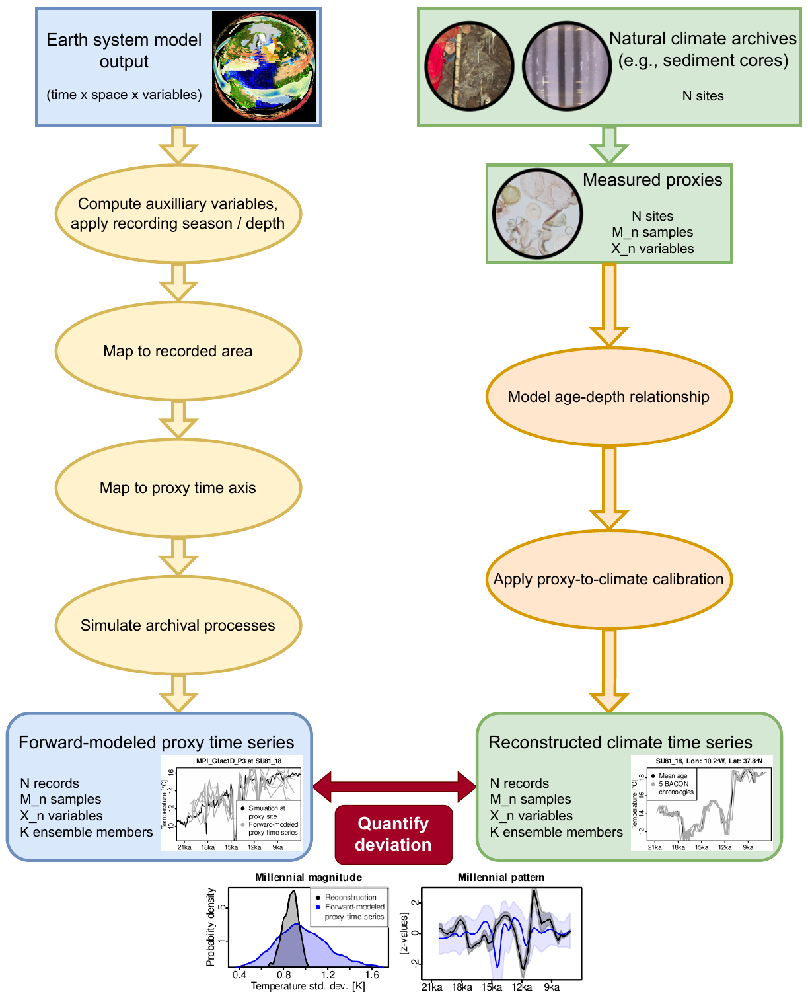

Concepts
=================================

Comparing paleoclimate simulations and proxies
---------------------------------------

Numerical models are a fundamental tool for understanding the Earth system. To test the reliability of models, they need to be compared with observational data. This task often involves operators that map model output onto the measurement space. In paleoclimatology, so-called proxy system models (PSMs) map Earth System Model (ESM) output onto proxy measurements from natural climate archives such as ice and sediment cores. Over time, the amounts of ESM data available for analysis has increased substantially, due to higher spatial resolutions, more complex representations of processes, inclusion of more compartments of the Earth systems, longer simulation periods, and increased ensembles sizes. Uncertainties of paleoclimate proxies tend to be non-Gaussian and auto-correlated, which makes them analytically intractable. Therefore, Monte Carlo methods are convenient for rigorous uncertainty quantification. Together with more comprehensive proxy record databases, this creates a need for incorporating big data methods into the evaluation of ESMs against paleoclimate proxies. This evaluation is valuable not just to understand past climate but also to improve future Earth system projections because past climate states provide an out-of-sample test for ESMs.

Data cubes
---------------------------------------

Data cubes are an increasingly popular paradigm for efficiently processing and visualizing large raster datasets in Earth system sciences. Data cubes are designed to efficiently perform operations that require only small chunks of large datasets, by parallelizing computations and loading only chunks of datasets which are needed for a specific operation, so called lazy loading. These are in particular operations that only require data along a subset of the dimensions of a dataset. This is the case in most paleoclimate applications that operate along either the temporal or the spatial dimension. Uncertainty quantification with Monte Carlo methods (also called ensemble methods) are suitable for data cube architectures because ensemble members are (approximately) independent. This makes operations embarrassingly parallel, i.e., they can be performed without communication between ensemble members. Exploiting embarrassingly parallel operations and lazy loading facilitates efficient memory and cpu usage.

Proxy system models
---------------------------------------

Proxy system models (PSMs) are mathematical models that map between gridded ESM output and point data from paleoclimate proxies by imitating processes that the measured proxy has been subjected to. This includes:

    • Restricting climate signals to the spatial area recorded by a proxy;
    • Computing auxiliary variables recorded by the proxy which are not directly simulated by ESMs;
    • Simulating archival processes that modify the recorded climate signal such as bioturbation for marine sediment cores;
    • Resampling to the temporally integrated and irregularly spaced time axis of a proxy record, which itself is determined by statistically inferring ages of samples from their depth in a record;
    • Applying statistical calibrations between measured quantities and climate variables.

Quantitative model-proxy comparison
---------------------------------------

Applying a PSM to ESM output results in an ensemble of forward-modeled proxy time series if uncertainties in the simulations and PSM are quantified with Monte Carlo methods. Therefore, quantitative comparisons of forward-modeled proxy time series and measured proxies require computing the deviations between probability distributions. So-called strictly proper score or divergence functions are particularly well suited for this task because their mathematical properties reward honest assessments of uncertainties. Integrating these metrics is the final step of model-proxy comparison workflows.

*The figure shows a conceptual workflow for model-proxy comparison in paleoclimatology. Starting from ESM output (top left) forward-modeled proxy time series (bottom left) are constructed by applying a chain of operators which together build a PSM. The forward-modeled proxy time series are compared with reconstructed climate time series (bottom right) which are inferred from proxies measured in natural climate archives (top right). The probability distributions formed by forward-modeled proxy time series and reconstructions are compared using strictly proper score or divergence functions. Sources of graphics:* `climatearchive.org <climatearchive.org>`_ *, Kira Rehfeld (pers. comm.), Weitzel et al., 2024 (* `doi.org/10.5194/cp-20-865-2024 <https://doi.org/10.5194/cp-20-865-2024>`_ *).*
