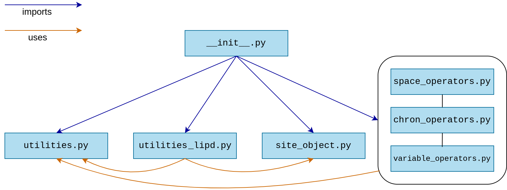

.. cupsm documentation master file, created by
   sphinx-quickstart on Thu Dec  5 18:46:41 2024.
   You can adapt this file completely to your liking, but it should at least
   contain the root `toctree` directive.

Welcome to cupsm!
=================================
**Proxy system modeling with data cubes**

``cupsm`` is an open-source python package for proxy system modeling that makes use of ``xarray`` and ``dask`` for efficient data handling and parallelization.

Introduction
---------------------------------------

To use the package, follow these steps

1. Clone the repository to a local directory of your choice:

   Using the terminal, navigate to the directory and type:

   ``git clone git@github.com:paleovar/cupsm.git``

   Alternatively, you can download the ``cupsm-main.zip`` file and extract it to your local directory.

2. Install the necessary packages

   cupsm depends on other Python packages. To run the package, you need numpy, xarray, pandas, geopy, lipd, dask, and numba. For plotting and regridding, we recommend matplotlib, cartopy, xesmf, and cdo.

   A ready-to-use environment `file <https://github.com/paleovar/cupsm/tree/main/tutorials/condaenv_python-3.11.7.yml>`_ for recreating a working conda environment (using python 3.11.7) is available in the `tutorials <https://github.com/paleovar/cupsm/tree/main/tutorials>`_ directory. To recreate an environment using conda, please make sure that conda is installed. Then type:

   ``conda env create -f tutorials/condaenv_python-3.11.7.yml``

   The default name of the environment is ``cupsm_env_python-3.11.7``. If you want a different name, please change it in the environment file before creating the environment.

   Working now in python, make sure to activate the environment and install a jupyter kernel for the environment, if needed.

3. Add the package path to your PYTHONPATH variable

   Working now in an python environment, e.g. a jupyter notebook, you must add the package path to your PYTHONPATH variable. Change the path accordingly and run the following lines in python:

   .. code:: 
       import sys
       sys.path.append('path/to/cupsm')

   Now you are ready to import the package:

   .. code:: 
       import cupsm

   If you want to add the package path permanently, please change your PYTHONPATH variable.

Browse through the jupyter notebooks in the tutorials directory and the documentation pages to learn everything you need to know about the package. All modules are documented in the API reference.

Documentation
--------------

* :doc:`concepts`
* :doc:`objects`
* :doc:`tutorial1`
* :doc:`autoapi/index`

.. toctree::
   :maxdepth: 2
   :hidden:
   :caption: Contents:

   concepts
   objects
   tutorial1

License
---------------------------------------
cupsm is published under the MIT License (Copyright (c) 2024, Nils Weitzel, Muriel Racky, Laura Braschoss, Kira Rehfeld)

Acknowledgments
---------------------------------------

This work has been funded by the German Research Foundation (`NFDI4Earth <https://www.nfdi4earth.de/>`_, DFG project no. 460036893).

Indices and tables
==================

* :ref:`genindex`
* :ref:`modindex`
* :ref:`search`
