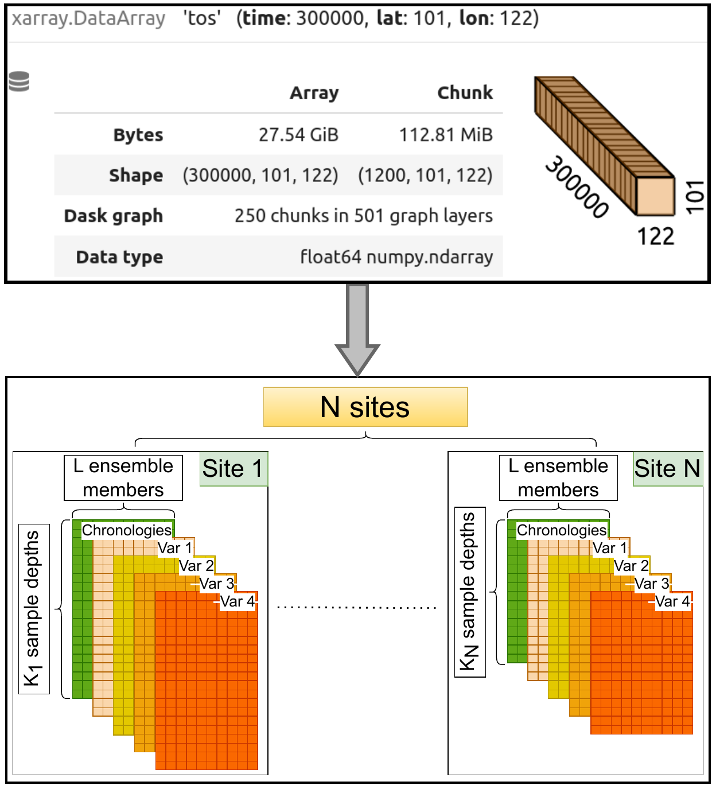

``cupsm`` objects
=================================

Two base objects are needed for model-proxy comparison, one for ESM output (``sim_data``) and one for proxy data (``obs_data``). The obs_data object is also used to store forward-model proxy time series, which have the same structure as proxy data. PSM operators are mapping between ``sim_data`` and ``obs_data`` objects (or intermediate products in the case of sequential application of operators). The structure of the two objects is depicted in the figure.

*Figure description: Measurement operators translate the sim_data (top, given by a chunked xarray DataArray for the variable ‘tos’, which is the CMOR variable name of SST, with space and time dimensions) into an obs_data object (bottom), which is given by N site_objects. Each site_object contain an xarray Dataset with dimensions depth and ens.*

``sim_data``
---------------------------------------

We load simulation data as an ``xarray.Dataset`` which has coordinates ``time``, ``space1``, ``space2`` (typically these are ``lon`` and ``lat``), ``level`` (vertical dimension), and optionally ``ens`` (ensemble members). Each ESM variable is loaded as an ``xarray.DataArray`` within the ``xarray.Dataset``. Using a standard xarray object structure has the advantage that existing ESM processing functionalities can be applied in addition to PSM operators. The ``xarray.Dataset`` structure facilitates lazy loading and parallelizing of operations by chunking datasets, which is of importance for the large data size of long paleoclimate simulations.

``obs_data`` and ``site_object``
---------------------------------------

In collections of proxy records, the number of samples and the measured and reconstructed variables tend to differ between measurement sites (here site refers to a specific location where a proxy archive is collected; archives can for example be sediment or ice cores). We use an ``xarray.Dataset`` for data from a single site (``site_object``), which has the dimensions ``depth`` (samples are identified by depth in a sediment core) and ``ens`` (ensemble members to quantify uncertainties), and variables cluster into four categories: chronological data (``chron_data``), measured proxy data (``paleo_data``), inferred variables such as temperature reconstructions (``rec_data``), and forward modeled proxy data derived from applying a PSM to ESM output (``forward_mod_data``). Our ``obs_data`` object is a dictionary or list of site_objects with additional attributes describing the shared metadata of all ``site_objects``, while the metadata specific to a site is stored in the ``site_objects``. The list structure allows to parallelize operations applied to a collection of ``site_objects`` and lazy loading of the site_object data based on metadata filtering. We implement parallelization over ``site_objects`` with the python library dask. The data cube architecture of the ``site_objects`` allows parallelization of operations on individual proxy records.

PSM operators
---------------------------------------

So far, three types of operators are implemented in ``cupsm``: space operators (``field2site``) that map the spatial fields of the ``sim_data`` onto the spatial structure of the ``site_objects``, chronology operators (``time2chron``) that map data from the regular ``sim_data`` time axis onto the irregular ``site_object`` time axis, and noise operators that perturb variables in ``sim_data`` or ``obs_data`` with either white or auto-correlated noise to imitate uncertainties from the proxy-climate relationship and archival processes.
