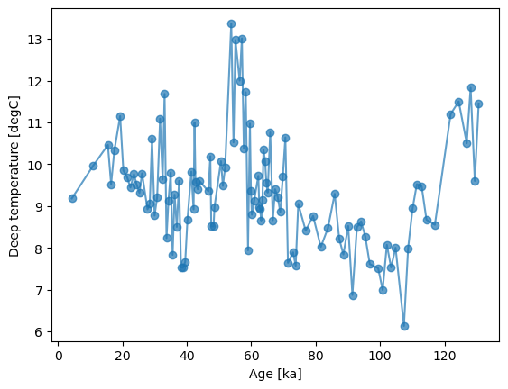
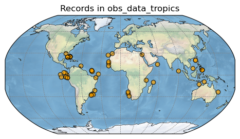

Tutorial 1: Getting started
===========================

In this Tutorial 1 we will choose proxy records and load their LiPD
files as class objects.

0. Preparations
---------------

Make sure you have all the dependencies for cupsm installed. You will
need numpy, xarray, pandas, geopy, lipd, dask and numba. A prepared
conda environment file is available
`here <https://github.com/paleovar/cupsm/tree/main/tutorials/condaenv_python-3.11.7.yml>`__.
See the
`README <https://github.com/paleovar/cupsm/blob/main/README.md>`__ for
instructions on setting up the environment.

Next, let’s import the necessary packages. Note that you must add the
path to the ``cupsm`` code core in order for ``import cupsm`` to run
successfully.

.. code:: ipython3

    # import packages
    import pandas as pd
    import numpy as np
    import xarray as xr
    
    # import cupsm
    # since cupsm is only available on GitHub, 
    # you need to expand your python path variable 
    # to the code directory for this notbook session
    import sys
    sys.path.append('../') # here, it will be the parent direcory
    import cupsm
    
    
    # import plotting packages
    import matplotlib
    import matplotlib.pyplot as plt
    import cartopy
    import cartopy.crs as ccrs

In the tutorial series, we are working with real data from paleoclimate
science. In the
`data <https://github.com/paleovar/cupsm/tree/main/data>`__ directory
you will find wget scripts to download the datasets used here. The wget
scripts have been tested and used on Linux only. You can also use your
own proxy data (LiPD files) or simulation data (files in netcdf format).

In this first tutorial, we will use the `PALMOD 130k marine
palaeoclimate data synthesis
V1_0_1 <https://doi.org/10.1594/PANGAEA.914466>`__ data set. More
information about the dataset can be found in the associated
`publication <https://doi.org/10.5194/essd-12-1053-2020>`__. You can
either download it manually
`here <https://store.pangaea.de/Publications/Jonkers-etal_2019/V1_0_1/LiPD.zip>`__
as a .zip file, or use the `wget
script <https://github.com/paleovar/cupsm/blob/main/data/wget_sst_reconstruction_databaset_20241212.sh>`__
to download it to your coputer.

.. code:: ipython3

    lipd_path = # path to directory where LiPD files are

1. Proxy overview table
-----------------------

``cupsm`` includes a helper infrastructure to easily handle LiPD files.

First an overview table is created as ``pandas`` DataFrame. This is done
by reading all LiPD files in the user-defined file path ``lipd_path``
and extracting the meta information of the records. The table is saved
as a pickle file at a user-defined path ``table_path``. In the next
session, ``cupsm`` reuses the previously created table. If you have
added new records to your ``lipd_path``, be sure to recreate the
overview table using the keyword argument ``update=True`` in the call to
the ``create_proxy_info`` function.

.. code:: ipython3

    table_path = # path where the overview table should be stored

.. code:: ipython3

    proxy_overview_table = cupsm.create_proxy_info(database_path=lipd_path, save_path=table_path) # create table
    proxy_overview_table.head() # show head of the table

2. Record choice
----------------

``cupsm`` provides a helper function ``get_records_df`` which returns a
list of class objects, one for each record. These proxy record objects
**obs_data** contain the proxy data as ``xarray`` ``DataSet`` and the
metadata of the specific record. Records can be chosen by function
parameters and keyword arguments. We will go through two examples and
explore the obs_data object on the fly: 

 1) Chosen by location
    
    - Explore obs_data object

 2) Chosen by file name

Type ``?cupsm.get_records_df`` for more information on available
arguments.

1) Chosen by location
~~~~~~~~~~~~~~~~~~~~~

Let’s assume we want to use all proxy records which are in the tropical
latitudes (30°S-30°N). This can be done with the ``location`` and
``loc_radius`` keyword arguments.

.. code:: ipython3

    obs_data_tropics = cupsm.get_records_df(proxy_overview_table, location=[True, 0], loc_radius=[0,30])

.. parsed-literal::

    I return a list with 54 record objects at [True, 0] +/- [0, 30].

Explore obs_data object
^^^^^^^^^^^^^^^^^^^^^^^

Let’s explore the first item of the list ``obs_data_tropics[0]``:

.. code:: ipython3

    example_object = obs_data_tropics[0] # take first object
    
    print("Available attributes and methods are:")
    [att for att in dir(example_object) if "__" not in att]

.. parsed-literal::

    Available attributes and methods are:

.. parsed-literal::

    ['age',
     'archive_type',
     'av_ds',
     'coords',
     'create_target',
     'fname',
     'info',
     'lipd',
     'load',
     'load_chron_data',
     'load_paleo_data',
     'path',
     'site_name',
     'target']

Short explanation of the available attributes and methods:

**Attributes:** 
  
 - ``age``: the age axis of the proxa data 
 - ``archive_type``: archive type, e.g. marine sediment 
 - ``av_ds``: available data sets 
 - ``coords``: proxy location in lon, lat, depth 
 - ``fname``: name of the LiPD file 
 - ``lipd``: the lipd file as it is read in with the python lipd package 
 - ``path``: the path where LiPD files are located 
 - ``site_name``: name of the record site 
 - ``target``: target object for proxy forward modeling (see Tutorial 2)

**Methods:** 

 - ``create_target``: creates a target subclass for proxy forward modeling (see Tutorial 2) 
 - ``info``: prints a basic overview of the record 
 - ``load``: loads all paleo/proxy data and age model data and combines them in one ``xarray`` ``DataSet`` 
 - ``load_chron_data``: loads the age model data 
 - ``load_paleo_data``: loads the proxy data, data can be chosen by ``data_set`` parameter. You can put ``"all"`` to load all available data. You can chose whether you want to work on the ``age`` or ``depth`` coordinate with the ``coord`` keyword argument.

.. code:: ipython3

    # Test the info function
    example_object.info()

.. parsed-literal::

    
    marine sediment record GIK18471_1 (4.27 - 130.61 ka)
    Position: lon=129.983°E, lat=-9.3665°N, elevation=-485m
    available datasets:
    ['depth_merged', 'age', 'age-1', 'benthic.MgCa', 'benthic.d18O', 'benthic.d18O-1', 'deep.temp', 'planktonic.MgCa', 'planktonic.d18O', 'surface.temp']
                

.. code:: ipython3

    # load Variable "deep.temp"
    example_data = example_object.load_paleo_data(data_set='deep.temp', coord="age")
    example_data

.. parsed-literal::

    Variables were renamed to make them accessible via xarray.dataset attributes, e.g. 'planktonic.d18O-1' --> 'planktonic_d18O_1' 

.. raw:: html

    
<svg style="position: absolute; width: 0; height: 0; overflow: hidden">
    <defs>
    <symbol id="icon-database" viewBox="0 0 32 32">
    <path d="M16 0c-8.837 0-16 2.239-16 5v4c0 2.761 7.163 5 16 5s16-2.239 16-5v-4c0-2.761-7.163-5-16-5z"></path>
    <path d="M16 17c-8.837 0-16-2.239-16-5v6c0 2.761 7.163 5 16 5s16-2.239 16-5v-6c0 2.761-7.163 5-16 5z"></path>
    <path d="M16 26c-8.837 0-16-2.239-16-5v6c0 2.761 7.163 5 16 5s16-2.239 16-5v-6c0 2.761-7.163 5-16 5z"></path>
    </symbol>
    <symbol id="icon-file-text2" viewBox="0 0 32 32">
    <path d="M28.681 7.159c-0.694-0.947-1.662-2.053-2.724-3.116s-2.169-2.030-3.116-2.724c-1.612-1.182-2.393-1.319-2.841-1.319h-15.5c-1.378 0-2.5 1.121-2.5 2.5v27c0 1.378 1.122 2.5 2.5 2.5h23c1.378 0 2.5-1.122 2.5-2.5v-19.5c0-0.448-0.137-1.23-1.319-2.841zM24.543 5.457c0.959 0.959 1.712 1.825 2.268 2.543h-4.811v-4.811c0.718 0.556 1.584 1.309 2.543 2.268zM28 29.5c0 0.271-0.229 0.5-0.5 0.5h-23c-0.271 0-0.5-0.229-0.5-0.5v-27c0-0.271 0.229-0.5 0.5-0.5 0 0 15.499-0 15.5 0v7c0 0.552 0.448 1 1 1h7v19.5z"></path>
    <path d="M23 26h-14c-0.552 0-1-0.448-1-1s0.448-1 1-1h14c0.552 0 1 0.448 1 1s-0.448 1-1 1z"></path>
    <path d="M23 22h-14c-0.552 0-1-0.448-1-1s0.448-1 1-1h14c0.552 0 1 0.448 1 1s-0.448 1-1 1z"></path>
    <path d="M23 18h-14c-0.552 0-1-0.448-1-1s0.448-1 1-1h14c0.552 0 1 0.448 1 1s-0.448 1-1 1z"></path>
    </symbol>
    </defs>
    </svg>
    <pre class='xr-text-repr-fallback'>&lt;xarray.Dataset&gt;
    Dimensions:    (age: 162)
    Coordinates:
      * age        (age) float64 4.273 7.438 10.88 13.09 ... 128.1 129.4 130.6 nan
    Data variables:
        deep_temp  (age) float64 9.18 nan 9.96 nan nan ... 10.5 11.83 9.6 11.45 8.63
    Attributes:
        description:  Measured paleo data from GIK18471_1.
        note:         Variables were renamed, e.g. &#x27;planktonic.d18O-1&#x27; --&gt; &#x27;plank...</pre>

xarray.Dataset

<ul class='xr-sections'><li class='xr-section-item'><input id='section-493c3c08-b811-4c26-9770-cc5ef7ad6533' class='xr-section-summary-in' type='checkbox' disabled ><label for='section-493c3c08-b811-4c26-9770-cc5ef7ad6533' class='xr-section-summary'  title='Expand/collapse section'>Dimensions:</label>
<ul class='xr-dim-list'><li>age: 162</li></ul>

</li><li class='xr-section-item'><input id='section-259c220c-5ce1-4819-bf23-c2769a66576c' class='xr-section-summary-in' type='checkbox'  checked><label for='section-259c220c-5ce1-4819-bf23-c2769a66576c' class='xr-section-summary' >Coordinates: (1)</label>

<ul class='xr-var-list'><li class='xr-var-item'>
age

(age)

float64

4.273 7.438 10.88 ... 130.6 nan
<input id='attrs-f224f289-ac43-4972-bb37-bdaa18ea6bd0' class='xr-var-attrs-in' type='checkbox' disabled><label for='attrs-f224f289-ac43-4972-bb37-bdaa18ea6bd0' title='Show/Hide attributes'><svg class='icon xr-icon-file-text2'><use xlink:href='#icon-file-text2'></use></svg></label><input id='data-fe4d97b3-5fd1-4a05-8ef3-9ce21a682391' class='xr-var-data-in' type='checkbox'><label for='data-fe4d97b3-5fd1-4a05-8ef3-9ce21a682391' title='Show/Hide data repr'><svg class='icon xr-icon-database'><use xlink:href='#icon-database'></use></svg></label>
<dl class='xr-attrs'></dl>

<pre>array([  4.272588,   7.438001,  10.876248,  13.093255,  14.254921,  15.536879,
            16.533205,  17.507282,  18.538825,  19.307662,  20.332743,  21.453493,
            22.545045,  23.613849,  24.449982,  25.259067,  26.051154,  26.896619,
            27.75289 ,  28.464402,  29.238788,  30.023037,  30.834238,  31.671897,
            32.462888,  33.118641,  33.709907,  34.320338,  34.965502,  35.601599,
            36.233209,  36.871473,  37.550898,  38.187902,  38.841208,  39.500268,
            40.160859,  40.798483,  41.435121,  42.07945 ,  42.407661,  42.732663,
            43.061252,  43.375125,  43.698423,  44.031369,  44.35059 ,  44.681965,
            45.028396,  45.367675,  45.69866 ,  45.999343,  46.332716,  46.66552 ,
            46.983774,  47.31328 ,  47.638131,  47.957653,  48.285236,  48.610783,
            48.917754,  49.246411,  49.57365 ,  49.907654,  50.237407,  50.565258,
            50.876797,  51.205408,  51.546839,  51.879692,  52.190612,  52.519379,
            52.854155,  53.171497,  53.498792,  53.835566,  54.143997,  54.470332,
            54.794064,  55.108039,  55.413146,  55.726571,  56.059794,  56.398424,
            56.720111,  57.052496,  57.35994 ,  57.698343,  58.016084,  58.331317,
            58.65841 ,  58.9672  ,  59.276964,  59.601987,  59.918232,  60.228636,
            60.539514,  60.883404,  61.195879,  61.519812,  61.853009,  62.174477,
            62.48362 ,  62.805679,  63.125564,  63.451857,  63.816206,  64.251439,
            64.662289,  65.068546,  65.887067,  66.654922,  67.440419,  68.207801,
            69.028914,  69.840402,  70.640523,  71.390512,  72.17949 ,  72.967071,
            73.783521,  74.604653,  76.91479 ,  79.22667 ,  81.552452,  83.800087,
            85.904008,  87.27268 ,  88.550759,  90.106903,  91.446851,  92.791718,
            94.077944,  95.413247,  96.752649,  98.112796,  99.407977, 100.796214,
           102.085151, 103.414717, 104.803032, 106.159992, 107.390788, 108.701269,
           110.090861, 111.416337, 112.862136, 114.379293, 115.75147 , 117.040952,
           118.264329, 119.480957, 120.720019, 121.936357, 123.106417, 124.3606  ,
           125.596404, 126.86439 , 128.133559, 129.375633, 130.610203,        nan])</pre>
</li></ul>
</li><li class='xr-section-item'><input id='section-b48426f8-0481-40db-9d7b-716ce590e816' class='xr-section-summary-in' type='checkbox'  checked><label for='section-b48426f8-0481-40db-9d7b-716ce590e816' class='xr-section-summary' >Data variables: (1)</label>

<ul class='xr-var-list'><li class='xr-var-item'>
deep_temp

(age)

float64

9.18 nan 9.96 ... 9.6 11.45 8.63
<input id='attrs-414da86f-1326-4c10-8d23-ce1c895e8179' class='xr-var-attrs-in' type='checkbox' ><label for='attrs-414da86f-1326-4c10-8d23-ce1c895e8179' title='Show/Hide attributes'><svg class='icon xr-icon-file-text2'><use xlink:href='#icon-file-text2'></use></svg></label><input id='data-f11ad97c-1be1-4589-9261-22e44c4687f2' class='xr-var-data-in' type='checkbox'><label for='data-f11ad97c-1be1-4589-9261-22e44c4687f2' title='Show/Hide data repr'><svg class='icon xr-icon-database'><use xlink:href='#icon-database'></use></svg></label>
<dl class='xr-attrs'><dt>description :</dt><dd>BWT_degC</dd><dt>variableName :</dt><dd>deep.temp</dd><dt>variableType :</dt><dd>inferred</dd><dt>units :</dt><dd>degC</dd><dt>measurementMaterial :</dt><dd>MgCa</dd><dt>sensorSpecies :</dt><dd>H. elegans</dd><dt>calibrationEquation :</dt><dd>Mg/Ca = 0.31 ± 0.06 exp. (0.14 ± 0.01) BWT</dd><dt>calibrationDOI :</dt><dd>10.1016/j.marmicro.2015.10.001</dd><dt>hasPubDOI :</dt><dd>10.1016/j.palaeo.2016.09.010</dd><dt>hasDataLink :</dt><dd>https://doi.pangaea.de/10.1594/PANGAEA.864731</dd><dt>TSid :</dt><dd>RPfJpqV9Evf</dd><dt>hasResolution :</dt><dd>{&#x27;hasMinValue&#x27;: 0.30914322675820216, &#x27;hasMaxValue&#x27;: 6.603659408264199, &#x27;hasMeanValue&#x27;: 1.1697927260271925, &#x27;hasMedianValue&#x27;: 0.8139695747599021}</dd><dt>hasMinValue :</dt><dd>6.13</dd><dt>hasMaxValue :</dt><dd>13.37</dd><dt>hasMeanValue :</dt><dd>9.349107142857141</dd><dt>hasMedianValue :</dt><dd>9.3</dd></dl>

<pre>array([ 9.18,   nan,  9.96,   nan,   nan, 10.46,  9.52, 10.32,   nan,
           11.15,  9.85,  9.68,  9.44,  9.76,  9.52,  9.31,  9.78,   nan,
            8.92,  9.05, 10.62,  8.77,  9.22, 11.09,  9.63, 11.68,  8.23,
            9.12,  9.8 ,  7.83,  9.27,  8.5 ,  9.6 ,  7.53,  7.52,  7.66,
            8.67,   nan,  9.82,  8.92, 10.99,  9.57,   nan,  9.4 ,   nan,
            9.59,   nan,   nan,   nan,   nan,   nan,   nan,   nan,  9.35,
             nan, 10.19,  8.51,   nan,  8.51,  8.98,   nan,   nan,   nan,
             nan,   nan, 10.07,   nan,  9.48,   nan,  9.92,   nan,   nan,
             nan,   nan,   nan, 13.37,   nan, 10.52,   nan, 12.97,   nan,
             nan,   nan, 12.  ,   nan, 13.01,   nan, 10.37,   nan, 11.72,
             nan,  7.94,   nan, 10.97,  9.36,  8.79,   nan,  9.13,   nan,
             nan,   nan,  9.72,  8.98,  8.92,  8.65,  9.15, 10.35, 10.07,
            9.55,  9.32, 10.76,  8.66,  9.4 ,  9.22,  8.86,  9.7 , 10.64,
            7.64,   nan,  7.89,  7.57,  9.05,  8.41,  8.76,  8.02,  8.47,
            9.29,  8.22,  7.84,  8.52,  6.87,  8.49,  8.63,  8.27,  7.61,
             nan,  7.51,  6.99,  8.07,  7.53,  8.  ,   nan,  6.13,  7.99,
            8.95,  9.52,  9.47,  8.67,   nan,  8.55,   nan,   nan,   nan,
           11.2 ,   nan, 11.5 ,   nan, 10.5 , 11.83,  9.6 , 11.45,  8.63])</pre>
</li></ul>
</li><li class='xr-section-item'><input id='section-5f47d9a9-13a1-4263-8d8c-d2249bcc0c6f' class='xr-section-summary-in' type='checkbox'  ><label for='section-5f47d9a9-13a1-4263-8d8c-d2249bcc0c6f' class='xr-section-summary' >Indexes: (1)</label>

<ul class='xr-var-list'><li class='xr-var-item'>

age

PandasIndex

<input id='index-640dd6df-704a-4914-a37e-9c23552c7ec7' class='xr-index-data-in' type='checkbox'/><label for='index-640dd6df-704a-4914-a37e-9c23552c7ec7' title='Show/Hide index repr'><svg class='icon xr-icon-database'><use xlink:href='#icon-database'></use></svg></label>
<pre>PandasIndex(Index([ 4.2725881652832,  7.4380006161499, 10.8762475735474, 13.0932547946167,
           14.2549212253761, 15.5368790813446, 16.5332047668076, 17.5072823760605,
           18.5388246795559, 19.3076620929241,
           ...
           120.720018986987, 121.936357457498, 123.106417314873, 124.360599665606,
           125.596404060898, 126.864389725994, 128.133559212041, 129.375633191786,
            130.61020257622,              nan],
          dtype=&#x27;float64&#x27;, name=&#x27;age&#x27;, length=162))</pre>
</li></ul>
</li><li class='xr-section-item'><input id='section-d88f652e-56ac-4b34-b8bc-552626fad0db' class='xr-section-summary-in' type='checkbox'  checked><label for='section-d88f652e-56ac-4b34-b8bc-552626fad0db' class='xr-section-summary' >Attributes: (2)</label>

<dl class='xr-attrs'><dt>description :</dt><dd>Measured paleo data from GIK18471_1.</dd><dt>note :</dt><dd>Variables were renamed, e.g. &#x27;planktonic.d18O-1&#x27; --&gt; &#x27;planktonic_d18O_1&#x27;</dd></dl>
</li></ul>

**NOTE:** Variables were renamed to make them accessible via
xarray.dataset attributes, e.g. ‘planktonic.d18O-1’ –>
‘planktonic_d18O_1’. This warning can be suppressed by using the keyword
argument ``quiet=True``. The attributes are also integrated into the
``xarray`` ``DataSet`` but left unchanged from the origin LiPD file.

.. code:: ipython3

    # Small plot
    # get rid of np.nans for plotting:
    nan_mask = np.invert(( np.isnan(example_data.age)) | ( np.isnan(example_data.deep_temp)))
    
    # plot data
    plt.plot(np.round(example_data.age[nan_mask],1), example_data.deep_temp[nan_mask], marker="o", alpha=0.7)
    # labels
    plt.xlabel("Age [ka]")
    plt.ylabel(f"Deep temperature [{example_data.deep_temp.units}]")
    plt.show()

Next, we create a small map plot of the chosen records. For that, we
first extract their positions:

.. code:: ipython3

    # initialize empty lists
    lon_list = []
    lat_list = []
    
    # iterate through object list
    for site in obs_data_tropics:
        lon, lat, el = site.coords
        lon_list.append(lon)
        lat_list.append(lat)

.. code:: ipython3

    # create a small plot
    fig, ax = plt.subplots(ncols=1, nrows=1, figsize=(8,3), subplot_kw={"projection" : ccrs.Robinson()})
    
    im = ax.scatter(lon_list, lat_list, transform=ccrs.PlateCarree(), color="orange", edgecolor="black", alpha=0.7)
    
    extent = [-180, 180, -90, 90]
    ax.set_extent(extent, ccrs.PlateCarree())
    
    ax.stock_img()
    ax.coastlines(linewidth=0.4)
    gl = ax.gridlines(draw_labels=False, linewidth=0.5, color='gray', linestyle='--')
    gl.xlocator = plt.FixedLocator(np.arange(-180,210,30))
    gl.ylocator = plt.FixedLocator(np.arange(-90,90,30))
    
    plt.title("Records in obs_data_tropics")
    
    plt.show()

2) Chosen by file name
~~~~~~~~~~~~~~~~~~~~~~

In this case, we already know the sites that we want to analyze.

.. code:: ipython3

    # list of our sites
    sites = ["SU81_18.lpd", "TR163_22.lpd", "SO201_2_12KL.lpd", "MD98_2181.lpd", "GeoB1711_4.lpd"]

.. code:: ipython3

    # initialize the obs_data object as list:
    obs_data = cupsm.get_records_df(df=proxy_overview_table, file_name=sites)
    
    print(f"The object is of type {type(obs_data)}.")
    
    # example printout:
    obs_data[1].info()

.. parsed-literal::

    I return a list with 5 record objects at None +/- None.
    The object is of type <class 'list'>.
    
    marine sediment record TR163_22 (0.94 - 128.52 ka)
    Position: lon=-92.3988°E, lat=0.5157°N, elevation=-2830m
    available datasets:
    ['depth_merged', 'age', 'age-1', 'planktonic.d18O', 'benthic.d18O', 'planktonic.MgCa', 'surface.temp']
                

Alternatively, you can initialize the obs_data object as a dictionary,
where the site name points to the proxy class object. We recommend this
method because the sites are directly identifiable.

.. code:: ipython3

    # One can also initialize the obs_data object as dictionary, where the site name points to the proxy class object:
    obs_data = cupsm.get_records_df(df=proxy_overview_table, file_name=sites, return_as="dictionary")
    
    print(f"The object is of type {type(obs_data)}.")
    
    # example printout:
    obs_data["TR163_22"].info()

.. parsed-literal::

    I return a dictionary with 5 record objects at None +/- None.
    The object is of type <class 'dict'>.
    
    marine sediment record TR163_22 (0.94 - 128.52 ka)
    Position: lon=-92.3988°E, lat=0.5157°N, elevation=-2830m
    available datasets:
    ['depth_merged', 'age', 'age-1', 'planktonic.d18O', 'benthic.d18O', 'planktonic.MgCa', 'surface.temp']
                

