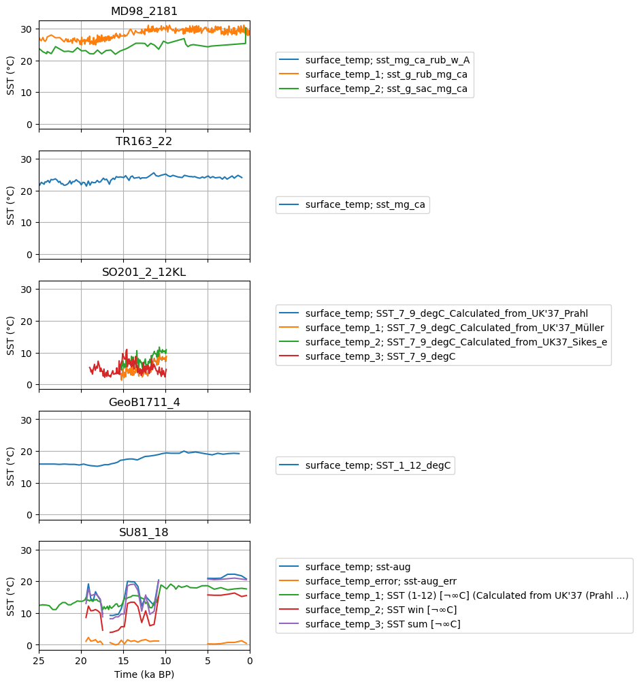

Tutorial 2: Forward modeling of proxy timeseries
================================================

In this Tutorial 2, we will apply operators in space and time to model
simulation data (``sim_data``). As a result, we will obtain
forward-modeled proxy time series for selected proxy datasets. Please
make sure you are familiar with the contents of Example 1 “Getting
Started”.

0. Preparations
---------------

In this tutorial, we will again work with real scientific data. We will
use climate model output of transient simulation of the last
deglaciation. The simulation was performed with MPI-ESM-CR-1.2 and used
the GLAC1D ice sheet reconstruction as boundary conditions. See the
`publication <https://doi.org/10.1029/2021GL096767>`__ for more details.
For downloading the netcdf files, use the `wget
script <https://github.com/paleovar/cupsm/blob/main/data/wget-mpiesm_simulations_20231208135007.sh>`__
we provided or check out the download possibilities in the dataset
`description <https://www.wdc-climate.de/ui/entry?acronym=PMMXMCRTDGP132>`__.

In our example, we will use the simulated sea surface temperature
(variable ``tos``) over 25000 simulated years. Naturally, the variable
comes on an unstructured grid and must be regridded. We recommend
regridding with the ``xesmf`` package. We prepared some code for it in
the ``utilities_sst_example.py`` file. To use it, please add the
absolute file path to one of your example files in line 27 in the
``utilities_sst_example.py`` file. Then run the provided piece of code
in a notebook (copy code into cells):

.. code:: python

   %run utilities_sst_example.py

Then, you can define a regridder and print its properties:

.. code:: python

   regridder = get_regridder()

   print(regrider)

We then regridded in a simple for-loop (change the paths to suit your
directory structure):

.. code:: python

   path_deglac='/path/to/your/downloaded/data'
   target_path = '/path/to/your/regridded/data'

   file_list = [f for f in os.listdir(path_deglac) if f.endswith(".nc")]

   for i, file in enumerate(file_list):
       # counter
       if not i % 10: 
           print(f"Interpolating file {i}/{len(file_list)}")
       f = xr.open_dataset(path_deglac+file)
       f_r = regridder(f, skipna=True, na_thres=0.5).tos.to_dataset()
       f_r.attrs["Interpolation"] = "Periodic bilinear interpolation by xESMF Regridder, skipna=True, na_thres=0.5"
       f_r.to_netcdf(target_path+"r_"+file)

Now let ``xesmf`` do its magic. Take a break, grab a coffee or tea. For
us, the regridding took about 10 minutes.

As in the first tutorial, the data paths must be defined. You can reuse
your ``lipd_path`` and ``table_path`` unless you want to use a different
proxy database. The ``sim_data_path`` is the directory where the
regridded netcdf files are.

.. code:: ipython3

    lipd_path = # path to directory where LiPD files are (only necessary if recreated)
    table_path = # path where the overview table should be stored
    sim_data_path = # path where the regridded netcdf files of the simulation data are

Finally, import the required packages.

.. code:: ipython3

    # import packages
    import pandas as pd
    import numpy as np
    import xarray as xr
    
    # import cupsm
    # since cupsm is only available on GitHub, 
    # you need to expand your python path variable 
    # to the code directory for this notbook session
    import sys
    for path in sys.path:
        if "tutorials" in path:
            sys.path.append(path.rstrip("/tutorials"))
    import cupsm
    
    # import a function from the tutorial code bits
    from tutorials.utilities_sst_example import transfer_timeaxis_deglac, plot_results
    
    # import plotting packages
    import matplotlib
    import matplotlib.pyplot as plt
    import cartopy
    import cartopy.crs as ccrs

1. Initialize obs_data
----------------------

**as dictionary, keys are the site names and values the site_objects**

Here, we reuse the code of the Tutorial 1.

.. code:: ipython3

    # load the overview table
    proxy_overview_table = cupsm.create_proxy_info(database_path=lipd_path, save_path=table_path)
    
    # specify example sites
    sites = ["SU81_18.lpd", "TR163_22.lpd", "SO201_2_12KL.lpd", "MD98_2181.lpd", "GeoB1711_4.lpd"]
    
    # get the obs_data object
    obs_data = cupsm.get_records_df(df=proxy_overview_table, file_name=sites, return_as="dictionary")

2. Initialize sim_data
----------------------

**as chunked xarray DataArray**

Here, we use xarray’s ``open_mfdataset`` function which allows to load
multiple files as a single dataset. The keyword ``parallel=True``
enables parallelized file opening using dask. For us, opening 25000
years of simulation data took about 9 seconds.

.. code:: ipython3

    sim_data = xr.open_mfdataset(f"{sim_data_path}*.nc", parallel=True, use_cftime=True,)
    
    sim_data

.. raw:: html

    
<svg style="position: absolute; width: 0; height: 0; overflow: hidden">
    <defs>
    <symbol id="icon-database" viewBox="0 0 32 32">
    <path d="M16 0c-8.837 0-16 2.239-16 5v4c0 2.761 7.163 5 16 5s16-2.239 16-5v-4c0-2.761-7.163-5-16-5z"></path>
    <path d="M16 17c-8.837 0-16-2.239-16-5v6c0 2.761 7.163 5 16 5s16-2.239 16-5v-6c0 2.761-7.163 5-16 5z"></path>
    <path d="M16 26c-8.837 0-16-2.239-16-5v6c0 2.761 7.163 5 16 5s16-2.239 16-5v-6c0 2.761-7.163 5-16 5z"></path>
    </symbol>
    <symbol id="icon-file-text2" viewBox="0 0 32 32">
    <path d="M28.681 7.159c-0.694-0.947-1.662-2.053-2.724-3.116s-2.169-2.030-3.116-2.724c-1.612-1.182-2.393-1.319-2.841-1.319h-15.5c-1.378 0-2.5 1.121-2.5 2.5v27c0 1.378 1.122 2.5 2.5 2.5h23c1.378 0 2.5-1.122 2.5-2.5v-19.5c0-0.448-0.137-1.23-1.319-2.841zM24.543 5.457c0.959 0.959 1.712 1.825 2.268 2.543h-4.811v-4.811c0.718 0.556 1.584 1.309 2.543 2.268zM28 29.5c0 0.271-0.229 0.5-0.5 0.5h-23c-0.271 0-0.5-0.229-0.5-0.5v-27c0-0.271 0.229-0.5 0.5-0.5 0 0 15.499-0 15.5 0v7c0 0.552 0.448 1 1 1h7v19.5z"></path>
    <path d="M23 26h-14c-0.552 0-1-0.448-1-1s0.448-1 1-1h14c0.552 0 1 0.448 1 1s-0.448 1-1 1z"></path>
    <path d="M23 22h-14c-0.552 0-1-0.448-1-1s0.448-1 1-1h14c0.552 0 1 0.448 1 1s-0.448 1-1 1z"></path>
    <path d="M23 18h-14c-0.552 0-1-0.448-1-1s0.448-1 1-1h14c0.552 0 1 0.448 1 1s-0.448 1-1 1z"></path>
    </symbol>
    </defs>
    </svg>
    <pre class='xr-text-repr-fallback'>&lt;xarray.Dataset&gt;
    Dimensions:  (time: 300000, lat: 101, lon: 122)
    Coordinates:
      * time     (time) object 0001-01-16 12:00:00 ... 25000-12-16 12:00:00
      * lat      (lat) float64 -90.0 -88.2 -86.4 -84.6 -82.8 ... 84.6 86.4 88.2 90.0
      * lon      (lon) float64 -180.0 -177.0 -174.1 -171.1 ... 171.1 174.1 177.0
    Data variables:
        tos      (time, lat, lon) float64 dask.array&lt;chunksize=(1200, 101, 122), meta=np.ndarray&gt;
    Attributes:
        Interpolation:  Periodic bilinear interpolation by xESMF Regridder, skipn...</pre>

xarray.Dataset

<ul class='xr-sections'><li class='xr-section-item'><input id='section-004faf5f-c53f-410c-b850-ffc40ad4d1aa' class='xr-section-summary-in' type='checkbox' disabled ><label for='section-004faf5f-c53f-410c-b850-ffc40ad4d1aa' class='xr-section-summary'  title='Expand/collapse section'>Dimensions:</label>
<ul class='xr-dim-list'><li>time: 300000</li><li>lat: 101</li><li>lon: 122</li></ul>

</li><li class='xr-section-item'><input id='section-063ef3e2-504e-4e05-b137-40b802ba1fbb' class='xr-section-summary-in' type='checkbox'  checked><label for='section-063ef3e2-504e-4e05-b137-40b802ba1fbb' class='xr-section-summary' >Coordinates: (3)</label>

<ul class='xr-var-list'><li class='xr-var-item'>
time

(time)

object

0001-01-16 12:00:00 ... 25000-12...
<input id='attrs-c81608e4-4162-48ea-bf16-0ff89487dcb9' class='xr-var-attrs-in' type='checkbox' disabled><label for='attrs-c81608e4-4162-48ea-bf16-0ff89487dcb9' title='Show/Hide attributes'><svg class='icon xr-icon-file-text2'><use xlink:href='#icon-file-text2'></use></svg></label><input id='data-d1cef317-2dc4-42b7-adf0-c11122480a12' class='xr-var-data-in' type='checkbox'><label for='data-d1cef317-2dc4-42b7-adf0-c11122480a12' title='Show/Hide data repr'><svg class='icon xr-icon-database'><use xlink:href='#icon-database'></use></svg></label>
<dl class='xr-attrs'></dl>

<pre>array([cftime.DatetimeProlepticGregorian(1, 1, 16, 12, 0, 0, 0, has_year_zero=True),
           cftime.DatetimeProlepticGregorian(1, 2, 15, 0, 0, 0, 0, has_year_zero=True),
           cftime.DatetimeProlepticGregorian(1, 3, 16, 12, 0, 0, 0, has_year_zero=True),
           ...,
           cftime.DatetimeProlepticGregorian(25000, 10, 16, 12, 0, 0, 0, has_year_zero=True),
           cftime.DatetimeProlepticGregorian(25000, 11, 16, 0, 0, 0, 0, has_year_zero=True),
           cftime.DatetimeProlepticGregorian(25000, 12, 16, 12, 0, 0, 0, has_year_zero=True)],
          dtype=object)</pre>
</li><li class='xr-var-item'>
lat

(lat)

float64

-90.0 -88.2 -86.4 ... 88.2 90.0
<input id='attrs-1a1ddb59-9689-44d9-a427-1793bf6a91cb' class='xr-var-attrs-in' type='checkbox' disabled><label for='attrs-1a1ddb59-9689-44d9-a427-1793bf6a91cb' title='Show/Hide attributes'><svg class='icon xr-icon-file-text2'><use xlink:href='#icon-file-text2'></use></svg></label><input id='data-9d6a65ae-faa4-428c-8782-b88d053ef231' class='xr-var-data-in' type='checkbox'><label for='data-9d6a65ae-faa4-428c-8782-b88d053ef231' title='Show/Hide data repr'><svg class='icon xr-icon-database'><use xlink:href='#icon-database'></use></svg></label>
<dl class='xr-attrs'></dl>

<pre>array([-90. , -88.2, -86.4, -84.6, -82.8, -81. , -79.2, -77.4, -75.6, -73.8,
           -72. , -70.2, -68.4, -66.6, -64.8, -63. , -61.2, -59.4, -57.6, -55.8,
           -54. , -52.2, -50.4, -48.6, -46.8, -45. , -43.2, -41.4, -39.6, -37.8,
           -36. , -34.2, -32.4, -30.6, -28.8, -27. , -25.2, -23.4, -21.6, -19.8,
           -18. , -16.2, -14.4, -12.6, -10.8,  -9. ,  -7.2,  -5.4,  -3.6,  -1.8,
             0. ,   1.8,   3.6,   5.4,   7.2,   9. ,  10.8,  12.6,  14.4,  16.2,
            18. ,  19.8,  21.6,  23.4,  25.2,  27. ,  28.8,  30.6,  32.4,  34.2,
            36. ,  37.8,  39.6,  41.4,  43.2,  45. ,  46.8,  48.6,  50.4,  52.2,
            54. ,  55.8,  57.6,  59.4,  61.2,  63. ,  64.8,  66.6,  68.4,  70.2,
            72. ,  73.8,  75.6,  77.4,  79.2,  81. ,  82.8,  84.6,  86.4,  88.2,
            90. ])</pre>
</li><li class='xr-var-item'>
lon

(lon)

float64

-180.0 -177.0 ... 174.1 177.0
<input id='attrs-6ac164d7-9536-44d5-ae38-2a73416fd50b' class='xr-var-attrs-in' type='checkbox' disabled><label for='attrs-6ac164d7-9536-44d5-ae38-2a73416fd50b' title='Show/Hide attributes'><svg class='icon xr-icon-file-text2'><use xlink:href='#icon-file-text2'></use></svg></label><input id='data-cca3c92a-d363-4c67-9140-158a82faa1b4' class='xr-var-data-in' type='checkbox'><label for='data-cca3c92a-d363-4c67-9140-158a82faa1b4' title='Show/Hide data repr'><svg class='icon xr-icon-database'><use xlink:href='#icon-database'></use></svg></label>
<dl class='xr-attrs'></dl>

<pre>array([-180.      , -177.04918 , -174.098361, -171.147541, -168.196721,
           -165.245902, -162.295082, -159.344262, -156.393443, -153.442623,
           -150.491803, -147.540984, -144.590164, -141.639344, -138.688525,
           -135.737705, -132.786885, -129.836066, -126.885246, -123.934426,
           -120.983607, -118.032787, -115.081967, -112.131148, -109.180328,
           -106.229508, -103.278689, -100.327869,  -97.377049,  -94.42623 ,
            -91.47541 ,  -88.52459 ,  -85.57377 ,  -82.622951,  -79.672131,
            -76.721311,  -73.770492,  -70.819672,  -67.868852,  -64.918033,
            -61.967213,  -59.016393,  -56.065574,  -53.114754,  -50.163934,
            -47.213115,  -44.262295,  -41.311475,  -38.360656,  -35.409836,
            -32.459016,  -29.508197,  -26.557377,  -23.606557,  -20.655738,
            -17.704918,  -14.754098,  -11.803279,   -8.852459,   -5.901639,
             -2.95082 ,    0.      ,    2.95082 ,    5.901639,    8.852459,
             11.803279,   14.754098,   17.704918,   20.655738,   23.606557,
             26.557377,   29.508197,   32.459016,   35.409836,   38.360656,
             41.311475,   44.262295,   47.213115,   50.163934,   53.114754,
             56.065574,   59.016393,   61.967213,   64.918033,   67.868852,
             70.819672,   73.770492,   76.721311,   79.672131,   82.622951,
             85.57377 ,   88.52459 ,   91.47541 ,   94.42623 ,   97.377049,
            100.327869,  103.278689,  106.229508,  109.180328,  112.131148,
            115.081967,  118.032787,  120.983607,  123.934426,  126.885246,
            129.836066,  132.786885,  135.737705,  138.688525,  141.639344,
            144.590164,  147.540984,  150.491803,  153.442623,  156.393443,
            159.344262,  162.295082,  165.245902,  168.196721,  171.147541,
            174.098361,  177.04918 ])</pre>
</li></ul>
</li><li class='xr-section-item'><input id='section-0a37d927-a3cd-4683-9bc8-68e6a088e7aa' class='xr-section-summary-in' type='checkbox'  checked><label for='section-0a37d927-a3cd-4683-9bc8-68e6a088e7aa' class='xr-section-summary' >Data variables: (1)</label>

<ul class='xr-var-list'><li class='xr-var-item'>
tos

(time, lat, lon)

float64

dask.array&lt;chunksize=(1200, 101, 122), meta=np.ndarray&gt;
<input id='attrs-ee0e77e3-2931-43cd-9584-b67b5bda696e' class='xr-var-attrs-in' type='checkbox' disabled><label for='attrs-ee0e77e3-2931-43cd-9584-b67b5bda696e' title='Show/Hide attributes'><svg class='icon xr-icon-file-text2'><use xlink:href='#icon-file-text2'></use></svg></label><input id='data-659f6177-8570-4fce-80af-1b7a0bd8bc3a' class='xr-var-data-in' type='checkbox'><label for='data-659f6177-8570-4fce-80af-1b7a0bd8bc3a' title='Show/Hide data repr'><svg class='icon xr-icon-database'><use xlink:href='#icon-database'></use></svg></label>
<dl class='xr-attrs'></dl>

<table>
        <tr>
            <td>
                <table style="border-collapse: collapse;">
                    <thead>
                        <tr>
                            <td> </td>
                            <th> Array </th>
                            <th> Chunk </th>
                        </tr>
                    </thead>
                    <tbody>
    
                        <tr>
                            <th> Bytes </th>
                            <td> 27.54 GiB </td>
                            <td> 112.81 MiB </td>
                        </tr>
    
                        <tr>
                            <th> Shape </th>
                            <td> (300000, 101, 122) </td>
                            <td> (1200, 101, 122) </td>
                        </tr>
                        <tr>
                            <th> Dask graph </th>
                            <td colspan="2"> 250 chunks in 501 graph layers </td>
                        </tr>
                        <tr>
                            <th> Data type </th>
                            <td colspan="2"> float64 numpy.ndarray </td>
                        </tr>
                    </tbody>
                </table>
            </td>
            <td>
            <svg width="156" height="146" style="stroke:rgb(0,0,0);stroke-width:1" >
    
      <!-- Horizontal lines -->
      <line x1="10" y1="0" x2="80" y2="70" style="stroke-width:2" />
      <line x1="10" y1="25" x2="80" y2="96" style="stroke-width:2" />
    
      <!-- Vertical lines -->
      <line x1="10" y1="0" x2="10" y2="25" style="stroke-width:2" />
      <line x1="13" y1="3" x2="13" y2="29" />
      <line x1="17" y1="7" x2="17" y2="32" />
      <line x1="21" y1="11" x2="21" y2="36" />
      <line x1="24" y1="14" x2="24" y2="40" />
      <line x1="28" y1="18" x2="28" y2="43" />
      <line x1="32" y1="22" x2="32" y2="47" />
      <line x1="35" y1="25" x2="35" y2="51" />
      <line x1="39" y1="29" x2="39" y2="55" />
      <line x1="43" y1="33" x2="43" y2="58" />
      <line x1="46" y1="36" x2="46" y2="62" />
      <line x1="50" y1="40" x2="50" y2="66" />
      <line x1="54" y1="44" x2="54" y2="69" />
      <line x1="58" y1="48" x2="58" y2="73" />
      <line x1="61" y1="51" x2="61" y2="77" />
      <line x1="65" y1="55" x2="65" y2="81" />
      <line x1="69" y1="59" x2="69" y2="84" />
      <line x1="72" y1="62" x2="72" y2="88" />
      <line x1="76" y1="66" x2="76" y2="92" />
      <line x1="80" y1="70" x2="80" y2="96" style="stroke-width:2" />
    
      <!-- Colored Rectangle -->
      <polygon points="10.0,0.0 80.58823529411765,70.58823529411765 80.58823529411765,96.00085180870013 10.0,25.412616514582485" style="fill:#8B4903A0;stroke-width:0"/>
    
      <!-- Horizontal lines -->
      <line x1="10" y1="0" x2="35" y2="0" style="stroke-width:2" />
      <line x1="13" y1="3" x2="39" y2="3" />
      <line x1="17" y1="7" x2="42" y2="7" />
      <line x1="21" y1="11" x2="46" y2="11" />
      <line x1="24" y1="14" x2="50" y2="14" />
      <line x1="28" y1="18" x2="53" y2="18" />
      <line x1="32" y1="22" x2="57" y2="22" />
      <line x1="35" y1="25" x2="61" y2="25" />
      <line x1="39" y1="29" x2="65" y2="29" />
      <line x1="43" y1="33" x2="68" y2="33" />
      <line x1="46" y1="36" x2="72" y2="36" />
      <line x1="50" y1="40" x2="76" y2="40" />
      <line x1="54" y1="44" x2="79" y2="44" />
      <line x1="58" y1="48" x2="83" y2="48" />
      <line x1="61" y1="51" x2="87" y2="51" />
      <line x1="65" y1="55" x2="91" y2="55" />
      <line x1="69" y1="59" x2="94" y2="59" />
      <line x1="72" y1="62" x2="98" y2="62" />
      <line x1="76" y1="66" x2="102" y2="66" />
      <line x1="80" y1="70" x2="106" y2="70" style="stroke-width:2" />
    
      <!-- Vertical lines -->
      <line x1="10" y1="0" x2="80" y2="70" style="stroke-width:2" />
      <line x1="35" y1="0" x2="106" y2="70" style="stroke-width:2" />
    
      <!-- Colored Rectangle -->
      <polygon points="10.0,0.0 35.41261651458248,0.0 106.00085180870013,70.58823529411765 80.58823529411765,70.58823529411765" style="fill:#8B4903A0;stroke-width:0"/>
    
      <!-- Horizontal lines -->
      <line x1="80" y1="70" x2="106" y2="70" style="stroke-width:2" />
      <line x1="80" y1="96" x2="106" y2="96" style="stroke-width:2" />
    
      <!-- Vertical lines -->
      <line x1="80" y1="70" x2="80" y2="96" style="stroke-width:2" />
      <line x1="106" y1="70" x2="106" y2="96" style="stroke-width:2" />
    
      <!-- Colored Rectangle -->
      <polygon points="80.58823529411765,70.58823529411765 106.00085180870013,70.58823529411765 106.00085180870013,96.00085180870013 80.58823529411765,96.00085180870013" style="fill:#ECB172A0;stroke-width:0"/>
    
      <!-- Text -->
      <text x="93.294544" y="116.000852" font-size="1.0rem" font-weight="100" text-anchor="middle" >122</text>
      <text x="126.000852" y="83.294544" font-size="1.0rem" font-weight="100" text-anchor="middle" transform="rotate(-90,126.000852,83.294544)">101</text>
      <text x="35.294118" y="80.706734" font-size="1.0rem" font-weight="100" text-anchor="middle" transform="rotate(45,35.294118,80.706734)">300000</text>
    </svg>
            </td>
        </tr>
    </table>
</li></ul>
</li><li class='xr-section-item'><input id='section-94a92914-9880-4ac4-a082-aab76d6a9c13' class='xr-section-summary-in' type='checkbox'  ><label for='section-94a92914-9880-4ac4-a082-aab76d6a9c13' class='xr-section-summary' >Indexes: (3)</label>

<ul class='xr-var-list'><li class='xr-var-item'>

time

PandasIndex

<input id='index-8de87bf5-517f-4ed2-b0f2-430a842bc938' class='xr-index-data-in' type='checkbox'/><label for='index-8de87bf5-517f-4ed2-b0f2-430a842bc938' title='Show/Hide index repr'><svg class='icon xr-icon-database'><use xlink:href='#icon-database'></use></svg></label>
<pre>PandasIndex(CFTimeIndex([0001-01-16 12:00:00, 0001-02-15 00:00:00, 0001-03-16 12:00:00,
                 0001-04-16 00:00:00, 0001-05-16 12:00:00, 0001-06-16 00:00:00,
                 0001-07-16 12:00:00, 0001-08-16 12:00:00, 0001-09-16 00:00:00,
                 0001-10-16 12:00:00,
                 ...
                 25000-03-16 12:00:00, 25000-04-16 00:00:00, 25000-05-16 12:00:00,
                 25000-06-16 00:00:00, 25000-07-16 12:00:00, 25000-08-16 12:00:00,
                 25000-09-16 00:00:00, 25000-10-16 12:00:00, 25000-11-16 00:00:00,
                 25000-12-16 12:00:00],
                dtype=&#x27;object&#x27;,
                length=300000,
                calendar=&#x27;proleptic_gregorian&#x27;,
                freq=&#x27;None&#x27;))</pre>
</li><li class='xr-var-item'>

lat

PandasIndex

<input id='index-0fb732cb-4aac-494d-8046-6d7e364ee89c' class='xr-index-data-in' type='checkbox'/><label for='index-0fb732cb-4aac-494d-8046-6d7e364ee89c' title='Show/Hide index repr'><svg class='icon xr-icon-database'><use xlink:href='#icon-database'></use></svg></label>
<pre>PandasIndex(Index([            -90.0,             -88.2,             -86.4,
                       -84.6,             -82.8,             -81.0,
                       -79.2,             -77.4,             -75.6,
                       -73.8,
           ...
           73.80000000000001,              75.6,              77.4,
           79.20000000000002,              81.0, 82.80000000000001,
                        84.6,              86.4, 88.20000000000002,
                        90.0],
          dtype=&#x27;float64&#x27;, name=&#x27;lat&#x27;, length=101))</pre>
</li><li class='xr-var-item'>

lon

PandasIndex

<input id='index-212a0d41-6840-4606-becb-6741958c9d63' class='xr-index-data-in' type='checkbox'/><label for='index-212a0d41-6840-4606-becb-6741958c9d63' title='Show/Hide index repr'><svg class='icon xr-icon-database'><use xlink:href='#icon-database'></use></svg></label>
<pre>PandasIndex(Index([             -180.0, -177.04918032786884,  -174.0983606557377,
           -171.14754098360655, -168.19672131147541, -165.24590163934425,
           -162.29508196721312, -159.34426229508196, -156.39344262295083,
           -153.44262295081967,
           ...
            150.49180327868856,  153.44262295081967,  156.39344262295083,
              159.344262295082,  162.29508196721315,  165.24590163934425,
            168.19672131147541,  171.14754098360658,  174.09836065573774,
             177.0491803278689],
          dtype=&#x27;float64&#x27;, name=&#x27;lon&#x27;, length=122))</pre>
</li></ul>
</li><li class='xr-section-item'><input id='section-4d357dda-b70a-4af0-9561-120ccdd9b7a2' class='xr-section-summary-in' type='checkbox'  checked><label for='section-4d357dda-b70a-4af0-9561-120ccdd9b7a2' class='xr-section-summary' >Attributes: (1)</label>

<dl class='xr-attrs'><dt>Interpolation :</dt><dd>Periodic bilinear interpolation by xESMF Regridder, skipna=True, na_thres=0.5</dd></dl>
</li></ul>

Our sim_data contains the variable ``tos`` on monthly resolution (300000
time steps) and the time axis goes from January in year 0001 to December
in year 25000. In the imports, a function ``transfer_timeaxis_deglac``
is imported from the ``utilities_sst_example.py``. This transfers the
time axis of the simulation data. Now, it covers the timespan of 25
kiloyears before present to 0 kiloyears before present and is therefore
in tune with the time axis of the proxy database.

**NOTE:** This is not a general function but very specific to our
example. If you use your own model output, make sure that the time axis
is correctly defined and contains ``cftime.Datetime`` objects.

.. code:: ipython3

    # apply the time axis transformation and chose our variable `tos`
    sim_data = transfer_timeaxis_deglac(sim_data.tos)

Now, since we chose the variable, we now have a chunked xarray DataArray
named ``tos``:

.. code:: ipython3

    sim_data

.. raw:: html

    
<svg style="position: absolute; width: 0; height: 0; overflow: hidden">
    <defs>
    <symbol id="icon-database" viewBox="0 0 32 32">
    <path d="M16 0c-8.837 0-16 2.239-16 5v4c0 2.761 7.163 5 16 5s16-2.239 16-5v-4c0-2.761-7.163-5-16-5z"></path>
    <path d="M16 17c-8.837 0-16-2.239-16-5v6c0 2.761 7.163 5 16 5s16-2.239 16-5v-6c0 2.761-7.163 5-16 5z"></path>
    <path d="M16 26c-8.837 0-16-2.239-16-5v6c0 2.761 7.163 5 16 5s16-2.239 16-5v-6c0 2.761-7.163 5-16 5z"></path>
    </symbol>
    <symbol id="icon-file-text2" viewBox="0 0 32 32">
    <path d="M28.681 7.159c-0.694-0.947-1.662-2.053-2.724-3.116s-2.169-2.030-3.116-2.724c-1.612-1.182-2.393-1.319-2.841-1.319h-15.5c-1.378 0-2.5 1.121-2.5 2.5v27c0 1.378 1.122 2.5 2.5 2.5h23c1.378 0 2.5-1.122 2.5-2.5v-19.5c0-0.448-0.137-1.23-1.319-2.841zM24.543 5.457c0.959 0.959 1.712 1.825 2.268 2.543h-4.811v-4.811c0.718 0.556 1.584 1.309 2.543 2.268zM28 29.5c0 0.271-0.229 0.5-0.5 0.5h-23c-0.271 0-0.5-0.229-0.5-0.5v-27c0-0.271 0.229-0.5 0.5-0.5 0 0 15.499-0 15.5 0v7c0 0.552 0.448 1 1 1h7v19.5z"></path>
    <path d="M23 26h-14c-0.552 0-1-0.448-1-1s0.448-1 1-1h14c0.552 0 1 0.448 1 1s-0.448 1-1 1z"></path>
    <path d="M23 22h-14c-0.552 0-1-0.448-1-1s0.448-1 1-1h14c0.552 0 1 0.448 1 1s-0.448 1-1 1z"></path>
    <path d="M23 18h-14c-0.552 0-1-0.448-1-1s0.448-1 1-1h14c0.552 0 1 0.448 1 1s-0.448 1-1 1z"></path>
    </symbol>
    </defs>
    </svg>
    <pre class='xr-text-repr-fallback'>&lt;xarray.DataArray &#x27;tos&#x27; (time: 300000, lat: 101, lon: 122)&gt;
    dask.array&lt;concatenate, shape=(300000, 101, 122), dtype=float64, chunksize=(1200, 101, 122), chunktype=numpy.ndarray&gt;
    Coordinates:
      * lat      (lat) float64 -90.0 -88.2 -86.4 -84.6 -82.8 ... 84.6 86.4 88.2 90.0
      * lon      (lon) float64 -180.0 -177.0 -174.1 -171.1 ... 171.1 174.1 177.0
      * time     (time) object 25000-01-16 12:00:00 ... 0001-12-16 12:00:00</pre>

xarray.DataArray

'tos'
<ul class='xr-dim-list'><li>time: 300000</li><li>lat: 101</li><li>lon: 122</li></ul>
<ul class='xr-sections'><li class='xr-section-item'>
<input id='section-15a1ca56-796d-446c-8667-e8e06c319ad4' class='xr-array-in' type='checkbox' checked><label for='section-15a1ca56-796d-446c-8667-e8e06c319ad4' title='Show/hide data repr'><svg class='icon xr-icon-database'><use xlink:href='#icon-database'></use></svg></label>
dask.array&lt;chunksize=(1200, 101, 122), meta=np.ndarray&gt;

<table>
        <tr>
            <td>
                <table style="border-collapse: collapse;">
                    <thead>
                        <tr>
                            <td> </td>
                            <th> Array </th>
                            <th> Chunk </th>
                        </tr>
                    </thead>
                    <tbody>
    
                        <tr>
                            <th> Bytes </th>
                            <td> 27.54 GiB </td>
                            <td> 112.81 MiB </td>
                        </tr>
    
                        <tr>
                            <th> Shape </th>
                            <td> (300000, 101, 122) </td>
                            <td> (1200, 101, 122) </td>
                        </tr>
                        <tr>
                            <th> Dask graph </th>
                            <td colspan="2"> 250 chunks in 501 graph layers </td>
                        </tr>
                        <tr>
                            <th> Data type </th>
                            <td colspan="2"> float64 numpy.ndarray </td>
                        </tr>
                    </tbody>
                </table>
            </td>
            <td>
            <svg width="156" height="146" style="stroke:rgb(0,0,0);stroke-width:1" >
    
      <!-- Horizontal lines -->
      <line x1="10" y1="0" x2="80" y2="70" style="stroke-width:2" />
      <line x1="10" y1="25" x2="80" y2="96" style="stroke-width:2" />
    
      <!-- Vertical lines -->
      <line x1="10" y1="0" x2="10" y2="25" style="stroke-width:2" />
      <line x1="13" y1="3" x2="13" y2="29" />
      <line x1="17" y1="7" x2="17" y2="32" />
      <line x1="21" y1="11" x2="21" y2="36" />
      <line x1="24" y1="14" x2="24" y2="40" />
      <line x1="28" y1="18" x2="28" y2="43" />
      <line x1="32" y1="22" x2="32" y2="47" />
      <line x1="35" y1="25" x2="35" y2="51" />
      <line x1="39" y1="29" x2="39" y2="55" />
      <line x1="43" y1="33" x2="43" y2="58" />
      <line x1="46" y1="36" x2="46" y2="62" />
      <line x1="50" y1="40" x2="50" y2="66" />
      <line x1="54" y1="44" x2="54" y2="69" />
      <line x1="58" y1="48" x2="58" y2="73" />
      <line x1="61" y1="51" x2="61" y2="77" />
      <line x1="65" y1="55" x2="65" y2="81" />
      <line x1="69" y1="59" x2="69" y2="84" />
      <line x1="72" y1="62" x2="72" y2="88" />
      <line x1="76" y1="66" x2="76" y2="92" />
      <line x1="80" y1="70" x2="80" y2="96" style="stroke-width:2" />
    
      <!-- Colored Rectangle -->
      <polygon points="10.0,0.0 80.58823529411765,70.58823529411765 80.58823529411765,96.00085180870013 10.0,25.412616514582485" style="fill:#8B4903A0;stroke-width:0"/>
    
      <!-- Horizontal lines -->
      <line x1="10" y1="0" x2="35" y2="0" style="stroke-width:2" />
      <line x1="13" y1="3" x2="39" y2="3" />
      <line x1="17" y1="7" x2="42" y2="7" />
      <line x1="21" y1="11" x2="46" y2="11" />
      <line x1="24" y1="14" x2="50" y2="14" />
      <line x1="28" y1="18" x2="53" y2="18" />
      <line x1="32" y1="22" x2="57" y2="22" />
      <line x1="35" y1="25" x2="61" y2="25" />
      <line x1="39" y1="29" x2="65" y2="29" />
      <line x1="43" y1="33" x2="68" y2="33" />
      <line x1="46" y1="36" x2="72" y2="36" />
      <line x1="50" y1="40" x2="76" y2="40" />
      <line x1="54" y1="44" x2="79" y2="44" />
      <line x1="58" y1="48" x2="83" y2="48" />
      <line x1="61" y1="51" x2="87" y2="51" />
      <line x1="65" y1="55" x2="91" y2="55" />
      <line x1="69" y1="59" x2="94" y2="59" />
      <line x1="72" y1="62" x2="98" y2="62" />
      <line x1="76" y1="66" x2="102" y2="66" />
      <line x1="80" y1="70" x2="106" y2="70" style="stroke-width:2" />
    
      <!-- Vertical lines -->
      <line x1="10" y1="0" x2="80" y2="70" style="stroke-width:2" />
      <line x1="35" y1="0" x2="106" y2="70" style="stroke-width:2" />
    
      <!-- Colored Rectangle -->
      <polygon points="10.0,0.0 35.41261651458248,0.0 106.00085180870013,70.58823529411765 80.58823529411765,70.58823529411765" style="fill:#8B4903A0;stroke-width:0"/>
    
      <!-- Horizontal lines -->
      <line x1="80" y1="70" x2="106" y2="70" style="stroke-width:2" />
      <line x1="80" y1="96" x2="106" y2="96" style="stroke-width:2" />
    
      <!-- Vertical lines -->
      <line x1="80" y1="70" x2="80" y2="96" style="stroke-width:2" />
      <line x1="106" y1="70" x2="106" y2="96" style="stroke-width:2" />
    
      <!-- Colored Rectangle -->
      <polygon points="80.58823529411765,70.58823529411765 106.00085180870013,70.58823529411765 106.00085180870013,96.00085180870013 80.58823529411765,96.00085180870013" style="fill:#ECB172A0;stroke-width:0"/>
    
      <!-- Text -->
      <text x="93.294544" y="116.000852" font-size="1.0rem" font-weight="100" text-anchor="middle" >122</text>
      <text x="126.000852" y="83.294544" font-size="1.0rem" font-weight="100" text-anchor="middle" transform="rotate(-90,126.000852,83.294544)">101</text>
      <text x="35.294118" y="80.706734" font-size="1.0rem" font-weight="100" text-anchor="middle" transform="rotate(45,35.294118,80.706734)">300000</text>
    </svg>
            </td>
        </tr>
    </table>

</li><li class='xr-section-item'><input id='section-2c227537-f636-4637-8ca4-d29e22eab65b' class='xr-section-summary-in' type='checkbox'  checked><label for='section-2c227537-f636-4637-8ca4-d29e22eab65b' class='xr-section-summary' >Coordinates: (3)</label>

<ul class='xr-var-list'><li class='xr-var-item'>
lat

(lat)

float64

-90.0 -88.2 -86.4 ... 88.2 90.0
<input id='attrs-920c14ce-45da-4cdb-889e-9a0fbbaa2e07' class='xr-var-attrs-in' type='checkbox' disabled><label for='attrs-920c14ce-45da-4cdb-889e-9a0fbbaa2e07' title='Show/Hide attributes'><svg class='icon xr-icon-file-text2'><use xlink:href='#icon-file-text2'></use></svg></label><input id='data-18895eea-d9fc-4971-98a6-c84e5e47e726' class='xr-var-data-in' type='checkbox'><label for='data-18895eea-d9fc-4971-98a6-c84e5e47e726' title='Show/Hide data repr'><svg class='icon xr-icon-database'><use xlink:href='#icon-database'></use></svg></label>
<dl class='xr-attrs'></dl>

<pre>array([-90. , -88.2, -86.4, -84.6, -82.8, -81. , -79.2, -77.4, -75.6, -73.8,
           -72. , -70.2, -68.4, -66.6, -64.8, -63. , -61.2, -59.4, -57.6, -55.8,
           -54. , -52.2, -50.4, -48.6, -46.8, -45. , -43.2, -41.4, -39.6, -37.8,
           -36. , -34.2, -32.4, -30.6, -28.8, -27. , -25.2, -23.4, -21.6, -19.8,
           -18. , -16.2, -14.4, -12.6, -10.8,  -9. ,  -7.2,  -5.4,  -3.6,  -1.8,
             0. ,   1.8,   3.6,   5.4,   7.2,   9. ,  10.8,  12.6,  14.4,  16.2,
            18. ,  19.8,  21.6,  23.4,  25.2,  27. ,  28.8,  30.6,  32.4,  34.2,
            36. ,  37.8,  39.6,  41.4,  43.2,  45. ,  46.8,  48.6,  50.4,  52.2,
            54. ,  55.8,  57.6,  59.4,  61.2,  63. ,  64.8,  66.6,  68.4,  70.2,
            72. ,  73.8,  75.6,  77.4,  79.2,  81. ,  82.8,  84.6,  86.4,  88.2,
            90. ])</pre>
</li><li class='xr-var-item'>
lon

(lon)

float64

-180.0 -177.0 ... 174.1 177.0
<input id='attrs-5d9b36b2-c17c-4190-bbb6-5bf775389b99' class='xr-var-attrs-in' type='checkbox' disabled><label for='attrs-5d9b36b2-c17c-4190-bbb6-5bf775389b99' title='Show/Hide attributes'><svg class='icon xr-icon-file-text2'><use xlink:href='#icon-file-text2'></use></svg></label><input id='data-fb35b35f-0d18-410a-b34d-e8a92c6d1ecc' class='xr-var-data-in' type='checkbox'><label for='data-fb35b35f-0d18-410a-b34d-e8a92c6d1ecc' title='Show/Hide data repr'><svg class='icon xr-icon-database'><use xlink:href='#icon-database'></use></svg></label>
<dl class='xr-attrs'></dl>

<pre>array([-180.      , -177.04918 , -174.098361, -171.147541, -168.196721,
           -165.245902, -162.295082, -159.344262, -156.393443, -153.442623,
           -150.491803, -147.540984, -144.590164, -141.639344, -138.688525,
           -135.737705, -132.786885, -129.836066, -126.885246, -123.934426,
           -120.983607, -118.032787, -115.081967, -112.131148, -109.180328,
           -106.229508, -103.278689, -100.327869,  -97.377049,  -94.42623 ,
            -91.47541 ,  -88.52459 ,  -85.57377 ,  -82.622951,  -79.672131,
            -76.721311,  -73.770492,  -70.819672,  -67.868852,  -64.918033,
            -61.967213,  -59.016393,  -56.065574,  -53.114754,  -50.163934,
            -47.213115,  -44.262295,  -41.311475,  -38.360656,  -35.409836,
            -32.459016,  -29.508197,  -26.557377,  -23.606557,  -20.655738,
            -17.704918,  -14.754098,  -11.803279,   -8.852459,   -5.901639,
             -2.95082 ,    0.      ,    2.95082 ,    5.901639,    8.852459,
             11.803279,   14.754098,   17.704918,   20.655738,   23.606557,
             26.557377,   29.508197,   32.459016,   35.409836,   38.360656,
             41.311475,   44.262295,   47.213115,   50.163934,   53.114754,
             56.065574,   59.016393,   61.967213,   64.918033,   67.868852,
             70.819672,   73.770492,   76.721311,   79.672131,   82.622951,
             85.57377 ,   88.52459 ,   91.47541 ,   94.42623 ,   97.377049,
            100.327869,  103.278689,  106.229508,  109.180328,  112.131148,
            115.081967,  118.032787,  120.983607,  123.934426,  126.885246,
            129.836066,  132.786885,  135.737705,  138.688525,  141.639344,
            144.590164,  147.540984,  150.491803,  153.442623,  156.393443,
            159.344262,  162.295082,  165.245902,  168.196721,  171.147541,
            174.098361,  177.04918 ])</pre>
</li><li class='xr-var-item'>
time

(time)

object

25000-01-16 12:00:00 ... 0001-12...
<input id='attrs-1b97d111-2a10-449f-9365-9a3f364e3ba2' class='xr-var-attrs-in' type='checkbox' disabled><label for='attrs-1b97d111-2a10-449f-9365-9a3f364e3ba2' title='Show/Hide attributes'><svg class='icon xr-icon-file-text2'><use xlink:href='#icon-file-text2'></use></svg></label><input id='data-e8b7a5e1-fcdd-4ae1-8653-d457bd51682f' class='xr-var-data-in' type='checkbox'><label for='data-e8b7a5e1-fcdd-4ae1-8653-d457bd51682f' title='Show/Hide data repr'><svg class='icon xr-icon-database'><use xlink:href='#icon-database'></use></svg></label>
<dl class='xr-attrs'></dl>

<pre>array([cftime.DatetimeProlepticGregorian(25000, 1, 16, 12, 0, 0, 0, has_year_zero=True),
           cftime.DatetimeProlepticGregorian(25000, 2, 15, 0, 0, 0, 0, has_year_zero=True),
           cftime.DatetimeProlepticGregorian(25000, 3, 16, 12, 0, 0, 0, has_year_zero=True),
           ...,
           cftime.DatetimeProlepticGregorian(1, 10, 16, 12, 0, 0, 0, has_year_zero=True),
           cftime.DatetimeProlepticGregorian(1, 11, 16, 0, 0, 0, 0, has_year_zero=True),
           cftime.DatetimeProlepticGregorian(1, 12, 16, 12, 0, 0, 0, has_year_zero=True)],
          dtype=object)</pre>
</li></ul>
</li><li class='xr-section-item'><input id='section-556de6f1-5227-4659-a879-017427a29c50' class='xr-section-summary-in' type='checkbox'  ><label for='section-556de6f1-5227-4659-a879-017427a29c50' class='xr-section-summary' >Indexes: (3)</label>

<ul class='xr-var-list'><li class='xr-var-item'>

lat

PandasIndex

<input id='index-5fbdc852-1282-4c09-b759-b77ca7251a55' class='xr-index-data-in' type='checkbox'/><label for='index-5fbdc852-1282-4c09-b759-b77ca7251a55' title='Show/Hide index repr'><svg class='icon xr-icon-database'><use xlink:href='#icon-database'></use></svg></label>
<pre>PandasIndex(Index([            -90.0,             -88.2,             -86.4,
                       -84.6,             -82.8,             -81.0,
                       -79.2,             -77.4,             -75.6,
                       -73.8,
           ...
           73.80000000000001,              75.6,              77.4,
           79.20000000000002,              81.0, 82.80000000000001,
                        84.6,              86.4, 88.20000000000002,
                        90.0],
          dtype=&#x27;float64&#x27;, name=&#x27;lat&#x27;, length=101))</pre>
</li><li class='xr-var-item'>

lon

PandasIndex

<input id='index-27c57a49-c42a-4494-af95-295b0753cfe9' class='xr-index-data-in' type='checkbox'/><label for='index-27c57a49-c42a-4494-af95-295b0753cfe9' title='Show/Hide index repr'><svg class='icon xr-icon-database'><use xlink:href='#icon-database'></use></svg></label>
<pre>PandasIndex(Index([             -180.0, -177.04918032786884,  -174.0983606557377,
           -171.14754098360655, -168.19672131147541, -165.24590163934425,
           -162.29508196721312, -159.34426229508196, -156.39344262295083,
           -153.44262295081967,
           ...
            150.49180327868856,  153.44262295081967,  156.39344262295083,
              159.344262295082,  162.29508196721315,  165.24590163934425,
            168.19672131147541,  171.14754098360658,  174.09836065573774,
             177.0491803278689],
          dtype=&#x27;float64&#x27;, name=&#x27;lon&#x27;, length=122))</pre>
</li><li class='xr-var-item'>

time

PandasIndex

<input id='index-671d0a61-7392-4e7e-8ae2-4d729f95bf71' class='xr-index-data-in' type='checkbox'/><label for='index-671d0a61-7392-4e7e-8ae2-4d729f95bf71' title='Show/Hide index repr'><svg class='icon xr-icon-database'><use xlink:href='#icon-database'></use></svg></label>
<pre>PandasIndex(CFTimeIndex([25000-01-16 12:00:00, 25000-02-15 00:00:00, 25000-03-16 12:00:00,
                 25000-04-16 00:00:00, 25000-05-16 12:00:00, 25000-06-16 00:00:00,
                 25000-07-16 12:00:00, 25000-08-16 12:00:00, 25000-09-16 00:00:00,
                 25000-10-16 12:00:00,
                 ...
                 0001-03-16 12:00:00, 0001-04-16 00:00:00, 0001-05-16 12:00:00,
                 0001-06-16 00:00:00, 0001-07-16 12:00:00, 0001-08-16 12:00:00,
                 0001-09-16 00:00:00, 0001-10-16 12:00:00, 0001-11-16 00:00:00,
                 0001-12-16 12:00:00],
                dtype=&#x27;object&#x27;,
                length=300000,
                calendar=&#x27;proleptic_gregorian&#x27;,
                freq=&#x27;None&#x27;))</pre>
</li></ul>
</li><li class='xr-section-item'><input id='section-5338eb0d-7f87-4355-8c91-a2c420403946' class='xr-section-summary-in' type='checkbox' disabled ><label for='section-5338eb0d-7f87-4355-8c91-a2c420403946' class='xr-section-summary'  title='Expand/collapse section'>Attributes: (0)</label>

<dl class='xr-attrs'></dl>
</li></ul>

3. Initialize target object
---------------------------

**as dictionary of python class objects, keys are the site_names**

If you have already worked with proxy data, you’ll know that it’s all
about the details! To define target objects for the chosen obs_data, we
need to know more about our proxies.

Let’s load the proxy data and hava a look at the available datasets.

.. code:: ipython3

    # load the data, quiet=True suppresses diagnostic print outs and save_in_object saves the xarray
    # DataSet in the data attribute: site_object.data
    
    for i,site_object in enumerate(obs_data.values()):
        site_object.load_paleo_data("all", save_in_object=True, quiet=True)

.. code:: ipython3

    # plot temperature data for the five sites
    fig, axes = plt.subplots(5,1, figsize=(4,12), sharex=True, sharey=True)
    axes = axes.flatten()
    
    # iterate through site_objects, one plot for one object
    for i,site_object in enumerate(obs_data.values()):
        a = axes[i]
        a.set_title(site_object.site_name)
        
        # create a list of available variables with the keyword "temp" in them
        temp_variables = [var for var in site_object.data.variables if "temp" in var]
    
        # iterate through available variables
        for var in temp_variables:
            mask = ~np.isnan(site_object.data[var])
            a.plot(site_object.data.age[mask], site_object.data[var][mask], label=f"{var}; {site_object.data[var].description}")
        a.legend(loc='center left', bbox_to_anchor=(1.1, 0.5))
        a.grid()
        a.set_xlim(25,0)
        a.set_ylabel("SST (°C)")
    
    axes[-1].set_xlabel("Time (ka BP)")
    plt.show()

There are indeed some details to explore! For three of the five records,
there are multiple datasets of palaeotemperature measurements. Now we
have to make some subjective choices: For these records, we have to
decide which temperature time series we want to use, since some of them
are summer or winter temperatures, for example. To do this we will use
two dictionaries where each site name is assigned a variable name and a
habitat season. This information is used to create a class object that
is a subclass of the ``site_object`` - the ``target`` using the
``create_target()`` method. Once created, the ``target`` is available
via ``site_object.target``.

The target object creator accepts the following keywords: 

 - ``record_var``: string; the variable name of the paleo dataset 
 - ``sim_var``: string; the variable name of the simulation dataset 
 - ``habitatSeason``: string or list of integers; 
 
     - string; valid keywords are “summer”, “winter” or “annual”. Refers to the local season (e.g. austral summer is summer). 
     - list of integers; indices of the month for which the paleo data are representative (for example, for boreal summer temperatures, month_i could be [7,8,9] for samples taken in July, August and September).

.. code:: ipython3

    # dictionaries for subjective choices
    
    mapping_vars = {"MD98_2181": "surface_temp_1", # orange line
                    "TR163_22": "surface_temp", # blue line
                    "SO201_2_12KL": "surface_temp_3", # red line
                    "GeoB1711_4": "surface_temp", # blue line
                    "SU81_18": "surface_temp_1", # green line
                   }
    
    mapping_season = {"MD98_2181": "annual", # assume annual, since no further information available
                    "TR163_22": "annual", # assume annual, since no further information available
                    "SO201_2_12KL": [7,8,9], # put 7,8,9 as list of integers, since month 7-9 are given in description
                    "GeoB1711_4": "annual", # assume annual, since month 1-12 are given
                    "SU81_18": "annual",  # assume annual, since month 1-12 are given
                   }

.. code:: ipython3

    # initialize target objects in a for loop
    
    for i,site_object in enumerate(obs_data.values()):
        
        # set variable names and season
        record_variable = mapping_vars[site_object.site_name]
        simulation_variable = "tos"
        habitat_season = mapping_season[site_object.site_name]
        
        # intializes target object
        site_object.create_target(record_var=record_variable, sim_var=simulation_variable, habitatSeason=habitat_season)

.. code:: ipython3

    # Now one can access the target via the site_object:
    import random # import random 
    
    example_site = random.choice(sites).rstrip(".lpd") # chose a random site from our list
    
    if obs_data[example_site].target.habitatSeason is None:
        print(f"For site {example_site}, the habitat season are the month {obs_data[example_site].target.month_i}.")
    else:
        print(f"For site {example_site}, the habitat season is {obs_data[example_site].target.habitatSeason}.")
    

.. parsed-literal::

    For site MD98_2181, the habitat season is annual.

4. Apply operators
------------------

Currently there are three types of operators implemented: 

 - Space operators (``field2site``) that map the spatial fields of the ``sim_data`` onto the spatial structure of the ``site_objects``. 
 - Chronology operators (``time2chron``) that map data from the regular ``sim_data`` time axis to the irregular ``site_object`` time axis. 
 - Variable operators that transform the data in ``sim_data`` to mimic uncertainties from the proxy-climate relationship and archival processes (see Tutorial 3).

First, we will explore the space and chronology operators for a shorter
section of the ``sim_data`` and finally apply both operators in a
parallelized for-loop for the ``obs_data`` object and the full length of
the ``sim_data``.

.. code:: ipython3

    # define an examle site_object
    
    example_site_object = obs_data[example_site]

.. code:: ipython3

    # define a shorter section (500 years from 16 ka to 15.5 ka)
    
    example_sim_data = sim_data.where(sim_data['time.year'].isin(np.arange(16000,15000,-1)), drop=True)
    example_sim_data

.. raw:: html

    
<svg style="position: absolute; width: 0; height: 0; overflow: hidden">
    <defs>
    <symbol id="icon-database" viewBox="0 0 32 32">
    <path d="M16 0c-8.837 0-16 2.239-16 5v4c0 2.761 7.163 5 16 5s16-2.239 16-5v-4c0-2.761-7.163-5-16-5z"></path>
    <path d="M16 17c-8.837 0-16-2.239-16-5v6c0 2.761 7.163 5 16 5s16-2.239 16-5v-6c0 2.761-7.163 5-16 5z"></path>
    <path d="M16 26c-8.837 0-16-2.239-16-5v6c0 2.761 7.163 5 16 5s16-2.239 16-5v-6c0 2.761-7.163 5-16 5z"></path>
    </symbol>
    <symbol id="icon-file-text2" viewBox="0 0 32 32">
    <path d="M28.681 7.159c-0.694-0.947-1.662-2.053-2.724-3.116s-2.169-2.030-3.116-2.724c-1.612-1.182-2.393-1.319-2.841-1.319h-15.5c-1.378 0-2.5 1.121-2.5 2.5v27c0 1.378 1.122 2.5 2.5 2.5h23c1.378 0 2.5-1.122 2.5-2.5v-19.5c0-0.448-0.137-1.23-1.319-2.841zM24.543 5.457c0.959 0.959 1.712 1.825 2.268 2.543h-4.811v-4.811c0.718 0.556 1.584 1.309 2.543 2.268zM28 29.5c0 0.271-0.229 0.5-0.5 0.5h-23c-0.271 0-0.5-0.229-0.5-0.5v-27c0-0.271 0.229-0.5 0.5-0.5 0 0 15.499-0 15.5 0v7c0 0.552 0.448 1 1 1h7v19.5z"></path>
    <path d="M23 26h-14c-0.552 0-1-0.448-1-1s0.448-1 1-1h14c0.552 0 1 0.448 1 1s-0.448 1-1 1z"></path>
    <path d="M23 22h-14c-0.552 0-1-0.448-1-1s0.448-1 1-1h14c0.552 0 1 0.448 1 1s-0.448 1-1 1z"></path>
    <path d="M23 18h-14c-0.552 0-1-0.448-1-1s0.448-1 1-1h14c0.552 0 1 0.448 1 1s-0.448 1-1 1z"></path>
    </symbol>
    </defs>
    </svg>
    <pre class='xr-text-repr-fallback'>&lt;xarray.DataArray &#x27;tos&#x27; (time: 12000, lat: 101, lon: 122)&gt;
    dask.array&lt;where, shape=(12000, 101, 122), dtype=float64, chunksize=(1200, 101, 122), chunktype=numpy.ndarray&gt;
    Coordinates:
      * lat      (lat) float64 -90.0 -88.2 -86.4 -84.6 -82.8 ... 84.6 86.4 88.2 90.0
      * lon      (lon) float64 -180.0 -177.0 -174.1 -171.1 ... 171.1 174.1 177.0
      * time     (time) object 16000-01-16 12:00:00 ... 15001-12-16 12:00:00</pre>

xarray.DataArray

'tos'
<ul class='xr-dim-list'><li>time: 12000</li><li>lat: 101</li><li>lon: 122</li></ul>
<ul class='xr-sections'><li class='xr-section-item'>
<input id='section-e962d9e1-fac2-4f0f-9d64-a6a059e3461d' class='xr-array-in' type='checkbox' checked><label for='section-e962d9e1-fac2-4f0f-9d64-a6a059e3461d' title='Show/hide data repr'><svg class='icon xr-icon-database'><use xlink:href='#icon-database'></use></svg></label>
dask.array&lt;chunksize=(1200, 101, 122), meta=np.ndarray&gt;

<table>
        <tr>
            <td>
                <table style="border-collapse: collapse;">
                    <thead>
                        <tr>
                            <td> </td>
                            <th> Array </th>
                            <th> Chunk </th>
                        </tr>
                    </thead>
                    <tbody>
    
                        <tr>
                            <th> Bytes </th>
                            <td> 1.10 GiB </td>
                            <td> 112.81 MiB </td>
                        </tr>
    
                        <tr>
                            <th> Shape </th>
                            <td> (12000, 101, 122) </td>
                            <td> (1200, 101, 122) </td>
                        </tr>
                        <tr>
                            <th> Dask graph </th>
                            <td colspan="2"> 10 chunks in 505 graph layers </td>
                        </tr>
                        <tr>
                            <th> Data type </th>
                            <td colspan="2"> float64 numpy.ndarray </td>
                        </tr>
                    </tbody>
                </table>
            </td>
            <td>
            <svg width="156" height="146" style="stroke:rgb(0,0,0);stroke-width:1" >
    
      <!-- Horizontal lines -->
      <line x1="10" y1="0" x2="80" y2="70" style="stroke-width:2" />
      <line x1="10" y1="25" x2="80" y2="96" style="stroke-width:2" />
    
      <!-- Vertical lines -->
      <line x1="10" y1="0" x2="10" y2="25" style="stroke-width:2" />
      <line x1="17" y1="7" x2="17" y2="32" />
      <line x1="24" y1="14" x2="24" y2="39" />
      <line x1="31" y1="21" x2="31" y2="46" />
      <line x1="38" y1="28" x2="38" y2="53" />
      <line x1="45" y1="35" x2="45" y2="60" />
      <line x1="52" y1="42" x2="52" y2="67" />
      <line x1="59" y1="49" x2="59" y2="74" />
      <line x1="66" y1="56" x2="66" y2="81" />
      <line x1="73" y1="63" x2="73" y2="88" />
      <line x1="80" y1="70" x2="80" y2="96" style="stroke-width:2" />
    
      <!-- Colored Rectangle -->
      <polygon points="10.0,0.0 80.58823529411765,70.58823529411765 80.58823529411765,96.00085180870013 10.0,25.412616514582485" style="fill:#ECB172A0;stroke-width:0"/>
    
      <!-- Horizontal lines -->
      <line x1="10" y1="0" x2="35" y2="0" style="stroke-width:2" />
      <line x1="17" y1="7" x2="42" y2="7" />
      <line x1="24" y1="14" x2="49" y2="14" />
      <line x1="31" y1="21" x2="56" y2="21" />
      <line x1="38" y1="28" x2="63" y2="28" />
      <line x1="45" y1="35" x2="70" y2="35" />
      <line x1="52" y1="42" x2="77" y2="42" />
      <line x1="59" y1="49" x2="84" y2="49" />
      <line x1="66" y1="56" x2="91" y2="56" />
      <line x1="73" y1="63" x2="99" y2="63" />
      <line x1="80" y1="70" x2="106" y2="70" style="stroke-width:2" />
    
      <!-- Vertical lines -->
      <line x1="10" y1="0" x2="80" y2="70" style="stroke-width:2" />
      <line x1="35" y1="0" x2="106" y2="70" style="stroke-width:2" />
    
      <!-- Colored Rectangle -->
      <polygon points="10.0,0.0 35.49193259461648,0.0 106.08016788873414,70.58823529411765 80.58823529411765,70.58823529411765" style="fill:#ECB172A0;stroke-width:0"/>
    
      <!-- Horizontal lines -->
      <line x1="80" y1="70" x2="106" y2="70" style="stroke-width:2" />
      <line x1="80" y1="96" x2="106" y2="96" style="stroke-width:2" />
    
      <!-- Vertical lines -->
      <line x1="80" y1="70" x2="80" y2="96" style="stroke-width:2" />
      <line x1="106" y1="70" x2="106" y2="96" style="stroke-width:2" />
    
      <!-- Colored Rectangle -->
      <polygon points="80.58823529411765,70.58823529411765 106.08016788873414,70.58823529411765 106.08016788873414,96.00085180870013 80.58823529411765,96.00085180870013" style="fill:#ECB172A0;stroke-width:0"/>
    
      <!-- Text -->
      <text x="93.334202" y="116.000852" font-size="1.0rem" font-weight="100" text-anchor="middle" >122</text>
      <text x="126.080168" y="83.294544" font-size="1.0rem" font-weight="100" text-anchor="middle" transform="rotate(-90,126.080168,83.294544)">101</text>
      <text x="35.294118" y="80.706734" font-size="1.0rem" font-weight="100" text-anchor="middle" transform="rotate(45,35.294118,80.706734)">12000</text>
    </svg>
            </td>
        </tr>
    </table>

</li><li class='xr-section-item'><input id='section-de313ad9-ec73-42d5-aad4-3a220e834f81' class='xr-section-summary-in' type='checkbox'  checked><label for='section-de313ad9-ec73-42d5-aad4-3a220e834f81' class='xr-section-summary' >Coordinates: (3)</label>

<ul class='xr-var-list'><li class='xr-var-item'>
lat

(lat)

float64

-90.0 -88.2 -86.4 ... 88.2 90.0
<input id='attrs-d3900b38-03d0-4f58-a4c9-ba377222bd36' class='xr-var-attrs-in' type='checkbox' disabled><label for='attrs-d3900b38-03d0-4f58-a4c9-ba377222bd36' title='Show/Hide attributes'><svg class='icon xr-icon-file-text2'><use xlink:href='#icon-file-text2'></use></svg></label><input id='data-7ec306ac-393c-4e06-b253-2d8a9d483ddb' class='xr-var-data-in' type='checkbox'><label for='data-7ec306ac-393c-4e06-b253-2d8a9d483ddb' title='Show/Hide data repr'><svg class='icon xr-icon-database'><use xlink:href='#icon-database'></use></svg></label>
<dl class='xr-attrs'></dl>

<pre>array([-90. , -88.2, -86.4, -84.6, -82.8, -81. , -79.2, -77.4, -75.6, -73.8,
           -72. , -70.2, -68.4, -66.6, -64.8, -63. , -61.2, -59.4, -57.6, -55.8,
           -54. , -52.2, -50.4, -48.6, -46.8, -45. , -43.2, -41.4, -39.6, -37.8,
           -36. , -34.2, -32.4, -30.6, -28.8, -27. , -25.2, -23.4, -21.6, -19.8,
           -18. , -16.2, -14.4, -12.6, -10.8,  -9. ,  -7.2,  -5.4,  -3.6,  -1.8,
             0. ,   1.8,   3.6,   5.4,   7.2,   9. ,  10.8,  12.6,  14.4,  16.2,
            18. ,  19.8,  21.6,  23.4,  25.2,  27. ,  28.8,  30.6,  32.4,  34.2,
            36. ,  37.8,  39.6,  41.4,  43.2,  45. ,  46.8,  48.6,  50.4,  52.2,
            54. ,  55.8,  57.6,  59.4,  61.2,  63. ,  64.8,  66.6,  68.4,  70.2,
            72. ,  73.8,  75.6,  77.4,  79.2,  81. ,  82.8,  84.6,  86.4,  88.2,
            90. ])</pre>
</li><li class='xr-var-item'>
lon

(lon)

float64

-180.0 -177.0 ... 174.1 177.0
<input id='attrs-123c1fdb-7382-47c7-8cc6-ea5704bf793f' class='xr-var-attrs-in' type='checkbox' disabled><label for='attrs-123c1fdb-7382-47c7-8cc6-ea5704bf793f' title='Show/Hide attributes'><svg class='icon xr-icon-file-text2'><use xlink:href='#icon-file-text2'></use></svg></label><input id='data-f6844085-a444-42cc-9fd7-1c39520157ab' class='xr-var-data-in' type='checkbox'><label for='data-f6844085-a444-42cc-9fd7-1c39520157ab' title='Show/Hide data repr'><svg class='icon xr-icon-database'><use xlink:href='#icon-database'></use></svg></label>
<dl class='xr-attrs'></dl>

<pre>array([-180.      , -177.04918 , -174.098361, -171.147541, -168.196721,
           -165.245902, -162.295082, -159.344262, -156.393443, -153.442623,
           -150.491803, -147.540984, -144.590164, -141.639344, -138.688525,
           -135.737705, -132.786885, -129.836066, -126.885246, -123.934426,
           -120.983607, -118.032787, -115.081967, -112.131148, -109.180328,
           -106.229508, -103.278689, -100.327869,  -97.377049,  -94.42623 ,
            -91.47541 ,  -88.52459 ,  -85.57377 ,  -82.622951,  -79.672131,
            -76.721311,  -73.770492,  -70.819672,  -67.868852,  -64.918033,
            -61.967213,  -59.016393,  -56.065574,  -53.114754,  -50.163934,
            -47.213115,  -44.262295,  -41.311475,  -38.360656,  -35.409836,
            -32.459016,  -29.508197,  -26.557377,  -23.606557,  -20.655738,
            -17.704918,  -14.754098,  -11.803279,   -8.852459,   -5.901639,
             -2.95082 ,    0.      ,    2.95082 ,    5.901639,    8.852459,
             11.803279,   14.754098,   17.704918,   20.655738,   23.606557,
             26.557377,   29.508197,   32.459016,   35.409836,   38.360656,
             41.311475,   44.262295,   47.213115,   50.163934,   53.114754,
             56.065574,   59.016393,   61.967213,   64.918033,   67.868852,
             70.819672,   73.770492,   76.721311,   79.672131,   82.622951,
             85.57377 ,   88.52459 ,   91.47541 ,   94.42623 ,   97.377049,
            100.327869,  103.278689,  106.229508,  109.180328,  112.131148,
            115.081967,  118.032787,  120.983607,  123.934426,  126.885246,
            129.836066,  132.786885,  135.737705,  138.688525,  141.639344,
            144.590164,  147.540984,  150.491803,  153.442623,  156.393443,
            159.344262,  162.295082,  165.245902,  168.196721,  171.147541,
            174.098361,  177.04918 ])</pre>
</li><li class='xr-var-item'>
time

(time)

object

16000-01-16 12:00:00 ... 15001-1...
<input id='attrs-b25170fa-7b9d-4058-a748-f93e7fe3bfa6' class='xr-var-attrs-in' type='checkbox' disabled><label for='attrs-b25170fa-7b9d-4058-a748-f93e7fe3bfa6' title='Show/Hide attributes'><svg class='icon xr-icon-file-text2'><use xlink:href='#icon-file-text2'></use></svg></label><input id='data-638bf193-f207-44dd-901a-200a2fae2f59' class='xr-var-data-in' type='checkbox'><label for='data-638bf193-f207-44dd-901a-200a2fae2f59' title='Show/Hide data repr'><svg class='icon xr-icon-database'><use xlink:href='#icon-database'></use></svg></label>
<dl class='xr-attrs'></dl>

<pre>array([cftime.DatetimeProlepticGregorian(16000, 1, 16, 12, 0, 0, 0, has_year_zero=True),
           cftime.DatetimeProlepticGregorian(16000, 2, 15, 0, 0, 0, 0, has_year_zero=True),
           cftime.DatetimeProlepticGregorian(16000, 3, 16, 12, 0, 0, 0, has_year_zero=True),
           ...,
           cftime.DatetimeProlepticGregorian(15001, 10, 16, 12, 0, 0, 0, has_year_zero=True),
           cftime.DatetimeProlepticGregorian(15001, 11, 16, 0, 0, 0, 0, has_year_zero=True),
           cftime.DatetimeProlepticGregorian(15001, 12, 16, 12, 0, 0, 0, has_year_zero=True)],
          dtype=object)</pre>
</li></ul>
</li><li class='xr-section-item'><input id='section-7879f6e8-0af1-4e62-988e-91f1d5030528' class='xr-section-summary-in' type='checkbox'  ><label for='section-7879f6e8-0af1-4e62-988e-91f1d5030528' class='xr-section-summary' >Indexes: (3)</label>

<ul class='xr-var-list'><li class='xr-var-item'>

lat

PandasIndex

<input id='index-d3727338-621f-41c6-8d06-8ecd4f9b6f22' class='xr-index-data-in' type='checkbox'/><label for='index-d3727338-621f-41c6-8d06-8ecd4f9b6f22' title='Show/Hide index repr'><svg class='icon xr-icon-database'><use xlink:href='#icon-database'></use></svg></label>
<pre>PandasIndex(Index([            -90.0,             -88.2,             -86.4,
                       -84.6,             -82.8,             -81.0,
                       -79.2,             -77.4,             -75.6,
                       -73.8,
           ...
           73.80000000000001,              75.6,              77.4,
           79.20000000000002,              81.0, 82.80000000000001,
                        84.6,              86.4, 88.20000000000002,
                        90.0],
          dtype=&#x27;float64&#x27;, name=&#x27;lat&#x27;, length=101))</pre>
</li><li class='xr-var-item'>

lon

PandasIndex

<input id='index-47ae03cd-68c4-4b24-bf09-06956dd84caf' class='xr-index-data-in' type='checkbox'/><label for='index-47ae03cd-68c4-4b24-bf09-06956dd84caf' title='Show/Hide index repr'><svg class='icon xr-icon-database'><use xlink:href='#icon-database'></use></svg></label>
<pre>PandasIndex(Index([             -180.0, -177.04918032786884,  -174.0983606557377,
           -171.14754098360655, -168.19672131147541, -165.24590163934425,
           -162.29508196721312, -159.34426229508196, -156.39344262295083,
           -153.44262295081967,
           ...
            150.49180327868856,  153.44262295081967,  156.39344262295083,
              159.344262295082,  162.29508196721315,  165.24590163934425,
            168.19672131147541,  171.14754098360658,  174.09836065573774,
             177.0491803278689],
          dtype=&#x27;float64&#x27;, name=&#x27;lon&#x27;, length=122))</pre>
</li><li class='xr-var-item'>

time

PandasIndex

<input id='index-b2022a4c-9de9-40a9-b5d9-40d8258d0d6e' class='xr-index-data-in' type='checkbox'/><label for='index-b2022a4c-9de9-40a9-b5d9-40d8258d0d6e' title='Show/Hide index repr'><svg class='icon xr-icon-database'><use xlink:href='#icon-database'></use></svg></label>
<pre>PandasIndex(CFTimeIndex([16000-01-16 12:00:00, 16000-02-15 00:00:00, 16000-03-16 12:00:00,
                 16000-04-16 00:00:00, 16000-05-16 12:00:00, 16000-06-16 00:00:00,
                 16000-07-16 12:00:00, 16000-08-16 12:00:00, 16000-09-16 00:00:00,
                 16000-10-16 12:00:00,
                 ...
                 15001-03-16 12:00:00, 15001-04-16 00:00:00, 15001-05-16 12:00:00,
                 15001-06-16 00:00:00, 15001-07-16 12:00:00, 15001-08-16 12:00:00,
                 15001-09-16 00:00:00, 15001-10-16 12:00:00, 15001-11-16 00:00:00,
                 15001-12-16 12:00:00],
                dtype=&#x27;object&#x27;,
                length=12000,
                calendar=&#x27;proleptic_gregorian&#x27;,
                freq=&#x27;None&#x27;))</pre>
</li></ul>
</li><li class='xr-section-item'><input id='section-05aa28ce-eb06-408c-b1e2-ae0ea3fbabd2' class='xr-section-summary-in' type='checkbox' disabled ><label for='section-05aa28ce-eb06-408c-b1e2-ae0ea3fbabd2' class='xr-section-summary'  title='Expand/collapse section'>Attributes: (0)</label>

<dl class='xr-attrs'></dl>
</li></ul>

4.1 Space operator
~~~~~~~~~~~~~~~~~~

When applying the space operator, you can choose between two
interpolation methods:
 - ``nn``: nearest grid cell which is not nan 
 - ``dist``: distance weighted mean over grid cells which are within radius (default: 500 km)

The radius for the method ``dist`` can be set by the ``radius_km``
keyword.

For diagnostic purposes, one can do a simple plot of the mask, which is
used for interpolation (``plot_mask=True``).

Here are some tests:

.. code:: ipython3

    %%time
    # test nn method
    
    _ = cupsm.field2site(example_sim_data, example_site_object, method="nn", plot_mask=True)

.. parsed-literal::

    CPU times: user 4.53 s, sys: 2.03 s, total: 6.57 s
    Wall time: 1.35 s

.. code:: ipython3

    %%time
    # test dist method
    
    _ = cupsm.field2site(example_sim_data, example_site_object, plot_mask=True)

.. parsed-literal::

    CPU times: user 1.81 s, sys: 986 ms, total: 2.8 s
    Wall time: 662 ms

.. code:: ipython3

    print(f"Our example site object is located at lon={example_site_object.coords[0]} and lat={example_site_object.coords[1]}.")

.. parsed-literal::

    Our example site object is located at lon=125.8274 and lat=6.3.

The maps used for interpolation have naturally the highest values at the
site location. For ``nn``, the nearest grid cell (only one) is taken.
For ``dist``, the number of grid cells which are used for interpolation
depend on the ``radius_km`` keyword.

If you want to see how the mask behaves for different radii, try this
code snippet:

.. code:: python

   for radius in [300,500,1000,2000]:
       print(f"For a radius of {radius} km, the interpolation mask looks like that:")
       cupsm.field2site(example_sim_data, example_site_object, radius_km=radius, plot_mask=True)
       plt.show()

The space operator works on chunked data. The chronology operator **does
not work well** on chunked data, so we need to compute our object at
this point.

.. code:: ipython3

    %%time
    
    example_sim_data2site = cupsm.field2site(example_sim_data, example_site_object).compute()

.. parsed-literal::

    CPU times: user 2.35 s, sys: 1.59 s, total: 3.94 s
    Wall time: 1.01 s

4.2 Chronologies operator
~~~~~~~~~~~~~~~~~~~~~~~~~

When applying the chronologies operator, you can choose between two
methods for mapping the data from the regular sim_data time axis onto
the irregular site_object time axis: 

 - ``point2point``: point to point mapping 
 - ``slice2point``: slice to point mapping; assumes time slices in the sim_data time axis that are representative of the measured sample, these are mapped to points in the chronologies.

For ``slice2point``, there are two sampling methods available,
``adjacent`` and ``distant``. The following graphic explains how the
different mappings work.

.. code:: ipython3

    %%time
    
    # using point2point (default)
    example_fwd_p2p = cupsm.time2chron(sim_data2site=example_sim_data2site, site_object=example_site_object, quiet=True)

.. parsed-literal::

    CPU times: user 1.47 s, sys: 7.23 ms, total: 1.48 s
    Wall time: 1.47 s

.. code:: ipython3

    %%time
    
    # using slice2point, adjacent
    example_fwd_s2p_a = cupsm.time2chron(sim_data2site=example_sim_data2site, site_object=example_site_object,
                                        method="slice2point", sampling="adjacent", quiet=True)

.. parsed-literal::

    CPU times: user 15.8 s, sys: 72.3 ms, total: 15.9 s
    Wall time: 15.8 s

.. code:: ipython3

    %%time
    
    # using slice2point, distant
    example_fwd_s2p_d = cupsm.time2chron(sim_data2site=example_sim_data2site, site_object=example_site_object,
                                        method="slice2point", sampling="distant", quiet=True)

.. parsed-literal::

    A default sampling size of 10 millimeter is used.
    CPU times: user 19.3 s, sys: 17.9 ms, total: 19.3 s
    Wall time: 19.3 s

The ``point2point`` mapping is much faster than the ``slice2point``
mapping. However, it is recommended to use the ``slice2point`` method,
since it should be more comparable to the way the samples were extracted
(adjust the ``sampling_size`` keyword accordingly).

Let’s have a look at the forward-modeled proxy time series:

.. code:: ipython3

    titles = ["a) point2point", "b) slice2point; adjacent", "c) slice2point; distant",]
    data = [example_fwd_p2p, example_fwd_s2p_a, example_fwd_s2p_d,]
    #----
    fig, axs = plt.subplots(1,3, figsize=(10,2.5), sharex=True, sharey=True)
    axes = axs.flatten()
    
    for i,a in enumerate(axes):
        a.set_title(titles[i], loc="left")
        ds = data [i]
        im = a.pcolormesh(ds.ens, ds.depth, ds, cmap="viridis")
        a.set(xlabel="Ensemble members")
    
    axes[0].set_ylabel("Depth [m]")
    
    plt.colorbar(im, ax=axs[:], label="SST [°C]", orientation="vertical")
    
    plt.show()

For each member of the chronology ensemble, the simulation data is
sampled according to the time axis mapping. If we had used a longer time
slice in our example, instead of just 1000 years, we would have more
data in the forward-modeled proxy time series. The spread among the
ensemble members reflects the uncertainty in the age model.

For the ``slice2point`` sampling method, the time series are smoother,
since more datapoints have been averaged. For the default
``sampling_size=10``, the ``adjacent`` method introduces the strongest
smoothing.

.. code:: ipython3

    fig, axs = plt.subplots(1,3, figsize=(10,2.5), sharex=True, sharey=True)
    axes = axs.flatten()
    
    for i,a in enumerate(axes):
        a.set_title(titles[i], loc="left")
        ds = data [i]
    
        # create mask, that at least 5 ensemble members contain data
        mask = ((~ np.isnan(ds)).sum("ens") >= 5)
        depth_masked = ds.depth[mask]
        
        percentile_5th = np.nanpercentile(ds, 5, axis=1)[mask]
        percentile_95th = np.nanpercentile(ds, 95, axis=1)[mask]
    
        a.fill_between(depth_masked, percentile_5th, percentile_95th, color="crimson", alpha=0.2, label="5th-95th percentile")
        a.plot(depth_masked, ds.median("ens")[mask], color="crimson", label="median")
        
    
        a.set(xlabel="Depth [m]")
    
    axes[0].set_ylabel("SST [°C]")
    axes[1].legend(frameon=False)
    
    plt.show()

This plot shows the forward-modeled proxy time series of SST versus
depth in terms of the ensemble median and the 5th to 95th percentile
range of the ensemble. Consistent with the upper plot, the range of the
ensemble is reduced for the ``slice2point`` method because it introduces
more smoothing.

4.3 Apply operators for obs_data
~~~~~~~~~~~~~~~~~~~~~~~~~~~~~~~~~

Here, we will apply the operators sequentially in a for loop for our
five example sites.

To parallize the loop, we will make use of the
`dask <https://docs.dask.org/en/stable/>`__ package. If you want to
read more about parallelized for loops in dask, check out dask’s
`tutorial <https://tutorial.dask.org/03_dask.delayed.html>`__ on it!

Here, we will only parallelize the application of the chron operator. To
obtain a nicer plot in the end, let’s select a longer time slice of
simulation data. We start with the space operator:

.. code:: ipython3

    # define another section (3000 years from 16 ka to 13 ka)
    
    example_sim_data = sim_data.where(sim_data['time.year'].isin(np.arange(16000,13000,-1)), drop=True)
    example_sim_data

.. raw:: html

    
<svg style="position: absolute; width: 0; height: 0; overflow: hidden">
    <defs>
    <symbol id="icon-database" viewBox="0 0 32 32">
    <path d="M16 0c-8.837 0-16 2.239-16 5v4c0 2.761 7.163 5 16 5s16-2.239 16-5v-4c0-2.761-7.163-5-16-5z"></path>
    <path d="M16 17c-8.837 0-16-2.239-16-5v6c0 2.761 7.163 5 16 5s16-2.239 16-5v-6c0 2.761-7.163 5-16 5z"></path>
    <path d="M16 26c-8.837 0-16-2.239-16-5v6c0 2.761 7.163 5 16 5s16-2.239 16-5v-6c0 2.761-7.163 5-16 5z"></path>
    </symbol>
    <symbol id="icon-file-text2" viewBox="0 0 32 32">
    <path d="M28.681 7.159c-0.694-0.947-1.662-2.053-2.724-3.116s-2.169-2.030-3.116-2.724c-1.612-1.182-2.393-1.319-2.841-1.319h-15.5c-1.378 0-2.5 1.121-2.5 2.5v27c0 1.378 1.122 2.5 2.5 2.5h23c1.378 0 2.5-1.122 2.5-2.5v-19.5c0-0.448-0.137-1.23-1.319-2.841zM24.543 5.457c0.959 0.959 1.712 1.825 2.268 2.543h-4.811v-4.811c0.718 0.556 1.584 1.309 2.543 2.268zM28 29.5c0 0.271-0.229 0.5-0.5 0.5h-23c-0.271 0-0.5-0.229-0.5-0.5v-27c0-0.271 0.229-0.5 0.5-0.5 0 0 15.499-0 15.5 0v7c0 0.552 0.448 1 1 1h7v19.5z"></path>
    <path d="M23 26h-14c-0.552 0-1-0.448-1-1s0.448-1 1-1h14c0.552 0 1 0.448 1 1s-0.448 1-1 1z"></path>
    <path d="M23 22h-14c-0.552 0-1-0.448-1-1s0.448-1 1-1h14c0.552 0 1 0.448 1 1s-0.448 1-1 1z"></path>
    <path d="M23 18h-14c-0.552 0-1-0.448-1-1s0.448-1 1-1h14c0.552 0 1 0.448 1 1s-0.448 1-1 1z"></path>
    </symbol>
    </defs>
    </svg>
    <pre class='xr-text-repr-fallback'>&lt;xarray.DataArray &#x27;tos&#x27; (time: 36000, lat: 101, lon: 122)&gt;
    dask.array&lt;where, shape=(36000, 101, 122), dtype=float64, chunksize=(1200, 101, 122), chunktype=numpy.ndarray&gt;
    Coordinates:
      * lat      (lat) float64 -90.0 -88.2 -86.4 -84.6 -82.8 ... 84.6 86.4 88.2 90.0
      * lon      (lon) float64 -180.0 -177.0 -174.1 -171.1 ... 171.1 174.1 177.0
      * time     (time) object 16000-01-16 12:00:00 ... 13001-12-16 12:00:00</pre>

xarray.DataArray

'tos'
<ul class='xr-dim-list'><li>time: 36000</li><li>lat: 101</li><li>lon: 122</li></ul>
<ul class='xr-sections'><li class='xr-section-item'>
<input id='section-ee21be3d-08a6-4788-8c60-1d86b20b577d' class='xr-array-in' type='checkbox' checked><label for='section-ee21be3d-08a6-4788-8c60-1d86b20b577d' title='Show/hide data repr'><svg class='icon xr-icon-database'><use xlink:href='#icon-database'></use></svg></label>
dask.array&lt;chunksize=(1200, 101, 122), meta=np.ndarray&gt;

<table>
        <tr>
            <td>
                <table style="border-collapse: collapse;">
                    <thead>
                        <tr>
                            <td> </td>
                            <th> Array </th>
                            <th> Chunk </th>
                        </tr>
                    </thead>
                    <tbody>
    
                        <tr>
                            <th> Bytes </th>
                            <td> 3.31 GiB </td>
                            <td> 112.81 MiB </td>
                        </tr>
    
                        <tr>
                            <th> Shape </th>
                            <td> (36000, 101, 122) </td>
                            <td> (1200, 101, 122) </td>
                        </tr>
                        <tr>
                            <th> Dask graph </th>
                            <td colspan="2"> 30 chunks in 505 graph layers </td>
                        </tr>
                        <tr>
                            <th> Data type </th>
                            <td colspan="2"> float64 numpy.ndarray </td>
                        </tr>
                    </tbody>
                </table>
            </td>
            <td>
            <svg width="156" height="146" style="stroke:rgb(0,0,0);stroke-width:1" >
    
      <!-- Horizontal lines -->
      <line x1="10" y1="0" x2="80" y2="70" style="stroke-width:2" />
      <line x1="10" y1="25" x2="80" y2="96" style="stroke-width:2" />
    
      <!-- Vertical lines -->
      <line x1="10" y1="0" x2="10" y2="25" style="stroke-width:2" />
      <line x1="12" y1="2" x2="12" y2="27" />
      <line x1="17" y1="7" x2="17" y2="32" />
      <line x1="19" y1="9" x2="19" y2="34" />
      <line x1="24" y1="14" x2="24" y2="39" />
      <line x1="26" y1="16" x2="26" y2="41" />
      <line x1="31" y1="21" x2="31" y2="46" />
      <line x1="35" y1="25" x2="35" y2="51" />
      <line x1="38" y1="28" x2="38" y2="53" />
      <line x1="42" y1="32" x2="42" y2="58" />
      <line x1="45" y1="35" x2="45" y2="60" />
      <line x1="50" y1="40" x2="50" y2="65" />
      <line x1="52" y1="42" x2="52" y2="67" />
      <line x1="57" y1="47" x2="57" y2="72" />
      <line x1="61" y1="51" x2="61" y2="77" />
      <line x1="64" y1="54" x2="64" y2="79" />
      <line x1="68" y1="58" x2="68" y2="84" />
      <line x1="71" y1="61" x2="71" y2="86" />
      <line x1="75" y1="65" x2="75" y2="91" />
      <line x1="80" y1="70" x2="80" y2="96" style="stroke-width:2" />
    
      <!-- Colored Rectangle -->
      <polygon points="10.0,0.0 80.58823529411765,70.58823529411765 80.58823529411765,96.00085180870013 10.0,25.412616514582485" style="fill:#8B4903A0;stroke-width:0"/>
    
      <!-- Horizontal lines -->
      <line x1="10" y1="0" x2="35" y2="0" style="stroke-width:2" />
      <line x1="12" y1="2" x2="37" y2="2" />
      <line x1="17" y1="7" x2="42" y2="7" />
      <line x1="19" y1="9" x2="44" y2="9" />
      <line x1="24" y1="14" x2="49" y2="14" />
      <line x1="26" y1="16" x2="51" y2="16" />
      <line x1="31" y1="21" x2="56" y2="21" />
      <line x1="35" y1="25" x2="61" y2="25" />
      <line x1="38" y1="28" x2="63" y2="28" />
      <line x1="42" y1="32" x2="68" y2="32" />
      <line x1="45" y1="35" x2="70" y2="35" />
      <line x1="50" y1="40" x2="75" y2="40" />
      <line x1="52" y1="42" x2="77" y2="42" />
      <line x1="57" y1="47" x2="82" y2="47" />
      <line x1="61" y1="51" x2="87" y2="51" />
      <line x1="64" y1="54" x2="89" y2="54" />
      <line x1="68" y1="58" x2="94" y2="58" />
      <line x1="71" y1="61" x2="96" y2="61" />
      <line x1="75" y1="65" x2="101" y2="65" />
      <line x1="80" y1="70" x2="106" y2="70" style="stroke-width:2" />
    
      <!-- Vertical lines -->
      <line x1="10" y1="0" x2="80" y2="70" style="stroke-width:2" />
      <line x1="35" y1="0" x2="106" y2="70" style="stroke-width:2" />
    
      <!-- Colored Rectangle -->
      <polygon points="10.0,0.0 35.41261651458248,0.0 106.00085180870013,70.58823529411765 80.58823529411765,70.58823529411765" style="fill:#8B4903A0;stroke-width:0"/>
    
      <!-- Horizontal lines -->
      <line x1="80" y1="70" x2="106" y2="70" style="stroke-width:2" />
      <line x1="80" y1="96" x2="106" y2="96" style="stroke-width:2" />
    
      <!-- Vertical lines -->
      <line x1="80" y1="70" x2="80" y2="96" style="stroke-width:2" />
      <line x1="106" y1="70" x2="106" y2="96" style="stroke-width:2" />
    
      <!-- Colored Rectangle -->
      <polygon points="80.58823529411765,70.58823529411765 106.00085180870013,70.58823529411765 106.00085180870013,96.00085180870013 80.58823529411765,96.00085180870013" style="fill:#ECB172A0;stroke-width:0"/>
    
      <!-- Text -->
      <text x="93.294544" y="116.000852" font-size="1.0rem" font-weight="100" text-anchor="middle" >122</text>
      <text x="126.000852" y="83.294544" font-size="1.0rem" font-weight="100" text-anchor="middle" transform="rotate(-90,126.000852,83.294544)">101</text>
      <text x="35.294118" y="80.706734" font-size="1.0rem" font-weight="100" text-anchor="middle" transform="rotate(45,35.294118,80.706734)">36000</text>
    </svg>
            </td>
        </tr>
    </table>

</li><li class='xr-section-item'><input id='section-b936faa8-f428-4fdc-be0e-e4e26a82e017' class='xr-section-summary-in' type='checkbox'  checked><label for='section-b936faa8-f428-4fdc-be0e-e4e26a82e017' class='xr-section-summary' >Coordinates: (3)</label>

<ul class='xr-var-list'><li class='xr-var-item'>
lat

(lat)

float64

-90.0 -88.2 -86.4 ... 88.2 90.0
<input id='attrs-529c2f90-a6a5-4144-a22a-607c7aa56a71' class='xr-var-attrs-in' type='checkbox' disabled><label for='attrs-529c2f90-a6a5-4144-a22a-607c7aa56a71' title='Show/Hide attributes'><svg class='icon xr-icon-file-text2'><use xlink:href='#icon-file-text2'></use></svg></label><input id='data-4ef5f6d7-03ee-46be-adca-0f41cf3c9555' class='xr-var-data-in' type='checkbox'><label for='data-4ef5f6d7-03ee-46be-adca-0f41cf3c9555' title='Show/Hide data repr'><svg class='icon xr-icon-database'><use xlink:href='#icon-database'></use></svg></label>
<dl class='xr-attrs'></dl>

<pre>array([-90. , -88.2, -86.4, -84.6, -82.8, -81. , -79.2, -77.4, -75.6, -73.8,
           -72. , -70.2, -68.4, -66.6, -64.8, -63. , -61.2, -59.4, -57.6, -55.8,
           -54. , -52.2, -50.4, -48.6, -46.8, -45. , -43.2, -41.4, -39.6, -37.8,
           -36. , -34.2, -32.4, -30.6, -28.8, -27. , -25.2, -23.4, -21.6, -19.8,
           -18. , -16.2, -14.4, -12.6, -10.8,  -9. ,  -7.2,  -5.4,  -3.6,  -1.8,
             0. ,   1.8,   3.6,   5.4,   7.2,   9. ,  10.8,  12.6,  14.4,  16.2,
            18. ,  19.8,  21.6,  23.4,  25.2,  27. ,  28.8,  30.6,  32.4,  34.2,
            36. ,  37.8,  39.6,  41.4,  43.2,  45. ,  46.8,  48.6,  50.4,  52.2,
            54. ,  55.8,  57.6,  59.4,  61.2,  63. ,  64.8,  66.6,  68.4,  70.2,
            72. ,  73.8,  75.6,  77.4,  79.2,  81. ,  82.8,  84.6,  86.4,  88.2,
            90. ])</pre>
</li><li class='xr-var-item'>
lon

(lon)

float64

-180.0 -177.0 ... 174.1 177.0
<input id='attrs-cc259d74-62e3-4595-814f-be16004933df' class='xr-var-attrs-in' type='checkbox' disabled><label for='attrs-cc259d74-62e3-4595-814f-be16004933df' title='Show/Hide attributes'><svg class='icon xr-icon-file-text2'><use xlink:href='#icon-file-text2'></use></svg></label><input id='data-5964467f-6c03-406a-a065-6bece0eb7edf' class='xr-var-data-in' type='checkbox'><label for='data-5964467f-6c03-406a-a065-6bece0eb7edf' title='Show/Hide data repr'><svg class='icon xr-icon-database'><use xlink:href='#icon-database'></use></svg></label>
<dl class='xr-attrs'></dl>

<pre>array([-180.      , -177.04918 , -174.098361, -171.147541, -168.196721,
           -165.245902, -162.295082, -159.344262, -156.393443, -153.442623,
           -150.491803, -147.540984, -144.590164, -141.639344, -138.688525,
           -135.737705, -132.786885, -129.836066, -126.885246, -123.934426,
           -120.983607, -118.032787, -115.081967, -112.131148, -109.180328,
           -106.229508, -103.278689, -100.327869,  -97.377049,  -94.42623 ,
            -91.47541 ,  -88.52459 ,  -85.57377 ,  -82.622951,  -79.672131,
            -76.721311,  -73.770492,  -70.819672,  -67.868852,  -64.918033,
            -61.967213,  -59.016393,  -56.065574,  -53.114754,  -50.163934,
            -47.213115,  -44.262295,  -41.311475,  -38.360656,  -35.409836,
            -32.459016,  -29.508197,  -26.557377,  -23.606557,  -20.655738,
            -17.704918,  -14.754098,  -11.803279,   -8.852459,   -5.901639,
             -2.95082 ,    0.      ,    2.95082 ,    5.901639,    8.852459,
             11.803279,   14.754098,   17.704918,   20.655738,   23.606557,
             26.557377,   29.508197,   32.459016,   35.409836,   38.360656,
             41.311475,   44.262295,   47.213115,   50.163934,   53.114754,
             56.065574,   59.016393,   61.967213,   64.918033,   67.868852,
             70.819672,   73.770492,   76.721311,   79.672131,   82.622951,
             85.57377 ,   88.52459 ,   91.47541 ,   94.42623 ,   97.377049,
            100.327869,  103.278689,  106.229508,  109.180328,  112.131148,
            115.081967,  118.032787,  120.983607,  123.934426,  126.885246,
            129.836066,  132.786885,  135.737705,  138.688525,  141.639344,
            144.590164,  147.540984,  150.491803,  153.442623,  156.393443,
            159.344262,  162.295082,  165.245902,  168.196721,  171.147541,
            174.098361,  177.04918 ])</pre>
</li><li class='xr-var-item'>
time

(time)

object

16000-01-16 12:00:00 ... 13001-1...
<input id='attrs-0ff16367-42ea-456b-9bc1-1188355f9fec' class='xr-var-attrs-in' type='checkbox' disabled><label for='attrs-0ff16367-42ea-456b-9bc1-1188355f9fec' title='Show/Hide attributes'><svg class='icon xr-icon-file-text2'><use xlink:href='#icon-file-text2'></use></svg></label><input id='data-260c3c35-ff0b-44e8-b868-c32496cbab72' class='xr-var-data-in' type='checkbox'><label for='data-260c3c35-ff0b-44e8-b868-c32496cbab72' title='Show/Hide data repr'><svg class='icon xr-icon-database'><use xlink:href='#icon-database'></use></svg></label>
<dl class='xr-attrs'></dl>

<pre>array([cftime.DatetimeProlepticGregorian(16000, 1, 16, 12, 0, 0, 0, has_year_zero=True),
           cftime.DatetimeProlepticGregorian(16000, 2, 15, 0, 0, 0, 0, has_year_zero=True),
           cftime.DatetimeProlepticGregorian(16000, 3, 16, 12, 0, 0, 0, has_year_zero=True),
           ...,
           cftime.DatetimeProlepticGregorian(13001, 10, 16, 12, 0, 0, 0, has_year_zero=True),
           cftime.DatetimeProlepticGregorian(13001, 11, 16, 0, 0, 0, 0, has_year_zero=True),
           cftime.DatetimeProlepticGregorian(13001, 12, 16, 12, 0, 0, 0, has_year_zero=True)],
          dtype=object)</pre>
</li></ul>
</li><li class='xr-section-item'><input id='section-4915d9dc-0697-4cdb-8baa-feff8ae8a532' class='xr-section-summary-in' type='checkbox'  ><label for='section-4915d9dc-0697-4cdb-8baa-feff8ae8a532' class='xr-section-summary' >Indexes: (3)</label>

<ul class='xr-var-list'><li class='xr-var-item'>

lat

PandasIndex

<input id='index-73e03d94-c39f-446a-b2f3-ad54ecc6b8c2' class='xr-index-data-in' type='checkbox'/><label for='index-73e03d94-c39f-446a-b2f3-ad54ecc6b8c2' title='Show/Hide index repr'><svg class='icon xr-icon-database'><use xlink:href='#icon-database'></use></svg></label>
<pre>PandasIndex(Index([            -90.0,             -88.2,             -86.4,
                       -84.6,             -82.8,             -81.0,
                       -79.2,             -77.4,             -75.6,
                       -73.8,
           ...
           73.80000000000001,              75.6,              77.4,
           79.20000000000002,              81.0, 82.80000000000001,
                        84.6,              86.4, 88.20000000000002,
                        90.0],
          dtype=&#x27;float64&#x27;, name=&#x27;lat&#x27;, length=101))</pre>
</li><li class='xr-var-item'>

lon

PandasIndex

<input id='index-5838f84d-26ed-48bf-ad51-efb6d1694ca3' class='xr-index-data-in' type='checkbox'/><label for='index-5838f84d-26ed-48bf-ad51-efb6d1694ca3' title='Show/Hide index repr'><svg class='icon xr-icon-database'><use xlink:href='#icon-database'></use></svg></label>
<pre>PandasIndex(Index([             -180.0, -177.04918032786884,  -174.0983606557377,
           -171.14754098360655, -168.19672131147541, -165.24590163934425,
           -162.29508196721312, -159.34426229508196, -156.39344262295083,
           -153.44262295081967,
           ...
            150.49180327868856,  153.44262295081967,  156.39344262295083,
              159.344262295082,  162.29508196721315,  165.24590163934425,
            168.19672131147541,  171.14754098360658,  174.09836065573774,
             177.0491803278689],
          dtype=&#x27;float64&#x27;, name=&#x27;lon&#x27;, length=122))</pre>
</li><li class='xr-var-item'>

time

PandasIndex

<input id='index-adae6a03-e4ae-4caa-8955-ff1e4b0f712c' class='xr-index-data-in' type='checkbox'/><label for='index-adae6a03-e4ae-4caa-8955-ff1e4b0f712c' title='Show/Hide index repr'><svg class='icon xr-icon-database'><use xlink:href='#icon-database'></use></svg></label>
<pre>PandasIndex(CFTimeIndex([16000-01-16 12:00:00, 16000-02-15 00:00:00, 16000-03-16 12:00:00,
                 16000-04-16 00:00:00, 16000-05-16 12:00:00, 16000-06-16 00:00:00,
                 16000-07-16 12:00:00, 16000-08-16 12:00:00, 16000-09-16 00:00:00,
                 16000-10-16 12:00:00,
                 ...
                 13001-03-16 12:00:00, 13001-04-16 00:00:00, 13001-05-16 12:00:00,
                 13001-06-16 00:00:00, 13001-07-16 12:00:00, 13001-08-16 12:00:00,
                 13001-09-16 00:00:00, 13001-10-16 12:00:00, 13001-11-16 00:00:00,
                 13001-12-16 12:00:00],
                dtype=&#x27;object&#x27;,
                length=36000,
                calendar=&#x27;proleptic_gregorian&#x27;,
                freq=&#x27;None&#x27;))</pre>
</li></ul>
</li><li class='xr-section-item'><input id='section-dd165de1-72dc-439d-b890-427e99b11c2f' class='xr-section-summary-in' type='checkbox' disabled ><label for='section-dd165de1-72dc-439d-b890-427e99b11c2f' class='xr-section-summary'  title='Expand/collapse section'>Attributes: (0)</label>

<dl class='xr-attrs'></dl>
</li></ul>

.. code:: ipython3

    %%time
    
    # for loop over the space operator
    # initalize forward_obs_data as dictionary
    
    sim_data2site = {}
    
    # compute in a for loop
    for i,site_object in enumerate(obs_data.values()):
        sim_data2site[site_object.site_name] = cupsm.field2site(example_sim_data, site_object).compute()
        print(site_object.site_name, " done")

.. parsed-literal::

    MD98_2181  done
    TR163_22  done
    SO201_2_12KL  done
    GeoB1711_4  done
    SU81_18  done
    CPU times: user 36.2 s, sys: 25.2 s, total: 1min 1s
    Wall time: 13.7 s

Now, let’s import the dask package and set up a parallelized for loop
for the chron operator:

.. code:: ipython3

    import dask

.. code:: ipython3

    # start a client, to your needs
    # the machine on which this example was produced has 16 cores --> n_workers=16
    
    from dask.distributed import Client
    client = Client(n_workers=16)
    client

.. raw:: html

    

        
 

        

            <h3 style="margin-bottom: 0px;">Client</h3>
            
Client-16542f14-ccd9-11ef-828e-7085c2ca684b

            <table style="width: 100%; text-align: left;">
    
            <tr>
    
                <td style="text-align: left;"><strong>Connection method:</strong> Cluster object</td>
                <td style="text-align: left;"><strong>Cluster type:</strong> distributed.LocalCluster</td>
    
            </tr>
    
    
                <tr>
                    <td style="text-align: left;">
                        <strong>Dashboard: </strong> <a href="http://127.0.0.1:45381/status" target="_blank">http://127.0.0.1:45381/status</a>
                    </td>
                    <td style="text-align: left;"></td>
                </tr>
    
    
            </table>
    
    
                <button style="margin-bottom: 12px;" data-commandlinker-command="dask:populate-and-launch-layout" data-commandlinker-args='{"url": "http://127.0.0.1:45381/status" }'>
                    Launch dashboard in JupyterLab
                </button>
    
    
    
                

                
<h3 style="display: inline;">Cluster Info</h3>

                

        

        

        

            <h3 style="margin-bottom: 0px; margin-top: 0px;">LocalCluster</h3>
            
5f529d7b

            <table style="width: 100%; text-align: left;">
                <tr>
                    <td style="text-align: left;">
                        <strong>Dashboard:</strong> <a href="http://127.0.0.1:45381/status" target="_blank">http://127.0.0.1:45381/status</a>
                    </td>
                    <td style="text-align: left;">
                        <strong>Workers:</strong> 16
                    </td>
                </tr>
                <tr>
                    <td style="text-align: left;">
                        <strong>Total threads:</strong> 16
                    </td>
                    <td style="text-align: left;">
                        <strong>Total memory:</strong> 62.46 GiB
                    </td>
                </tr>
    
                <tr>
        <td style="text-align: left;"><strong>Status:</strong> running</td>
        <td style="text-align: left;"><strong>Using processes:</strong> True</td>
    </tr>
    
    
            </table>
    
            

                

                    <h3 style="display: inline;">Scheduler Info</h3>
                

    
                

        

            
 

            

                <h3 style="margin-bottom: 0px;">Scheduler</h3>
                
Scheduler-8b274f6b-db5b-45ba-af7e-0d95ba999b69

                <table style="width: 100%; text-align: left;">
                    <tr>
                        <td style="text-align: left;">
                            <strong>Comm:</strong> tcp://127.0.0.1:38139
                        </td>
                        <td style="text-align: left;">
                            <strong>Workers:</strong> 16
                        </td>
                    </tr>
                    <tr>
                        <td style="text-align: left;">
                            <strong>Dashboard:</strong> <a href="http://127.0.0.1:45381/status" target="_blank">http://127.0.0.1:45381/status</a>
                        </td>
                        <td style="text-align: left;">
                            <strong>Total threads:</strong> 16
                        </td>
                    </tr>
                    <tr>
                        <td style="text-align: left;">
                            <strong>Started:</strong> Just now
                        </td>
                        <td style="text-align: left;">
                            <strong>Total memory:</strong> 62.46 GiB
                        </td>
                    </tr>
                </table>
            

        

    
        

            

                <h3 style="display: inline;">Workers</h3>
            

    
    
            

                
 

                

                

                    

                        <h4 style="margin-bottom: 0px; display: inline;">Worker: 0</h4>
                    

                    <table style="width: 100%; text-align: left;">
                        <tr>
                            <td style="text-align: left;">
                                <strong>Comm: </strong> tcp://127.0.0.1:34857
                            </td>
                            <td style="text-align: left;">
                                <strong>Total threads: </strong> 1
                            </td>
                        </tr>
                        <tr>
                            <td style="text-align: left;">
                                <strong>Dashboard: </strong> <a href="http://127.0.0.1:40967/status" target="_blank">http://127.0.0.1:40967/status</a>
                            </td>
                            <td style="text-align: left;">
                                <strong>Memory: </strong> 3.90 GiB
                            </td>
                        </tr>
                        <tr>
                            <td style="text-align: left;">
                                <strong>Nanny: </strong> tcp://127.0.0.1:38487
                            </td>
                            <td style="text-align: left;"></td>
                        </tr>
                        <tr>
                            <td colspan="2" style="text-align: left;">
                                <strong>Local directory: </strong> /tmp/dask-scratch-space/worker-bo8_vrta
                            </td>
                        </tr>
    
    
    
    
    
                    </table>
                

                

            

    
            

                
 

                

                

                    

                        <h4 style="margin-bottom: 0px; display: inline;">Worker: 1</h4>
                    

                    <table style="width: 100%; text-align: left;">
                        <tr>
                            <td style="text-align: left;">
                                <strong>Comm: </strong> tcp://127.0.0.1:38205
                            </td>
                            <td style="text-align: left;">
                                <strong>Total threads: </strong> 1
                            </td>
                        </tr>
                        <tr>
                            <td style="text-align: left;">
                                <strong>Dashboard: </strong> <a href="http://127.0.0.1:39123/status" target="_blank">http://127.0.0.1:39123/status</a>
                            </td>
                            <td style="text-align: left;">
                                <strong>Memory: </strong> 3.90 GiB
                            </td>
                        </tr>
                        <tr>
                            <td style="text-align: left;">
                                <strong>Nanny: </strong> tcp://127.0.0.1:45129
                            </td>
                            <td style="text-align: left;"></td>
                        </tr>
                        <tr>
                            <td colspan="2" style="text-align: left;">
                                <strong>Local directory: </strong> /tmp/dask-scratch-space/worker-9_5sw1vo
                            </td>
                        </tr>
    
    
    
    
    
                    </table>
                

                

            

    
            

                
 

                

                

                    

                        <h4 style="margin-bottom: 0px; display: inline;">Worker: 2</h4>
                    

                    <table style="width: 100%; text-align: left;">
                        <tr>
                            <td style="text-align: left;">
                                <strong>Comm: </strong> tcp://127.0.0.1:40749
                            </td>
                            <td style="text-align: left;">
                                <strong>Total threads: </strong> 1
                            </td>
                        </tr>
                        <tr>
                            <td style="text-align: left;">
                                <strong>Dashboard: </strong> <a href="http://127.0.0.1:45151/status" target="_blank">http://127.0.0.1:45151/status</a>
                            </td>
                            <td style="text-align: left;">
                                <strong>Memory: </strong> 3.90 GiB
                            </td>
                        </tr>
                        <tr>
                            <td style="text-align: left;">
                                <strong>Nanny: </strong> tcp://127.0.0.1:40237
                            </td>
                            <td style="text-align: left;"></td>
                        </tr>
                        <tr>
                            <td colspan="2" style="text-align: left;">
                                <strong>Local directory: </strong> /tmp/dask-scratch-space/worker-b2_1d5l7
                            </td>
                        </tr>
    
    
    
    
    
                    </table>
                

                

            

    
            

                
 

                

                

                    

                        <h4 style="margin-bottom: 0px; display: inline;">Worker: 3</h4>
                    

                    <table style="width: 100%; text-align: left;">
                        <tr>
                            <td style="text-align: left;">
                                <strong>Comm: </strong> tcp://127.0.0.1:38375
                            </td>
                            <td style="text-align: left;">
                                <strong>Total threads: </strong> 1
                            </td>
                        </tr>
                        <tr>
                            <td style="text-align: left;">
                                <strong>Dashboard: </strong> <a href="http://127.0.0.1:38243/status" target="_blank">http://127.0.0.1:38243/status</a>
                            </td>
                            <td style="text-align: left;">
                                <strong>Memory: </strong> 3.90 GiB
                            </td>
                        </tr>
                        <tr>
                            <td style="text-align: left;">
                                <strong>Nanny: </strong> tcp://127.0.0.1:46463
                            </td>
                            <td style="text-align: left;"></td>
                        </tr>
                        <tr>
                            <td colspan="2" style="text-align: left;">
                                <strong>Local directory: </strong> /tmp/dask-scratch-space/worker-h2y6darw
                            </td>
                        </tr>
    
    
    
    
    
                    </table>
                

                

            

    
            

                
 

                

                

                    

                        <h4 style="margin-bottom: 0px; display: inline;">Worker: 4</h4>
                    

                    <table style="width: 100%; text-align: left;">
                        <tr>
                            <td style="text-align: left;">
                                <strong>Comm: </strong> tcp://127.0.0.1:40163
                            </td>
                            <td style="text-align: left;">
                                <strong>Total threads: </strong> 1
                            </td>
                        </tr>
                        <tr>
                            <td style="text-align: left;">
                                <strong>Dashboard: </strong> <a href="http://127.0.0.1:45635/status" target="_blank">http://127.0.0.1:45635/status</a>
                            </td>
                            <td style="text-align: left;">
                                <strong>Memory: </strong> 3.90 GiB
                            </td>
                        </tr>
                        <tr>
                            <td style="text-align: left;">
                                <strong>Nanny: </strong> tcp://127.0.0.1:36023
                            </td>
                            <td style="text-align: left;"></td>
                        </tr>
                        <tr>
                            <td colspan="2" style="text-align: left;">
                                <strong>Local directory: </strong> /tmp/dask-scratch-space/worker-vq0mbmzl
                            </td>
                        </tr>
    
    
    
    
    
                    </table>
                

                

            

    
            

                
 

                

                

                    

                        <h4 style="margin-bottom: 0px; display: inline;">Worker: 5</h4>
                    

                    <table style="width: 100%; text-align: left;">
                        <tr>
                            <td style="text-align: left;">
                                <strong>Comm: </strong> tcp://127.0.0.1:33115
                            </td>
                            <td style="text-align: left;">
                                <strong>Total threads: </strong> 1
                            </td>
                        </tr>
                        <tr>
                            <td style="text-align: left;">
                                <strong>Dashboard: </strong> <a href="http://127.0.0.1:41843/status" target="_blank">http://127.0.0.1:41843/status</a>
                            </td>
                            <td style="text-align: left;">
                                <strong>Memory: </strong> 3.90 GiB
                            </td>
                        </tr>
                        <tr>
                            <td style="text-align: left;">
                                <strong>Nanny: </strong> tcp://127.0.0.1:41415
                            </td>
                            <td style="text-align: left;"></td>
                        </tr>
                        <tr>
                            <td colspan="2" style="text-align: left;">
                                <strong>Local directory: </strong> /tmp/dask-scratch-space/worker-oi1d2b5h
                            </td>
                        </tr>
    
    
    
    
    
                    </table>
                

                

            

    
            

                
 

                

                

                    

                        <h4 style="margin-bottom: 0px; display: inline;">Worker: 6</h4>
                    

                    <table style="width: 100%; text-align: left;">
                        <tr>
                            <td style="text-align: left;">
                                <strong>Comm: </strong> tcp://127.0.0.1:32863
                            </td>
                            <td style="text-align: left;">
                                <strong>Total threads: </strong> 1
                            </td>
                        </tr>
                        <tr>
                            <td style="text-align: left;">
                                <strong>Dashboard: </strong> <a href="http://127.0.0.1:44523/status" target="_blank">http://127.0.0.1:44523/status</a>
                            </td>
                            <td style="text-align: left;">
                                <strong>Memory: </strong> 3.90 GiB
                            </td>
                        </tr>
                        <tr>
                            <td style="text-align: left;">
                                <strong>Nanny: </strong> tcp://127.0.0.1:43581
                            </td>
                            <td style="text-align: left;"></td>
                        </tr>
                        <tr>
                            <td colspan="2" style="text-align: left;">
                                <strong>Local directory: </strong> /tmp/dask-scratch-space/worker-gy0dpq4k
                            </td>
                        </tr>
    
    
    
    
    
                    </table>
                

                

            

    
            

                
 

                

                

                    

                        <h4 style="margin-bottom: 0px; display: inline;">Worker: 7</h4>
                    

                    <table style="width: 100%; text-align: left;">
                        <tr>
                            <td style="text-align: left;">
                                <strong>Comm: </strong> tcp://127.0.0.1:45379
                            </td>
                            <td style="text-align: left;">
                                <strong>Total threads: </strong> 1
                            </td>
                        </tr>
                        <tr>
                            <td style="text-align: left;">
                                <strong>Dashboard: </strong> <a href="http://127.0.0.1:45249/status" target="_blank">http://127.0.0.1:45249/status</a>
                            </td>
                            <td style="text-align: left;">
                                <strong>Memory: </strong> 3.90 GiB
                            </td>
                        </tr>
                        <tr>
                            <td style="text-align: left;">
                                <strong>Nanny: </strong> tcp://127.0.0.1:39255
                            </td>
                            <td style="text-align: left;"></td>
                        </tr>
                        <tr>
                            <td colspan="2" style="text-align: left;">
                                <strong>Local directory: </strong> /tmp/dask-scratch-space/worker-zlcie937
                            </td>
                        </tr>
    
    
    
    
    
                    </table>
                

                

            

    
            

                
 

                

                

                    

                        <h4 style="margin-bottom: 0px; display: inline;">Worker: 8</h4>
                    

                    <table style="width: 100%; text-align: left;">
                        <tr>
                            <td style="text-align: left;">
                                <strong>Comm: </strong> tcp://127.0.0.1:37383
                            </td>
                            <td style="text-align: left;">
                                <strong>Total threads: </strong> 1
                            </td>
                        </tr>
                        <tr>
                            <td style="text-align: left;">
                                <strong>Dashboard: </strong> <a href="http://127.0.0.1:37515/status" target="_blank">http://127.0.0.1:37515/status</a>
                            </td>
                            <td style="text-align: left;">
                                <strong>Memory: </strong> 3.90 GiB
                            </td>
                        </tr>
                        <tr>
                            <td style="text-align: left;">
                                <strong>Nanny: </strong> tcp://127.0.0.1:37733
                            </td>
                            <td style="text-align: left;"></td>
                        </tr>
                        <tr>
                            <td colspan="2" style="text-align: left;">
                                <strong>Local directory: </strong> /tmp/dask-scratch-space/worker-kkhfwgh4
                            </td>
                        </tr>
    
    
    
    
    
                    </table>
                

                

            

    
            

                
 

                

                

                    

                        <h4 style="margin-bottom: 0px; display: inline;">Worker: 9</h4>
                    

                    <table style="width: 100%; text-align: left;">
                        <tr>
                            <td style="text-align: left;">
                                <strong>Comm: </strong> tcp://127.0.0.1:46829
                            </td>
                            <td style="text-align: left;">
                                <strong>Total threads: </strong> 1
                            </td>
                        </tr>
                        <tr>
                            <td style="text-align: left;">
                                <strong>Dashboard: </strong> <a href="http://127.0.0.1:41961/status" target="_blank">http://127.0.0.1:41961/status</a>
                            </td>
                            <td style="text-align: left;">
                                <strong>Memory: </strong> 3.90 GiB
                            </td>
                        </tr>
                        <tr>
                            <td style="text-align: left;">
                                <strong>Nanny: </strong> tcp://127.0.0.1:41971
                            </td>
                            <td style="text-align: left;"></td>
                        </tr>
                        <tr>
                            <td colspan="2" style="text-align: left;">
                                <strong>Local directory: </strong> /tmp/dask-scratch-space/worker-er99e8ev
                            </td>
                        </tr>
    
    
    
    
    
                    </table>
                

                

            

    
            

                
 

                

                

                    

                        <h4 style="margin-bottom: 0px; display: inline;">Worker: 10</h4>
                    

                    <table style="width: 100%; text-align: left;">
                        <tr>
                            <td style="text-align: left;">
                                <strong>Comm: </strong> tcp://127.0.0.1:42529
                            </td>
                            <td style="text-align: left;">
                                <strong>Total threads: </strong> 1
                            </td>
                        </tr>
                        <tr>
                            <td style="text-align: left;">
                                <strong>Dashboard: </strong> <a href="http://127.0.0.1:35199/status" target="_blank">http://127.0.0.1:35199/status</a>
                            </td>
                            <td style="text-align: left;">
                                <strong>Memory: </strong> 3.90 GiB
                            </td>
                        </tr>
                        <tr>
                            <td style="text-align: left;">
                                <strong>Nanny: </strong> tcp://127.0.0.1:41761
                            </td>
                            <td style="text-align: left;"></td>
                        </tr>
                        <tr>
                            <td colspan="2" style="text-align: left;">
                                <strong>Local directory: </strong> /tmp/dask-scratch-space/worker-gukzewpt
                            </td>
                        </tr>
    
    
    
    
    
                    </table>
                

                

            

    
            

                
 

                

                

                    

                        <h4 style="margin-bottom: 0px; display: inline;">Worker: 11</h4>
                    

                    <table style="width: 100%; text-align: left;">
                        <tr>
                            <td style="text-align: left;">
                                <strong>Comm: </strong> tcp://127.0.0.1:40531
                            </td>
                            <td style="text-align: left;">
                                <strong>Total threads: </strong> 1
                            </td>
                        </tr>
                        <tr>
                            <td style="text-align: left;">
                                <strong>Dashboard: </strong> <a href="http://127.0.0.1:35451/status" target="_blank">http://127.0.0.1:35451/status</a>
                            </td>
                            <td style="text-align: left;">
                                <strong>Memory: </strong> 3.90 GiB
                            </td>
                        </tr>
                        <tr>
                            <td style="text-align: left;">
                                <strong>Nanny: </strong> tcp://127.0.0.1:42827
                            </td>
                            <td style="text-align: left;"></td>
                        </tr>
                        <tr>
                            <td colspan="2" style="text-align: left;">
                                <strong>Local directory: </strong> /tmp/dask-scratch-space/worker-2tk_8pb8
                            </td>
                        </tr>
    
    
    
    
    
                    </table>
                

                

            

    
            

                
 

                

                

                    

                        <h4 style="margin-bottom: 0px; display: inline;">Worker: 12</h4>
                    

                    <table style="width: 100%; text-align: left;">
                        <tr>
                            <td style="text-align: left;">
                                <strong>Comm: </strong> tcp://127.0.0.1:42133
                            </td>
                            <td style="text-align: left;">
                                <strong>Total threads: </strong> 1
                            </td>
                        </tr>
                        <tr>
                            <td style="text-align: left;">
                                <strong>Dashboard: </strong> <a href="http://127.0.0.1:43553/status" target="_blank">http://127.0.0.1:43553/status</a>
                            </td>
                            <td style="text-align: left;">
                                <strong>Memory: </strong> 3.90 GiB
                            </td>
                        </tr>
                        <tr>
                            <td style="text-align: left;">
                                <strong>Nanny: </strong> tcp://127.0.0.1:40631
                            </td>
                            <td style="text-align: left;"></td>
                        </tr>
                        <tr>
                            <td colspan="2" style="text-align: left;">
                                <strong>Local directory: </strong> /tmp/dask-scratch-space/worker-l4ohujj6
                            </td>
                        </tr>
    
    
    
    
    
                    </table>
                

                

            

    
            

                
 

                

                

                    

                        <h4 style="margin-bottom: 0px; display: inline;">Worker: 13</h4>
                    

                    <table style="width: 100%; text-align: left;">
                        <tr>
                            <td style="text-align: left;">
                                <strong>Comm: </strong> tcp://127.0.0.1:42513
                            </td>
                            <td style="text-align: left;">
                                <strong>Total threads: </strong> 1
                            </td>
                        </tr>
                        <tr>
                            <td style="text-align: left;">
                                <strong>Dashboard: </strong> <a href="http://127.0.0.1:44097/status" target="_blank">http://127.0.0.1:44097/status</a>
                            </td>
                            <td style="text-align: left;">
                                <strong>Memory: </strong> 3.90 GiB
                            </td>
                        </tr>
                        <tr>
                            <td style="text-align: left;">
                                <strong>Nanny: </strong> tcp://127.0.0.1:44343
                            </td>
                            <td style="text-align: left;"></td>
                        </tr>
                        <tr>
                            <td colspan="2" style="text-align: left;">
                                <strong>Local directory: </strong> /tmp/dask-scratch-space/worker-hh7p_109
                            </td>
                        </tr>
    
    
    
    
    
                    </table>
                

                

            

    
            

                
 

                

                

                    

                        <h4 style="margin-bottom: 0px; display: inline;">Worker: 14</h4>
                    

                    <table style="width: 100%; text-align: left;">
                        <tr>
                            <td style="text-align: left;">
                                <strong>Comm: </strong> tcp://127.0.0.1:34671
                            </td>
                            <td style="text-align: left;">
                                <strong>Total threads: </strong> 1
                            </td>
                        </tr>
                        <tr>
                            <td style="text-align: left;">
                                <strong>Dashboard: </strong> <a href="http://127.0.0.1:35003/status" target="_blank">http://127.0.0.1:35003/status</a>
                            </td>
                            <td style="text-align: left;">
                                <strong>Memory: </strong> 3.90 GiB
                            </td>
                        </tr>
                        <tr>
                            <td style="text-align: left;">
                                <strong>Nanny: </strong> tcp://127.0.0.1:45619
                            </td>
                            <td style="text-align: left;"></td>
                        </tr>
                        <tr>
                            <td colspan="2" style="text-align: left;">
                                <strong>Local directory: </strong> /tmp/dask-scratch-space/worker-q5q5v5oe
                            </td>
                        </tr>
    
    
    
    
    
                    </table>
                

                

            

    
            

                
 

                

                

                    

                        <h4 style="margin-bottom: 0px; display: inline;">Worker: 15</h4>
                    

                    <table style="width: 100%; text-align: left;">
                        <tr>
                            <td style="text-align: left;">
                                <strong>Comm: </strong> tcp://127.0.0.1:39987
                            </td>
                            <td style="text-align: left;">
                                <strong>Total threads: </strong> 1
                            </td>
                        </tr>
                        <tr>
                            <td style="text-align: left;">
                                <strong>Dashboard: </strong> <a href="http://127.0.0.1:42909/status" target="_blank">http://127.0.0.1:42909/status</a>
                            </td>
                            <td style="text-align: left;">
                                <strong>Memory: </strong> 3.90 GiB
                            </td>
                        </tr>
                        <tr>
                            <td style="text-align: left;">
                                <strong>Nanny: </strong> tcp://127.0.0.1:45623
                            </td>
                            <td style="text-align: left;"></td>
                        </tr>
                        <tr>
                            <td colspan="2" style="text-align: left;">
                                <strong>Local directory: </strong> /tmp/dask-scratch-space/worker-tf9oq7ab
                            </td>
                        </tr>
    
    
    
    
    
                    </table>
                

                

            

    
    
        

    

    
            

        

    

                

    
    
        

    

.. code:: ipython3

    # Since cupsm is not an installed package, the path needs to be added also for the workers:
    def add_to_sys_path(path):
        import sys
        if path not in sys.path:
            sys.path.append(path)
    
    client.run(add_to_sys_path, sys.path[-1])

.. code:: ipython3

    # wrapper function which will be used in parallel
    @dask.delayed(nout=2)
    def apply_chron_operator(sd2s, site_object):
        """
        sd2s:         sim_data2site (sim_data on which the space operator had been applied)
        site_object:  site object
        """
        # apply chron operators
        forward_model, resampled_simdata = cupsm.time2chron(sim_data2site=sd2s, site_object=site_object,
                                                            method="slice2point", sampling="distant", return_resampled=True, quiet=True) 
        return forward_model, resampled_simdata

.. code:: ipython3

    %%time
    
    # initalize forward_obs_data as dictionary
    forward_obs_data = {}
    resampled_sim_data = {}
    
    # compute in a parallelized for loop
    for i,site_object in enumerate(obs_data.values()):
        # select sim_data2site
        sd2s = sim_data2site[site_object.site_name]
        forward_obs_data[site_object.site_name], resampled_sim_data[site_object.site_name] = apply_chron_operator(sd2s, site_object)

.. parsed-literal::

    CPU times: user 810 µs, sys: 937 µs, total: 1.75 ms
    Wall time: 1.8 ms

Now the calculations are done lazily (that’s why it was so fast), and
the results are delayed objects. A delayed object contains everything
needed to compute the final result, including references to all the
necessary functions, their inputs, and their relationship to each other.

.. code:: ipython3

    # What is in forward_obs_data?
    forward_obs_data

.. parsed-literal::

    {'MD98_2181': Delayed('getitem-e5cbbb67778d398d9f291458acbc1cc0'),
     'TR163_22': Delayed('getitem-757e22e1595793972b123318e9caf7fe'),
     'SO201_2_12KL': Delayed('getitem-c0e84192c6415b8c066f5c197507d1b6'),
     'GeoB1711_4': Delayed('getitem-40299e6ade5df8fc007a51db6abcebca'),
     'SU81_18': Delayed('getitem-1f33c2b97ed55e8e9af88d7d13fe0fc1')}

.. code:: ipython3

    dask.visualize(forward_obs_data,filename=None)

Let’s compute the results! This might take some time, so feel free to
grab a drink. On our machine, the computation took about one minute.

.. code:: ipython3

    %%time
    
    forward_obs_data = dask.compute(forward_obs_data)

.. parsed-literal::

    CPU times: user 4.13 s, sys: 936 ms, total: 5.06 s
    Wall time: 54.9 s

.. code:: ipython3

    %%time
    
    resampled_sim_data = dask.compute(resampled_sim_data)

.. parsed-literal::

    CPU times: user 4.22 s, sys: 929 ms, total: 5.15 s
    Wall time: 54.1 s

.. code:: ipython3

    # shut down the client
    client.shutdown()

.. parsed-literal::

    A default sampling size of 10 millimeter is used.
    A default sampling size of 10 millimeter is used.
    A default sampling size of 10 millimeter is used.
    A default sampling size of 10 millimeter is used.
    A default sampling size of 10 millimeter is used.
    A default sampling size of 10 millimeter is used.
    A default sampling size of 10 millimeter is used.
    A default sampling size of 10 millimeter is used.
    A default sampling size of 10 millimeter is used.
    A default sampling size of 10 millimeter is used.

5. Plot results
---------------

Finally, let us plot the results.

.. code:: ipython3

    # sort the sites
    sites_sorted = ["SU81_18", "SO201_2_12KL", "legend", "GeoB1711_4", "MD98_2181", "TR163_22"]

.. code:: ipython3

    plot_results(site_list=sites_sorted, obs_data=obs_data, res_sim_data=resampled_sim_data,
                for_obs_data=forward_obs_data, mapping_vars=mapping_vars)

Well done! If you want to dig deeper, you can try the same with a longer
time span of simulation data - the plot will look much nicer :) If your
calculations take a long time, consider saving intermediate results!
