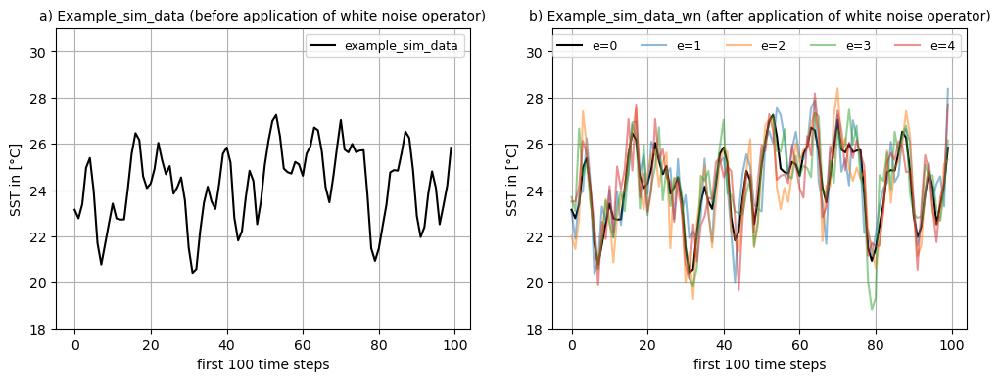
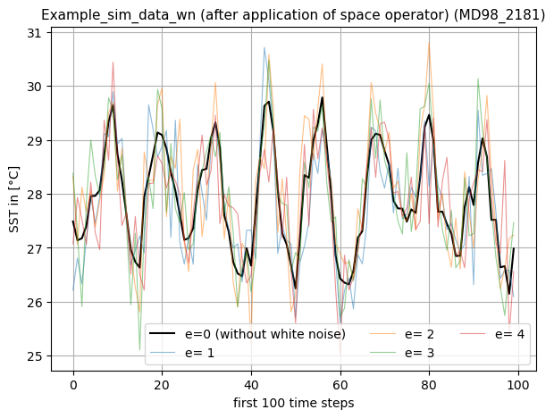
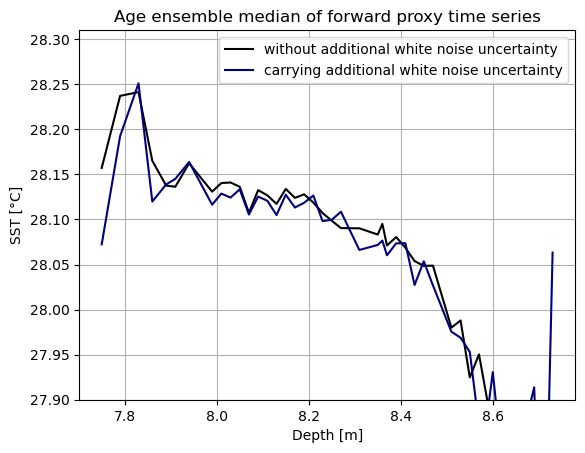
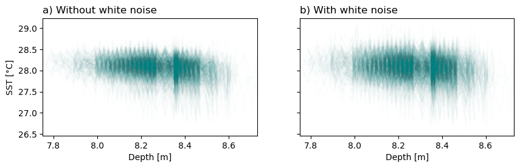

Tutorial 3: Noise perturbation
==============================

In this Tutorial 3, we will demonstrate the application of variable
operators in cupsm by exemplarily applying a white noise operator to
model simulation data (``sim_data``). Before you start, please make sure
you are familiar with the contents of Tutorial 1 “Getting Started” and
Tutorial 2 “Forward modelling of proxy time series”.

0. Preparations
~~~~~~~~~~~~~~~

For this Example, we can use the same simulation data that was used in
Tutorial 2, i.e. climate model output of a transient simulation of the
last deglaciation performed with MPI-ESM-CR-1.2 using the GLAC1D ice
sheet reconstruction as boundary conditions (see
`publication <https://agupubs.onlinelibrary.wiley.com/doi/10.1029/2021GL096767>`__
for more details). For instructions on downloading and regridding the
data please check Tutorial 2.

To access the data we need to set the path to the directory to which the
regridded simulation data was previously saved (see Tutorial 2):

.. code:: ipython3

    # define path
    sim_data_path = # path where the netcdf files of the simulation data are

As in Tutorial 2, we eventually want to create a forward proxy time
series from our simulation data. To do this, we set a path to the LiPD
files and the proxy overview table. The latter, was created in Tutorial
1 and contains the meta information of the LiPD files of the `PALMOD
130k marine palaeoclimate data synthesis
V1_0_1 <https://doi.org/10.1594/PANGAEA.914466>`__ dataset (see the
related
`publication <https://essd.copernicus.org/articles/12/1053/2020/>`__ and
refer to Tutorial 1 for download instructions).

.. code:: ipython3

    # define paths
    lipd_path =  # path to directory where LiPD files are 
    table_path =  # path where the overview table was stored in Tutorial 1

Next, we import the necessary packages.

.. code:: ipython3

    # import packages
    import pandas as pd
    import numpy as np
    import xarray as xr
    
    # import cupsm
    # since cupsm is only available on GitHub, 
    # you need to expand your python path variable 
    # to the code directory for this notbook session
    import sys
    sys.path.append('../') # here, it will be the parent direcory
    import cupsm
    # import a function from the tutorial code bits
    from tutorials.utilities_sst_example import transfer_timeaxis_deglac
    
    # import plotting packages
    import matplotlib
    import matplotlib.pyplot as plt

1. Initialize sim data and select a 1000 year time slice
~~~~~~~~~~~~~~~~~~~~~~~~~~~~~~~~~~~~~~~~~~~~~~~~~~~~~~~~

Applying what we have learned in Tutorial 2, we load the simulation data
using xarray’s ``open_mfdataset`` function, enabling parallelized file
opening via dask by setting the keyword ``parallel=True``.

.. code:: ipython3

    # Load deglaciation data
    sim_data = xr.open_mfdataset(f"{sim_data_path}*.nc", parallel=True, use_cftime=True,)

As before, we then select the sea surface temperature variable (``tos``)
and apply the transfer_timeaxis_deglac function to appropriately
transfer the time axis specifically for the data in our example. The
resulting time axis covers a time span from 25 to 0 kiloyears before
present (BP).

.. code:: ipython3

    # apply the time axis transformation and chose our variable `tos`
    sim_data = transfer_timeaxis_deglac(sim_data.tos)

For exploring the white noise operator, we choose a short section of the
``sim_data``.

.. code:: ipython3

    # select 1000 years of sim_data for our example #10-9 ka BP
    example_sim_data = sim_data.where(sim_data['time.year'].isin(np.arange(10000,9000,-1)), drop=True)
    example_sim_data

.. raw:: html

    
<svg style="position: absolute; width: 0; height: 0; overflow: hidden">
    <defs>
    <symbol id="icon-database" viewBox="0 0 32 32">
    <path d="M16 0c-8.837 0-16 2.239-16 5v4c0 2.761 7.163 5 16 5s16-2.239 16-5v-4c0-2.761-7.163-5-16-5z"></path>
    <path d="M16 17c-8.837 0-16-2.239-16-5v6c0 2.761 7.163 5 16 5s16-2.239 16-5v-6c0 2.761-7.163 5-16 5z"></path>
    <path d="M16 26c-8.837 0-16-2.239-16-5v6c0 2.761 7.163 5 16 5s16-2.239 16-5v-6c0 2.761-7.163 5-16 5z"></path>
    </symbol>
    <symbol id="icon-file-text2" viewBox="0 0 32 32">
    <path d="M28.681 7.159c-0.694-0.947-1.662-2.053-2.724-3.116s-2.169-2.030-3.116-2.724c-1.612-1.182-2.393-1.319-2.841-1.319h-15.5c-1.378 0-2.5 1.121-2.5 2.5v27c0 1.378 1.122 2.5 2.5 2.5h23c1.378 0 2.5-1.122 2.5-2.5v-19.5c0-0.448-0.137-1.23-1.319-2.841zM24.543 5.457c0.959 0.959 1.712 1.825 2.268 2.543h-4.811v-4.811c0.718 0.556 1.584 1.309 2.543 2.268zM28 29.5c0 0.271-0.229 0.5-0.5 0.5h-23c-0.271 0-0.5-0.229-0.5-0.5v-27c0-0.271 0.229-0.5 0.5-0.5 0 0 15.499-0 15.5 0v7c0 0.552 0.448 1 1 1h7v19.5z"></path>
    <path d="M23 26h-14c-0.552 0-1-0.448-1-1s0.448-1 1-1h14c0.552 0 1 0.448 1 1s-0.448 1-1 1z"></path>
    <path d="M23 22h-14c-0.552 0-1-0.448-1-1s0.448-1 1-1h14c0.552 0 1 0.448 1 1s-0.448 1-1 1z"></path>
    <path d="M23 18h-14c-0.552 0-1-0.448-1-1s0.448-1 1-1h14c0.552 0 1 0.448 1 1s-0.448 1-1 1z"></path>
    </symbol>
    </defs>
    </svg>
    <pre class='xr-text-repr-fallback'>&lt;xarray.DataArray &#x27;tos&#x27; (time: 12000, lat: 101, lon: 122)&gt;
    dask.array&lt;where, shape=(12000, 101, 122), dtype=float64, chunksize=(1200, 101, 122), chunktype=numpy.ndarray&gt;
    Coordinates:
      * lat      (lat) float64 -90.0 -88.2 -86.4 -84.6 -82.8 ... 84.6 86.4 88.2 90.0
      * lon      (lon) float64 -180.0 -177.0 -174.1 -171.1 ... 171.1 174.1 177.0
      * time     (time) object 10000-01-16 12:00:00 ... 9001-12-16 12:00:00</pre>

xarray.DataArray

'tos'
<ul class='xr-dim-list'><li>time: 12000</li><li>lat: 101</li><li>lon: 122</li></ul>
<ul class='xr-sections'><li class='xr-section-item'>
<input id='section-a8fbafd4-cbad-48c0-a280-1e298d04b32b' class='xr-array-in' type='checkbox' checked><label for='section-a8fbafd4-cbad-48c0-a280-1e298d04b32b' title='Show/hide data repr'><svg class='icon xr-icon-database'><use xlink:href='#icon-database'></use></svg></label>
dask.array&lt;chunksize=(1200, 101, 122), meta=np.ndarray&gt;

<table>
        <tr>
            <td>
                <table style="border-collapse: collapse;">
                    <thead>
                        <tr>
                            <td> </td>
                            <th> Array </th>
                            <th> Chunk </th>
                        </tr>
                    </thead>
                    <tbody>
    
                        <tr>
                            <th> Bytes </th>
                            <td> 1.10 GiB </td>
                            <td> 112.81 MiB </td>
                        </tr>
    
                        <tr>
                            <th> Shape </th>
                            <td> (12000, 101, 122) </td>
                            <td> (1200, 101, 122) </td>
                        </tr>
                        <tr>
                            <th> Dask graph </th>
                            <td colspan="2"> 10 chunks in 505 graph layers </td>
                        </tr>
                        <tr>
                            <th> Data type </th>
                            <td colspan="2"> float64 numpy.ndarray </td>
                        </tr>
                    </tbody>
                </table>
            </td>
            <td>
            <svg width="156" height="146" style="stroke:rgb(0,0,0);stroke-width:1" >
    
      <!-- Horizontal lines -->
      <line x1="10" y1="0" x2="80" y2="70" style="stroke-width:2" />
      <line x1="10" y1="25" x2="80" y2="96" style="stroke-width:2" />
    
      <!-- Vertical lines -->
      <line x1="10" y1="0" x2="10" y2="25" style="stroke-width:2" />
      <line x1="17" y1="7" x2="17" y2="32" />
      <line x1="24" y1="14" x2="24" y2="39" />
      <line x1="31" y1="21" x2="31" y2="46" />
      <line x1="38" y1="28" x2="38" y2="53" />
      <line x1="45" y1="35" x2="45" y2="60" />
      <line x1="52" y1="42" x2="52" y2="67" />
      <line x1="59" y1="49" x2="59" y2="74" />
      <line x1="66" y1="56" x2="66" y2="81" />
      <line x1="73" y1="63" x2="73" y2="88" />
      <line x1="80" y1="70" x2="80" y2="96" style="stroke-width:2" />
    
      <!-- Colored Rectangle -->
      <polygon points="10.0,0.0 80.58823529411765,70.58823529411765 80.58823529411765,96.00085180870013 10.0,25.412616514582485" style="fill:#ECB172A0;stroke-width:0"/>
    
      <!-- Horizontal lines -->
      <line x1="10" y1="0" x2="35" y2="0" style="stroke-width:2" />
      <line x1="17" y1="7" x2="42" y2="7" />
      <line x1="24" y1="14" x2="49" y2="14" />
      <line x1="31" y1="21" x2="56" y2="21" />
      <line x1="38" y1="28" x2="63" y2="28" />
      <line x1="45" y1="35" x2="70" y2="35" />
      <line x1="52" y1="42" x2="77" y2="42" />
      <line x1="59" y1="49" x2="84" y2="49" />
      <line x1="66" y1="56" x2="91" y2="56" />
      <line x1="73" y1="63" x2="99" y2="63" />
      <line x1="80" y1="70" x2="106" y2="70" style="stroke-width:2" />
    
      <!-- Vertical lines -->
      <line x1="10" y1="0" x2="80" y2="70" style="stroke-width:2" />
      <line x1="35" y1="0" x2="106" y2="70" style="stroke-width:2" />
    
      <!-- Colored Rectangle -->
      <polygon points="10.0,0.0 35.49193259461648,0.0 106.08016788873414,70.58823529411765 80.58823529411765,70.58823529411765" style="fill:#ECB172A0;stroke-width:0"/>
    
      <!-- Horizontal lines -->
      <line x1="80" y1="70" x2="106" y2="70" style="stroke-width:2" />
      <line x1="80" y1="96" x2="106" y2="96" style="stroke-width:2" />
    
      <!-- Vertical lines -->
      <line x1="80" y1="70" x2="80" y2="96" style="stroke-width:2" />
      <line x1="106" y1="70" x2="106" y2="96" style="stroke-width:2" />
    
      <!-- Colored Rectangle -->
      <polygon points="80.58823529411765,70.58823529411765 106.08016788873414,70.58823529411765 106.08016788873414,96.00085180870013 80.58823529411765,96.00085180870013" style="fill:#ECB172A0;stroke-width:0"/>
    
      <!-- Text -->
      <text x="93.334202" y="116.000852" font-size="1.0rem" font-weight="100" text-anchor="middle" >122</text>
      <text x="126.080168" y="83.294544" font-size="1.0rem" font-weight="100" text-anchor="middle" transform="rotate(-90,126.080168,83.294544)">101</text>
      <text x="35.294118" y="80.706734" font-size="1.0rem" font-weight="100" text-anchor="middle" transform="rotate(45,35.294118,80.706734)">12000</text>
    </svg>
            </td>
        </tr>
    </table>

</li><li class='xr-section-item'><input id='section-43eedfea-bb96-43cd-b2b6-582cae6a62b3' class='xr-section-summary-in' type='checkbox'  checked><label for='section-43eedfea-bb96-43cd-b2b6-582cae6a62b3' class='xr-section-summary' >Coordinates: (3)</label>

<ul class='xr-var-list'><li class='xr-var-item'>
lat

(lat)

float64

-90.0 -88.2 -86.4 ... 88.2 90.0
<input id='attrs-13e00b3e-bb0f-481c-9c5a-48aee183059d' class='xr-var-attrs-in' type='checkbox' disabled><label for='attrs-13e00b3e-bb0f-481c-9c5a-48aee183059d' title='Show/Hide attributes'><svg class='icon xr-icon-file-text2'><use xlink:href='#icon-file-text2'></use></svg></label><input id='data-27f3ba6a-e683-4b62-a381-62a3e33e1253' class='xr-var-data-in' type='checkbox'><label for='data-27f3ba6a-e683-4b62-a381-62a3e33e1253' title='Show/Hide data repr'><svg class='icon xr-icon-database'><use xlink:href='#icon-database'></use></svg></label>
<dl class='xr-attrs'></dl>

<pre>array([-90. , -88.2, -86.4, -84.6, -82.8, -81. , -79.2, -77.4, -75.6, -73.8,
           -72. , -70.2, -68.4, -66.6, -64.8, -63. , -61.2, -59.4, -57.6, -55.8,
           -54. , -52.2, -50.4, -48.6, -46.8, -45. , -43.2, -41.4, -39.6, -37.8,
           -36. , -34.2, -32.4, -30.6, -28.8, -27. , -25.2, -23.4, -21.6, -19.8,
           -18. , -16.2, -14.4, -12.6, -10.8,  -9. ,  -7.2,  -5.4,  -3.6,  -1.8,
             0. ,   1.8,   3.6,   5.4,   7.2,   9. ,  10.8,  12.6,  14.4,  16.2,
            18. ,  19.8,  21.6,  23.4,  25.2,  27. ,  28.8,  30.6,  32.4,  34.2,
            36. ,  37.8,  39.6,  41.4,  43.2,  45. ,  46.8,  48.6,  50.4,  52.2,
            54. ,  55.8,  57.6,  59.4,  61.2,  63. ,  64.8,  66.6,  68.4,  70.2,
            72. ,  73.8,  75.6,  77.4,  79.2,  81. ,  82.8,  84.6,  86.4,  88.2,
            90. ])</pre>
</li><li class='xr-var-item'>
lon

(lon)

float64

-180.0 -177.0 ... 174.1 177.0
<input id='attrs-4b4b4961-1a82-4608-885b-88cb171177e6' class='xr-var-attrs-in' type='checkbox' disabled><label for='attrs-4b4b4961-1a82-4608-885b-88cb171177e6' title='Show/Hide attributes'><svg class='icon xr-icon-file-text2'><use xlink:href='#icon-file-text2'></use></svg></label><input id='data-bb20ae93-1333-4fc5-bc11-fbef0562c82d' class='xr-var-data-in' type='checkbox'><label for='data-bb20ae93-1333-4fc5-bc11-fbef0562c82d' title='Show/Hide data repr'><svg class='icon xr-icon-database'><use xlink:href='#icon-database'></use></svg></label>
<dl class='xr-attrs'></dl>

<pre>array([-180.      , -177.04918 , -174.098361, -171.147541, -168.196721,
           -165.245902, -162.295082, -159.344262, -156.393443, -153.442623,
           -150.491803, -147.540984, -144.590164, -141.639344, -138.688525,
           -135.737705, -132.786885, -129.836066, -126.885246, -123.934426,
           -120.983607, -118.032787, -115.081967, -112.131148, -109.180328,
           -106.229508, -103.278689, -100.327869,  -97.377049,  -94.42623 ,
            -91.47541 ,  -88.52459 ,  -85.57377 ,  -82.622951,  -79.672131,
            -76.721311,  -73.770492,  -70.819672,  -67.868852,  -64.918033,
            -61.967213,  -59.016393,  -56.065574,  -53.114754,  -50.163934,
            -47.213115,  -44.262295,  -41.311475,  -38.360656,  -35.409836,
            -32.459016,  -29.508197,  -26.557377,  -23.606557,  -20.655738,
            -17.704918,  -14.754098,  -11.803279,   -8.852459,   -5.901639,
             -2.95082 ,    0.      ,    2.95082 ,    5.901639,    8.852459,
             11.803279,   14.754098,   17.704918,   20.655738,   23.606557,
             26.557377,   29.508197,   32.459016,   35.409836,   38.360656,
             41.311475,   44.262295,   47.213115,   50.163934,   53.114754,
             56.065574,   59.016393,   61.967213,   64.918033,   67.868852,
             70.819672,   73.770492,   76.721311,   79.672131,   82.622951,
             85.57377 ,   88.52459 ,   91.47541 ,   94.42623 ,   97.377049,
            100.327869,  103.278689,  106.229508,  109.180328,  112.131148,
            115.081967,  118.032787,  120.983607,  123.934426,  126.885246,
            129.836066,  132.786885,  135.737705,  138.688525,  141.639344,
            144.590164,  147.540984,  150.491803,  153.442623,  156.393443,
            159.344262,  162.295082,  165.245902,  168.196721,  171.147541,
            174.098361,  177.04918 ])</pre>
</li><li class='xr-var-item'>
time

(time)

object

10000-01-16 12:00:00 ... 9001-12...
<input id='attrs-90b4d1d5-3ff8-4e13-81ae-e398291cc6f0' class='xr-var-attrs-in' type='checkbox' disabled><label for='attrs-90b4d1d5-3ff8-4e13-81ae-e398291cc6f0' title='Show/Hide attributes'><svg class='icon xr-icon-file-text2'><use xlink:href='#icon-file-text2'></use></svg></label><input id='data-207453f3-2322-4ee5-90d4-4173b5ab5aee' class='xr-var-data-in' type='checkbox'><label for='data-207453f3-2322-4ee5-90d4-4173b5ab5aee' title='Show/Hide data repr'><svg class='icon xr-icon-database'><use xlink:href='#icon-database'></use></svg></label>
<dl class='xr-attrs'></dl>

<pre>array([cftime.DatetimeProlepticGregorian(10000, 1, 16, 12, 0, 0, 0, has_year_zero=True),
           cftime.DatetimeProlepticGregorian(10000, 2, 15, 0, 0, 0, 0, has_year_zero=True),
           cftime.DatetimeProlepticGregorian(10000, 3, 16, 12, 0, 0, 0, has_year_zero=True),
           ...,
           cftime.DatetimeProlepticGregorian(9001, 10, 16, 12, 0, 0, 0, has_year_zero=True),
           cftime.DatetimeProlepticGregorian(9001, 11, 16, 0, 0, 0, 0, has_year_zero=True),
           cftime.DatetimeProlepticGregorian(9001, 12, 16, 12, 0, 0, 0, has_year_zero=True)],
          dtype=object)</pre>
</li></ul>
</li><li class='xr-section-item'><input id='section-9557d963-0917-4280-b80a-756ed3c76e00' class='xr-section-summary-in' type='checkbox'  ><label for='section-9557d963-0917-4280-b80a-756ed3c76e00' class='xr-section-summary' >Indexes: (3)</label>

<ul class='xr-var-list'><li class='xr-var-item'>

lat

PandasIndex

<input id='index-0828fdf8-29c7-4d55-8112-23be891503ee' class='xr-index-data-in' type='checkbox'/><label for='index-0828fdf8-29c7-4d55-8112-23be891503ee' title='Show/Hide index repr'><svg class='icon xr-icon-database'><use xlink:href='#icon-database'></use></svg></label>
<pre>PandasIndex(Index([            -90.0,             -88.2,             -86.4,
                       -84.6,             -82.8,             -81.0,
                       -79.2,             -77.4,             -75.6,
                       -73.8,
           ...
           73.80000000000001,              75.6,              77.4,
           79.20000000000002,              81.0, 82.80000000000001,
                        84.6,              86.4, 88.20000000000002,
                        90.0],
          dtype=&#x27;float64&#x27;, name=&#x27;lat&#x27;, length=101))</pre>
</li><li class='xr-var-item'>

lon

PandasIndex

<input id='index-3da6d0e9-fb48-4056-94fe-c1cd1330fa44' class='xr-index-data-in' type='checkbox'/><label for='index-3da6d0e9-fb48-4056-94fe-c1cd1330fa44' title='Show/Hide index repr'><svg class='icon xr-icon-database'><use xlink:href='#icon-database'></use></svg></label>
<pre>PandasIndex(Index([             -180.0, -177.04918032786884,  -174.0983606557377,
           -171.14754098360655, -168.19672131147541, -165.24590163934425,
           -162.29508196721312, -159.34426229508196, -156.39344262295083,
           -153.44262295081967,
           ...
            150.49180327868856,  153.44262295081967,  156.39344262295083,
              159.344262295082,  162.29508196721315,  165.24590163934425,
            168.19672131147541,  171.14754098360658,  174.09836065573774,
             177.0491803278689],
          dtype=&#x27;float64&#x27;, name=&#x27;lon&#x27;, length=122))</pre>
</li><li class='xr-var-item'>

time

PandasIndex

<input id='index-7494ba08-38f6-4bb9-bdba-17ccdac5f988' class='xr-index-data-in' type='checkbox'/><label for='index-7494ba08-38f6-4bb9-bdba-17ccdac5f988' title='Show/Hide index repr'><svg class='icon xr-icon-database'><use xlink:href='#icon-database'></use></svg></label>
<pre>PandasIndex(CFTimeIndex([10000-01-16 12:00:00, 10000-02-15 00:00:00, 10000-03-16 12:00:00,
                 10000-04-16 00:00:00, 10000-05-16 12:00:00, 10000-06-16 00:00:00,
                 10000-07-16 12:00:00, 10000-08-16 12:00:00, 10000-09-16 00:00:00,
                 10000-10-16 12:00:00,
                 ...
                 9001-03-16 12:00:00, 9001-04-16 00:00:00, 9001-05-16 12:00:00,
                 9001-06-16 00:00:00, 9001-07-16 12:00:00, 9001-08-16 12:00:00,
                 9001-09-16 00:00:00, 9001-10-16 12:00:00, 9001-11-16 00:00:00,
                 9001-12-16 12:00:00],
                dtype=&#x27;object&#x27;,
                length=12000,
                calendar=&#x27;proleptic_gregorian&#x27;,
                freq=&#x27;None&#x27;))</pre>
</li></ul>
</li><li class='xr-section-item'><input id='section-29ca4ca0-7a67-4963-9f89-140b8a796010' class='xr-section-summary-in' type='checkbox' disabled ><label for='section-29ca4ca0-7a67-4963-9f89-140b8a796010' class='xr-section-summary'  title='Expand/collapse section'>Attributes: (0)</label>

<dl class='xr-attrs'></dl>
</li></ul>

2. Adding white noise to the ``sim_data``
~~~~~~~~~~~~~~~~~~~~~~~~~~~~~~~~~~~~~~~~~

By applying variable operators in cupsm, new ensemble members can be
generated: The white noise operator (``cupsm.white_noise``) does this by
first creating the noise in question and then adding it to the original
input data, saving the result as a new ensemble member. A chosen number
of new ensemble members can be generated.

Here we will exemplarily apply cupsm.white_noise to our
example_sim_data. By setting ``num_ensemble=4``, we request four new
ensemble members to be generated.

.. code:: ipython3

    cupsm.white_noise?

.. parsed-literal::

    Signature: cupsm.white_noise(sim_data, num_ensemble, mu=0, sigma=1)
    Docstring:
    Creates white noise by filling an array in shape of the input data with randomly drawn values from a normal (Gaussian) distribution. 
    Adds this white noise to the input data and saves the result as a new (white noise) ensemble member. 
    Multiple new ensemble members can be created. The original input data is kept as the first ensemble member. 
    The result is returned as a xarray Dataarray.
    
    Parameters:
    ------------------------------
    :sim_data:       xarray Datarray; input data (e.g. simulation data)
    :num_ensemble:   integer; number of additional white noise ensemble members to be created.
    :mu:             float; mean of the normal distribution. Default is mu=0.
    :sigma:          float; standard deviation of the normal distribution. Default is sigma=1.
    File:      ~/Code/Python/cupsm/cupsm/variable_operators.py
    Type:      function

.. code:: ipython3

    # create 4 new noisy ensemble members for sim_data by adding white noise
    example_sim_data_wn=cupsm.white_noise(example_sim_data,num_ensemble=4) 
    example_sim_data_wn

.. raw:: html

    
<svg style="position: absolute; width: 0; height: 0; overflow: hidden">
    <defs>
    <symbol id="icon-database" viewBox="0 0 32 32">
    <path d="M16 0c-8.837 0-16 2.239-16 5v4c0 2.761 7.163 5 16 5s16-2.239 16-5v-4c0-2.761-7.163-5-16-5z"></path>
    <path d="M16 17c-8.837 0-16-2.239-16-5v6c0 2.761 7.163 5 16 5s16-2.239 16-5v-6c0 2.761-7.163 5-16 5z"></path>
    <path d="M16 26c-8.837 0-16-2.239-16-5v6c0 2.761 7.163 5 16 5s16-2.239 16-5v-6c0 2.761-7.163 5-16 5z"></path>
    </symbol>
    <symbol id="icon-file-text2" viewBox="0 0 32 32">
    <path d="M28.681 7.159c-0.694-0.947-1.662-2.053-2.724-3.116s-2.169-2.030-3.116-2.724c-1.612-1.182-2.393-1.319-2.841-1.319h-15.5c-1.378 0-2.5 1.121-2.5 2.5v27c0 1.378 1.122 2.5 2.5 2.5h23c1.378 0 2.5-1.122 2.5-2.5v-19.5c0-0.448-0.137-1.23-1.319-2.841zM24.543 5.457c0.959 0.959 1.712 1.825 2.268 2.543h-4.811v-4.811c0.718 0.556 1.584 1.309 2.543 2.268zM28 29.5c0 0.271-0.229 0.5-0.5 0.5h-23c-0.271 0-0.5-0.229-0.5-0.5v-27c0-0.271 0.229-0.5 0.5-0.5 0 0 15.499-0 15.5 0v7c0 0.552 0.448 1 1 1h7v19.5z"></path>
    <path d="M23 26h-14c-0.552 0-1-0.448-1-1s0.448-1 1-1h14c0.552 0 1 0.448 1 1s-0.448 1-1 1z"></path>
    <path d="M23 22h-14c-0.552 0-1-0.448-1-1s0.448-1 1-1h14c0.552 0 1 0.448 1 1s-0.448 1-1 1z"></path>
    <path d="M23 18h-14c-0.552 0-1-0.448-1-1s0.448-1 1-1h14c0.552 0 1 0.448 1 1s-0.448 1-1 1z"></path>
    </symbol>
    </defs>
    </svg>
    <pre class='xr-text-repr-fallback'>&lt;xarray.DataArray &#x27;tos&#x27; (ensemble_member: 5, time: 12000, lat: 101, lon: 122)&gt;
    dask.array&lt;setitem, shape=(5, 12000, 101, 122), dtype=float64, chunksize=(1, 1200, 101, 122), chunktype=numpy.ndarray&gt;
    Coordinates:
      * lat              (lat) float64 -90.0 -88.2 -86.4 -84.6 ... 86.4 88.2 90.0
      * lon              (lon) float64 -180.0 -177.0 -174.1 ... 171.1 174.1 177.0
      * time             (time) object 10000-01-16 12:00:00 ... 9001-12-16 12:00:00
      * ensemble_member  (ensemble_member) int64 0 1 2 3 4</pre>

xarray.DataArray

'tos'
<ul class='xr-dim-list'><li>ensemble_member: 5</li><li>time: 12000</li><li>lat: 101</li><li>lon: 122</li></ul>
<ul class='xr-sections'><li class='xr-section-item'>
<input id='section-0e0aca8c-a25f-45fd-8e52-55359db6572d' class='xr-array-in' type='checkbox' checked><label for='section-0e0aca8c-a25f-45fd-8e52-55359db6572d' title='Show/hide data repr'><svg class='icon xr-icon-database'><use xlink:href='#icon-database'></use></svg></label>
dask.array&lt;chunksize=(1, 1200, 101, 122), meta=np.ndarray&gt;

<table>
        <tr>
            <td>
                <table style="border-collapse: collapse;">
                    <thead>
                        <tr>
                            <td> </td>
                            <th> Array </th>
                            <th> Chunk </th>
                        </tr>
                    </thead>
                    <tbody>
    
                        <tr>
                            <th> Bytes </th>
                            <td> 5.51 GiB </td>
                            <td> 112.81 MiB </td>
                        </tr>
    
                        <tr>
                            <th> Shape </th>
                            <td> (5, 12000, 101, 122) </td>
                            <td> (1, 1200, 101, 122) </td>
                        </tr>
                        <tr>
                            <th> Dask graph </th>
                            <td colspan="2"> 50 chunks in 511 graph layers </td>
                        </tr>
                        <tr>
                            <th> Data type </th>
                            <td colspan="2"> float64 numpy.ndarray </td>
                        </tr>
                    </tbody>
                </table>
            </td>
            <td>
            <svg width="336" height="146" style="stroke:rgb(0,0,0);stroke-width:1" >
    
      <!-- Horizontal lines -->
      <line x1="0" y1="0" x2="25" y2="0" style="stroke-width:2" />
      <line x1="0" y1="25" x2="25" y2="25" style="stroke-width:2" />
    
      <!-- Vertical lines -->
      <line x1="0" y1="0" x2="0" y2="25" style="stroke-width:2" />
      <line x1="5" y1="0" x2="5" y2="25" />
      <line x1="10" y1="0" x2="10" y2="25" />
      <line x1="15" y1="0" x2="15" y2="25" />
      <line x1="20" y1="0" x2="20" y2="25" />
      <line x1="25" y1="0" x2="25" y2="25" style="stroke-width:2" />
    
      <!-- Colored Rectangle -->
      <polygon points="0.0,0.0 25.412616514582485,0.0 25.412616514582485,25.412616514582485 0.0,25.412616514582485" style="fill:#ECB172A0;stroke-width:0"/>
    
      <!-- Text -->
      <text x="12.706308" y="45.412617" font-size="1.0rem" font-weight="100" text-anchor="middle" >5</text>
      <text x="45.412617" y="12.706308" font-size="1.0rem" font-weight="100" text-anchor="middle" transform="rotate(0,45.412617,12.706308)">1</text>
    
    
      <!-- Horizontal lines -->
      <line x1="95" y1="0" x2="165" y2="70" style="stroke-width:2" />
      <line x1="95" y1="25" x2="165" y2="96" style="stroke-width:2" />
    
      <!-- Vertical lines -->
      <line x1="95" y1="0" x2="95" y2="25" style="stroke-width:2" />
      <line x1="102" y1="7" x2="102" y2="32" />
      <line x1="109" y1="14" x2="109" y2="39" />
      <line x1="116" y1="21" x2="116" y2="46" />
      <line x1="123" y1="28" x2="123" y2="53" />
      <line x1="130" y1="35" x2="130" y2="60" />
      <line x1="137" y1="42" x2="137" y2="67" />
      <line x1="144" y1="49" x2="144" y2="74" />
      <line x1="151" y1="56" x2="151" y2="81" />
      <line x1="158" y1="63" x2="158" y2="88" />
      <line x1="165" y1="70" x2="165" y2="96" style="stroke-width:2" />
    
      <!-- Colored Rectangle -->
      <polygon points="95.0,0.0 165.58823529411765,70.58823529411765 165.58823529411765,96.00085180870013 95.0,25.412616514582485" style="fill:#ECB172A0;stroke-width:0"/>
    
      <!-- Horizontal lines -->
      <line x1="95" y1="0" x2="120" y2="0" style="stroke-width:2" />
      <line x1="102" y1="7" x2="127" y2="7" />
      <line x1="109" y1="14" x2="134" y2="14" />
      <line x1="116" y1="21" x2="141" y2="21" />
      <line x1="123" y1="28" x2="148" y2="28" />
      <line x1="130" y1="35" x2="155" y2="35" />
      <line x1="137" y1="42" x2="162" y2="42" />
      <line x1="144" y1="49" x2="169" y2="49" />
      <line x1="151" y1="56" x2="176" y2="56" />
      <line x1="158" y1="63" x2="184" y2="63" />
      <line x1="165" y1="70" x2="191" y2="70" style="stroke-width:2" />
    
      <!-- Vertical lines -->
      <line x1="95" y1="0" x2="165" y2="70" style="stroke-width:2" />
      <line x1="120" y1="0" x2="191" y2="70" style="stroke-width:2" />
    
      <!-- Colored Rectangle -->
      <polygon points="95.0,0.0 120.49193259461649,0.0 191.08016788873414,70.58823529411765 165.58823529411765,70.58823529411765" style="fill:#ECB172A0;stroke-width:0"/>
    
      <!-- Horizontal lines -->
      <line x1="165" y1="70" x2="191" y2="70" style="stroke-width:2" />
      <line x1="165" y1="96" x2="191" y2="96" style="stroke-width:2" />
    
      <!-- Vertical lines -->
      <line x1="165" y1="70" x2="165" y2="96" style="stroke-width:2" />
      <line x1="191" y1="70" x2="191" y2="96" style="stroke-width:2" />
    
      <!-- Colored Rectangle -->
      <polygon points="165.58823529411765,70.58823529411765 191.08016788873414,70.58823529411765 191.08016788873414,96.00085180870013 165.58823529411765,96.00085180870013" style="fill:#ECB172A0;stroke-width:0"/>
    
      <!-- Text -->
      <text x="178.334202" y="116.000852" font-size="1.0rem" font-weight="100" text-anchor="middle" >122</text>
      <text x="211.080168" y="83.294544" font-size="1.0rem" font-weight="100" text-anchor="middle" transform="rotate(-90,211.080168,83.294544)">101</text>
      <text x="120.294118" y="80.706734" font-size="1.0rem" font-weight="100" text-anchor="middle" transform="rotate(45,120.294118,80.706734)">12000</text>
    </svg>
            </td>
        </tr>
    </table>

</li><li class='xr-section-item'><input id='section-30f23842-1ce7-45c2-8230-1f51c4fcf44d' class='xr-section-summary-in' type='checkbox'  checked><label for='section-30f23842-1ce7-45c2-8230-1f51c4fcf44d' class='xr-section-summary' >Coordinates: (4)</label>

<ul class='xr-var-list'><li class='xr-var-item'>
lat

(lat)

float64

-90.0 -88.2 -86.4 ... 88.2 90.0
<input id='attrs-6dece48a-5eb8-45c3-8db4-6cf53ce72af4' class='xr-var-attrs-in' type='checkbox' disabled><label for='attrs-6dece48a-5eb8-45c3-8db4-6cf53ce72af4' title='Show/Hide attributes'><svg class='icon xr-icon-file-text2'><use xlink:href='#icon-file-text2'></use></svg></label><input id='data-19f4db1d-5301-4e94-982c-5ebec68d64fb' class='xr-var-data-in' type='checkbox'><label for='data-19f4db1d-5301-4e94-982c-5ebec68d64fb' title='Show/Hide data repr'><svg class='icon xr-icon-database'><use xlink:href='#icon-database'></use></svg></label>
<dl class='xr-attrs'></dl>

<pre>array([-90. , -88.2, -86.4, -84.6, -82.8, -81. , -79.2, -77.4, -75.6, -73.8,
           -72. , -70.2, -68.4, -66.6, -64.8, -63. , -61.2, -59.4, -57.6, -55.8,
           -54. , -52.2, -50.4, -48.6, -46.8, -45. , -43.2, -41.4, -39.6, -37.8,
           -36. , -34.2, -32.4, -30.6, -28.8, -27. , -25.2, -23.4, -21.6, -19.8,
           -18. , -16.2, -14.4, -12.6, -10.8,  -9. ,  -7.2,  -5.4,  -3.6,  -1.8,
             0. ,   1.8,   3.6,   5.4,   7.2,   9. ,  10.8,  12.6,  14.4,  16.2,
            18. ,  19.8,  21.6,  23.4,  25.2,  27. ,  28.8,  30.6,  32.4,  34.2,
            36. ,  37.8,  39.6,  41.4,  43.2,  45. ,  46.8,  48.6,  50.4,  52.2,
            54. ,  55.8,  57.6,  59.4,  61.2,  63. ,  64.8,  66.6,  68.4,  70.2,
            72. ,  73.8,  75.6,  77.4,  79.2,  81. ,  82.8,  84.6,  86.4,  88.2,
            90. ])</pre>
</li><li class='xr-var-item'>
lon

(lon)

float64

-180.0 -177.0 ... 174.1 177.0
<input id='attrs-96f5cbc1-ab4a-43c1-8a75-cdb9c7ffc21f' class='xr-var-attrs-in' type='checkbox' disabled><label for='attrs-96f5cbc1-ab4a-43c1-8a75-cdb9c7ffc21f' title='Show/Hide attributes'><svg class='icon xr-icon-file-text2'><use xlink:href='#icon-file-text2'></use></svg></label><input id='data-51186d76-0e42-4d7a-b33b-5f03c7c72972' class='xr-var-data-in' type='checkbox'><label for='data-51186d76-0e42-4d7a-b33b-5f03c7c72972' title='Show/Hide data repr'><svg class='icon xr-icon-database'><use xlink:href='#icon-database'></use></svg></label>
<dl class='xr-attrs'></dl>

<pre>array([-180.      , -177.04918 , -174.098361, -171.147541, -168.196721,
           -165.245902, -162.295082, -159.344262, -156.393443, -153.442623,
           -150.491803, -147.540984, -144.590164, -141.639344, -138.688525,
           -135.737705, -132.786885, -129.836066, -126.885246, -123.934426,
           -120.983607, -118.032787, -115.081967, -112.131148, -109.180328,
           -106.229508, -103.278689, -100.327869,  -97.377049,  -94.42623 ,
            -91.47541 ,  -88.52459 ,  -85.57377 ,  -82.622951,  -79.672131,
            -76.721311,  -73.770492,  -70.819672,  -67.868852,  -64.918033,
            -61.967213,  -59.016393,  -56.065574,  -53.114754,  -50.163934,
            -47.213115,  -44.262295,  -41.311475,  -38.360656,  -35.409836,
            -32.459016,  -29.508197,  -26.557377,  -23.606557,  -20.655738,
            -17.704918,  -14.754098,  -11.803279,   -8.852459,   -5.901639,
             -2.95082 ,    0.      ,    2.95082 ,    5.901639,    8.852459,
             11.803279,   14.754098,   17.704918,   20.655738,   23.606557,
             26.557377,   29.508197,   32.459016,   35.409836,   38.360656,
             41.311475,   44.262295,   47.213115,   50.163934,   53.114754,
             56.065574,   59.016393,   61.967213,   64.918033,   67.868852,
             70.819672,   73.770492,   76.721311,   79.672131,   82.622951,
             85.57377 ,   88.52459 ,   91.47541 ,   94.42623 ,   97.377049,
            100.327869,  103.278689,  106.229508,  109.180328,  112.131148,
            115.081967,  118.032787,  120.983607,  123.934426,  126.885246,
            129.836066,  132.786885,  135.737705,  138.688525,  141.639344,
            144.590164,  147.540984,  150.491803,  153.442623,  156.393443,
            159.344262,  162.295082,  165.245902,  168.196721,  171.147541,
            174.098361,  177.04918 ])</pre>
</li><li class='xr-var-item'>
time

(time)

object

10000-01-16 12:00:00 ... 9001-12...
<input id='attrs-e175e560-0a1b-4c7b-8b59-8d7d7f586f75' class='xr-var-attrs-in' type='checkbox' disabled><label for='attrs-e175e560-0a1b-4c7b-8b59-8d7d7f586f75' title='Show/Hide attributes'><svg class='icon xr-icon-file-text2'><use xlink:href='#icon-file-text2'></use></svg></label><input id='data-8ce8b53c-e701-471e-8061-702b8083a512' class='xr-var-data-in' type='checkbox'><label for='data-8ce8b53c-e701-471e-8061-702b8083a512' title='Show/Hide data repr'><svg class='icon xr-icon-database'><use xlink:href='#icon-database'></use></svg></label>
<dl class='xr-attrs'></dl>

<pre>array([cftime.DatetimeProlepticGregorian(10000, 1, 16, 12, 0, 0, 0, has_year_zero=True),
           cftime.DatetimeProlepticGregorian(10000, 2, 15, 0, 0, 0, 0, has_year_zero=True),
           cftime.DatetimeProlepticGregorian(10000, 3, 16, 12, 0, 0, 0, has_year_zero=True),
           ...,
           cftime.DatetimeProlepticGregorian(9001, 10, 16, 12, 0, 0, 0, has_year_zero=True),
           cftime.DatetimeProlepticGregorian(9001, 11, 16, 0, 0, 0, 0, has_year_zero=True),
           cftime.DatetimeProlepticGregorian(9001, 12, 16, 12, 0, 0, 0, has_year_zero=True)],
          dtype=object)</pre>
</li><li class='xr-var-item'>
ensemble_member

(ensemble_member)

int64

0 1 2 3 4
<input id='attrs-efa69d79-da7a-4643-995f-d32a85006926' class='xr-var-attrs-in' type='checkbox' disabled><label for='attrs-efa69d79-da7a-4643-995f-d32a85006926' title='Show/Hide attributes'><svg class='icon xr-icon-file-text2'><use xlink:href='#icon-file-text2'></use></svg></label><input id='data-b02814e8-ba27-4e71-8ee7-8affac0efe7b' class='xr-var-data-in' type='checkbox'><label for='data-b02814e8-ba27-4e71-8ee7-8affac0efe7b' title='Show/Hide data repr'><svg class='icon xr-icon-database'><use xlink:href='#icon-database'></use></svg></label>
<dl class='xr-attrs'></dl>

<pre>array([0, 1, 2, 3, 4])</pre>
</li></ul>
</li><li class='xr-section-item'><input id='section-abb68e37-fb8b-4216-9412-293b16583d52' class='xr-section-summary-in' type='checkbox'  ><label for='section-abb68e37-fb8b-4216-9412-293b16583d52' class='xr-section-summary' >Indexes: (4)</label>

<ul class='xr-var-list'><li class='xr-var-item'>

lat

PandasIndex

<input id='index-bb8f7d7b-3cf4-42d5-bd27-a4016d7c8941' class='xr-index-data-in' type='checkbox'/><label for='index-bb8f7d7b-3cf4-42d5-bd27-a4016d7c8941' title='Show/Hide index repr'><svg class='icon xr-icon-database'><use xlink:href='#icon-database'></use></svg></label>
<pre>PandasIndex(Index([            -90.0,             -88.2,             -86.4,
                       -84.6,             -82.8,             -81.0,
                       -79.2,             -77.4,             -75.6,
                       -73.8,
           ...
           73.80000000000001,              75.6,              77.4,
           79.20000000000002,              81.0, 82.80000000000001,
                        84.6,              86.4, 88.20000000000002,
                        90.0],
          dtype=&#x27;float64&#x27;, name=&#x27;lat&#x27;, length=101))</pre>
</li><li class='xr-var-item'>

lon

PandasIndex

<input id='index-c39266c7-43e1-4cdd-8960-f352940ff425' class='xr-index-data-in' type='checkbox'/><label for='index-c39266c7-43e1-4cdd-8960-f352940ff425' title='Show/Hide index repr'><svg class='icon xr-icon-database'><use xlink:href='#icon-database'></use></svg></label>
<pre>PandasIndex(Index([             -180.0, -177.04918032786884,  -174.0983606557377,
           -171.14754098360655, -168.19672131147541, -165.24590163934425,
           -162.29508196721312, -159.34426229508196, -156.39344262295083,
           -153.44262295081967,
           ...
            150.49180327868856,  153.44262295081967,  156.39344262295083,
              159.344262295082,  162.29508196721315,  165.24590163934425,
            168.19672131147541,  171.14754098360658,  174.09836065573774,
             177.0491803278689],
          dtype=&#x27;float64&#x27;, name=&#x27;lon&#x27;, length=122))</pre>
</li><li class='xr-var-item'>

time

PandasIndex

<input id='index-cb31bc38-746e-4a86-b945-87712658e412' class='xr-index-data-in' type='checkbox'/><label for='index-cb31bc38-746e-4a86-b945-87712658e412' title='Show/Hide index repr'><svg class='icon xr-icon-database'><use xlink:href='#icon-database'></use></svg></label>
<pre>PandasIndex(CFTimeIndex([10000-01-16 12:00:00, 10000-02-15 00:00:00, 10000-03-16 12:00:00,
                 10000-04-16 00:00:00, 10000-05-16 12:00:00, 10000-06-16 00:00:00,
                 10000-07-16 12:00:00, 10000-08-16 12:00:00, 10000-09-16 00:00:00,
                 10000-10-16 12:00:00,
                 ...
                 9001-03-16 12:00:00, 9001-04-16 00:00:00, 9001-05-16 12:00:00,
                 9001-06-16 00:00:00, 9001-07-16 12:00:00, 9001-08-16 12:00:00,
                 9001-09-16 00:00:00, 9001-10-16 12:00:00, 9001-11-16 00:00:00,
                 9001-12-16 12:00:00],
                dtype=&#x27;object&#x27;,
                length=12000,
                calendar=&#x27;proleptic_gregorian&#x27;,
                freq=&#x27;None&#x27;))</pre>
</li><li class='xr-var-item'>

ensemble_member

PandasIndex

<input id='index-454aceb7-2164-439c-93d0-ff8bd69f20f9' class='xr-index-data-in' type='checkbox'/><label for='index-454aceb7-2164-439c-93d0-ff8bd69f20f9' title='Show/Hide index repr'><svg class='icon xr-icon-database'><use xlink:href='#icon-database'></use></svg></label>
<pre>PandasIndex(RangeIndex(start=0, stop=5, step=1, name=&#x27;ensemble_member&#x27;))</pre>
</li></ul>
</li><li class='xr-section-item'><input id='section-a9dccf4e-1745-4afb-9ff5-69f32fc04bfa' class='xr-section-summary-in' type='checkbox' disabled ><label for='section-a9dccf4e-1745-4afb-9ff5-69f32fc04bfa' class='xr-section-summary'  title='Expand/collapse section'>Attributes: (0)</label>

<dl class='xr-attrs'></dl>
</li></ul>

Note that after the application of the white noise operator, a new
dimension ``ensemble_member`` was created. The output array now contains
five ensemble members - four newly created noisy ones and the original
``example_sim_data``, which is kept as the first ensemble member.

Let’s visualize the difference between ``example_sim_data`` and
``example_sim_data_wn`` (with ensemble members e) by plotting their tos
variable side by side for the first 100 steps (months) of the time axis
(starting at 10000 years BP) for an arbitrary chosen location (here at
latitude 0°N and longitude 0°E).

.. code:: ipython3

    # Plot 
    lat_ind=50; lon_ind=61
    print(f"Location: "+str(example_sim_data.lat.values[lat_ind])+" °N, "+str(example_sim_data.lon.values[lon_ind])+" °E")
    fig=plt.figure(figsize=(12,4))
    plt.subplot(1,2,1)
    plt.title("a) Example_sim_data (before application of white noise operator)",fontsize=10)
    plt.plot(example_sim_data[0:100,lat_ind,lon_ind],color="black",label="example_sim_data")
    plt.ylim(18,31);plt.grid();plt.legend(fontsize=9)
    plt.xlabel("first 100 time steps"), plt.ylabel("SST in [°C]")
    plt.subplot(1,2,2)
    plt.title("b) Example_sim_data_wn (after application of white noise operator)",fontsize=10)
    plt.plot(example_sim_data_wn[0,0:100,lat_ind,lon_ind],color="black",label="e=0")
    for e in range(1,5):
        plt.plot(example_sim_data_wn[e,0:100,lat_ind,lon_ind],alpha=0.5,label="e="+str(e))
    plt.grid();plt.ylim(18,31);plt.legend(fontsize=9,ncol=5)
    plt.xlabel("first 100 time steps");plt.ylabel("SST in [°C]")
    plt.show()

.. parsed-literal::

    Location: 0.0 °N, 0.0 °E

2. Initialize example site and its target
-----------------------------------------

For this example, we will again select an example site from our list of
LiPD sites (see Tutorial 1). Let’s use ``cupsm.get_records_df`` to load
the overview table and print the metadata of the selected site
``MD98_2181.lpd``.

.. code:: ipython3

    # load the overview table
    proxy_overview_table = cupsm.create_proxy_info(database_path=lipd_path, save_path=table_path)
    # create site_object 
    example_site = cupsm.get_records_df(df=proxy_overview_table, file_name="MD98_2181.lpd")
    # print out info
    example_site.info()

.. parsed-literal::

    The .proxy_meta_data.pkl file is already present in /data/projects/nfdi4earth/ and is returned.
    For updating the file, run with the update=True
    
    marine sediment record MD98_2181 (0.07 - 28.01 ka)
    Position: lon=125.8274°E, lat=6.3°N, elevation=-2114m
    available datasets:
    ['depth_merged', 'age', 'age-1', 'benthic.d13C', 'benthic.d18O', 'benthic.d13C-1', 'benthic.d18O-1', 'benthic.d13C-2', 'benthic.d18O-2', 'benthic.d13C-3', 'benthic.d18O-3', 'benthic.d13C-4', 'benthic.d18O-4', 'age-2', 'planktonic.d18O', 'planktonic.MgCa', 'surface.temp', 'benthic.d18O-5', 'age-3', 'planktonic.MgCa-1', 'surface.temp-1', 'planktonic.d13C', 'planktonic.d18O-1', 'planktonic.d13C-1', 'planktonic.d18O-2', 'planktonic.MgCa-2', 'surface.temp-2', 'benthic.d18O-6']
                

As in Tutorial 2, we need to initialize a target. This time we chose the
variable ``surface_temp_1`` and an unknown habitatSeason (is considered
to be annual in the end, to keep potential biases small).

.. code:: ipython3

    # initialize target
    example_site.create_target(record_var="surface_temp_1", sim_var="tos", habitatSeason="unknown")

## 3. Apply space operator

Next, we want to use the space operator to map the spatial field of
``example_sim_data_wn`` onto the spatial structure of the
``site_object``. Therefore, we define the following function that
applies ``cupsm.field2site`` to each ensemble member individually,
iterating through all ensemble members.

.. code:: ipython3

    def apply_space(site_object,data):
        if 'ensemble_member' in data.coords and data.ensemble_member.ndim!=0:
            a=[]
            for i in data.ensemble_member.values: 
                 a.append(cupsm.field2site(data.sel(ensemble_member=i), site_object, radius_km=300))
            a=xr.concat(a,dim="ensemble_member")
        else:
            a=cupsm.field2site(data, site_object, radius_km=300)
        return a

.. code:: ipython3

    # apply space_operator to example_sim_data_wn for example_site
    example_sim_data_wn2site=apply_space(example_site,example_sim_data_wn).compute()
    example_sim_data_wn2site

.. raw:: html

    
<svg style="position: absolute; width: 0; height: 0; overflow: hidden">
    <defs>
    <symbol id="icon-database" viewBox="0 0 32 32">
    <path d="M16 0c-8.837 0-16 2.239-16 5v4c0 2.761 7.163 5 16 5s16-2.239 16-5v-4c0-2.761-7.163-5-16-5z"></path>
    <path d="M16 17c-8.837 0-16-2.239-16-5v6c0 2.761 7.163 5 16 5s16-2.239 16-5v-6c0 2.761-7.163 5-16 5z"></path>
    <path d="M16 26c-8.837 0-16-2.239-16-5v6c0 2.761 7.163 5 16 5s16-2.239 16-5v-6c0 2.761-7.163 5-16 5z"></path>
    </symbol>
    <symbol id="icon-file-text2" viewBox="0 0 32 32">
    <path d="M28.681 7.159c-0.694-0.947-1.662-2.053-2.724-3.116s-2.169-2.030-3.116-2.724c-1.612-1.182-2.393-1.319-2.841-1.319h-15.5c-1.378 0-2.5 1.121-2.5 2.5v27c0 1.378 1.122 2.5 2.5 2.5h23c1.378 0 2.5-1.122 2.5-2.5v-19.5c0-0.448-0.137-1.23-1.319-2.841zM24.543 5.457c0.959 0.959 1.712 1.825 2.268 2.543h-4.811v-4.811c0.718 0.556 1.584 1.309 2.543 2.268zM28 29.5c0 0.271-0.229 0.5-0.5 0.5h-23c-0.271 0-0.5-0.229-0.5-0.5v-27c0-0.271 0.229-0.5 0.5-0.5 0 0 15.499-0 15.5 0v7c0 0.552 0.448 1 1 1h7v19.5z"></path>
    <path d="M23 26h-14c-0.552 0-1-0.448-1-1s0.448-1 1-1h14c0.552 0 1 0.448 1 1s-0.448 1-1 1z"></path>
    <path d="M23 22h-14c-0.552 0-1-0.448-1-1s0.448-1 1-1h14c0.552 0 1 0.448 1 1s-0.448 1-1 1z"></path>
    <path d="M23 18h-14c-0.552 0-1-0.448-1-1s0.448-1 1-1h14c0.552 0 1 0.448 1 1s-0.448 1-1 1z"></path>
    </symbol>
    </defs>
    </svg>
    <pre class='xr-text-repr-fallback'>&lt;xarray.DataArray &#x27;tos&#x27; (ensemble_member: 5, time: 12000)&gt;
    array([[27.4884405 , 27.13882707, 27.17627556, ..., 29.32636391,
            29.06147225, 28.14666154],
           [26.21797336, 26.81184172, 26.33088464, ..., 29.14532688,
            28.94478191, 27.86029706],
           [28.32147322, 27.05729992, 28.12475778, ..., 29.77061314,
            28.59933015, 28.82338172],
           [28.38401348, 27.29697947, 25.91089577, ..., 28.69011039,
            28.65290226, 28.55898772],
           [27.07482999, 27.93126354, 27.53081519, ..., 29.94261326,
            28.15152623, 28.25434836]])
    Coordinates:
      * time             (time) object 10000-01-16 12:00:00 ... 9001-12-16 12:00:00
      * ensemble_member  (ensemble_member) int64 0 1 2 3 4
    Attributes:
        lon:      125.8274
        lat:      6.3</pre>

xarray.DataArray

'tos'
<ul class='xr-dim-list'><li>ensemble_member: 5</li><li>time: 12000</li></ul>
<ul class='xr-sections'><li class='xr-section-item'>
<input id='section-985ab7dc-711c-411d-9f48-c13feae3bcbe' class='xr-array-in' type='checkbox' checked><label for='section-985ab7dc-711c-411d-9f48-c13feae3bcbe' title='Show/hide data repr'><svg class='icon xr-icon-database'><use xlink:href='#icon-database'></use></svg></label>
27.49 27.14 27.18 27.41 27.96 27.96 ... 29.78 29.42 29.94 28.15 28.25

<pre>array([[27.4884405 , 27.13882707, 27.17627556, ..., 29.32636391,
            29.06147225, 28.14666154],
           [26.21797336, 26.81184172, 26.33088464, ..., 29.14532688,
            28.94478191, 27.86029706],
           [28.32147322, 27.05729992, 28.12475778, ..., 29.77061314,
            28.59933015, 28.82338172],
           [28.38401348, 27.29697947, 25.91089577, ..., 28.69011039,
            28.65290226, 28.55898772],
           [27.07482999, 27.93126354, 27.53081519, ..., 29.94261326,
            28.15152623, 28.25434836]])</pre>

</li><li class='xr-section-item'><input id='section-bdb35c6a-aa8e-4c5d-93f0-d48c225ace4d' class='xr-section-summary-in' type='checkbox'  checked><label for='section-bdb35c6a-aa8e-4c5d-93f0-d48c225ace4d' class='xr-section-summary' >Coordinates: (2)</label>

<ul class='xr-var-list'><li class='xr-var-item'>
time

(time)

object

10000-01-16 12:00:00 ... 9001-12...
<input id='attrs-0ab0c919-3406-4e40-85bd-3916e9168b96' class='xr-var-attrs-in' type='checkbox' disabled><label for='attrs-0ab0c919-3406-4e40-85bd-3916e9168b96' title='Show/Hide attributes'><svg class='icon xr-icon-file-text2'><use xlink:href='#icon-file-text2'></use></svg></label><input id='data-bb1839a3-9d0d-4ccf-9b60-218b8056a0db' class='xr-var-data-in' type='checkbox'><label for='data-bb1839a3-9d0d-4ccf-9b60-218b8056a0db' title='Show/Hide data repr'><svg class='icon xr-icon-database'><use xlink:href='#icon-database'></use></svg></label>
<dl class='xr-attrs'></dl>

<pre>array([cftime.DatetimeProlepticGregorian(10000, 1, 16, 12, 0, 0, 0, has_year_zero=True),
           cftime.DatetimeProlepticGregorian(10000, 2, 15, 0, 0, 0, 0, has_year_zero=True),
           cftime.DatetimeProlepticGregorian(10000, 3, 16, 12, 0, 0, 0, has_year_zero=True),
           ...,
           cftime.DatetimeProlepticGregorian(9001, 10, 16, 12, 0, 0, 0, has_year_zero=True),
           cftime.DatetimeProlepticGregorian(9001, 11, 16, 0, 0, 0, 0, has_year_zero=True),
           cftime.DatetimeProlepticGregorian(9001, 12, 16, 12, 0, 0, 0, has_year_zero=True)],
          dtype=object)</pre>
</li><li class='xr-var-item'>
ensemble_member

(ensemble_member)

int64

0 1 2 3 4
<input id='attrs-8c17b033-7d1b-4b88-a8b5-fca1eb075b24' class='xr-var-attrs-in' type='checkbox' disabled><label for='attrs-8c17b033-7d1b-4b88-a8b5-fca1eb075b24' title='Show/Hide attributes'><svg class='icon xr-icon-file-text2'><use xlink:href='#icon-file-text2'></use></svg></label><input id='data-729c79e5-4554-4611-b297-284e99831fa6' class='xr-var-data-in' type='checkbox'><label for='data-729c79e5-4554-4611-b297-284e99831fa6' title='Show/Hide data repr'><svg class='icon xr-icon-database'><use xlink:href='#icon-database'></use></svg></label>
<dl class='xr-attrs'></dl>

<pre>array([0, 1, 2, 3, 4])</pre>
</li></ul>
</li><li class='xr-section-item'><input id='section-2e183c0b-05b8-457c-a5d4-3cc86d9c4146' class='xr-section-summary-in' type='checkbox'  ><label for='section-2e183c0b-05b8-457c-a5d4-3cc86d9c4146' class='xr-section-summary' >Indexes: (2)</label>

<ul class='xr-var-list'><li class='xr-var-item'>

time

PandasIndex

<input id='index-8ddcd3ab-69bd-4f56-b251-e92453285c5f' class='xr-index-data-in' type='checkbox'/><label for='index-8ddcd3ab-69bd-4f56-b251-e92453285c5f' title='Show/Hide index repr'><svg class='icon xr-icon-database'><use xlink:href='#icon-database'></use></svg></label>
<pre>PandasIndex(CFTimeIndex([10000-01-16 12:00:00, 10000-02-15 00:00:00, 10000-03-16 12:00:00,
                 10000-04-16 00:00:00, 10000-05-16 12:00:00, 10000-06-16 00:00:00,
                 10000-07-16 12:00:00, 10000-08-16 12:00:00, 10000-09-16 00:00:00,
                 10000-10-16 12:00:00,
                 ...
                 9001-03-16 12:00:00, 9001-04-16 00:00:00, 9001-05-16 12:00:00,
                 9001-06-16 00:00:00, 9001-07-16 12:00:00, 9001-08-16 12:00:00,
                 9001-09-16 00:00:00, 9001-10-16 12:00:00, 9001-11-16 00:00:00,
                 9001-12-16 12:00:00],
                dtype=&#x27;object&#x27;,
                length=12000,
                calendar=&#x27;proleptic_gregorian&#x27;,
                freq=&#x27;None&#x27;))</pre>
</li><li class='xr-var-item'>

ensemble_member

PandasIndex

<input id='index-73a296e1-5a3d-45f8-b95c-91178ff3e496' class='xr-index-data-in' type='checkbox'/><label for='index-73a296e1-5a3d-45f8-b95c-91178ff3e496' title='Show/Hide index repr'><svg class='icon xr-icon-database'><use xlink:href='#icon-database'></use></svg></label>
<pre>PandasIndex(Index([0, 1, 2, 3, 4], dtype=&#x27;int64&#x27;, name=&#x27;ensemble_member&#x27;))</pre>
</li></ul>
</li><li class='xr-section-item'><input id='section-206da5e4-02c6-448f-846a-b2e0e55ebd8e' class='xr-section-summary-in' type='checkbox'  checked><label for='section-206da5e4-02c6-448f-846a-b2e0e55ebd8e' class='xr-section-summary' >Attributes: (2)</label>

<dl class='xr-attrs'><dt>lon :</dt><dd>125.8274</dd><dt>lat :</dt><dd>6.3</dd></dl>
</li></ul>

Well done! Now after the spatial mapping, we have once again obtained
five ensemble members (e): the first is created from the original
example_sim_data (equal to the first ensemble member of
``example_sim_data_wn``) without additional white noise and the other
four ensemble members are created from the noisy ensemble members of
``example_sim_data_wn``.

To visualize this let us again plot the ``tos`` variable for the
different ensemble members of the ``example_sim_data_wn`` against the
first 100 time steps of the time axis.

.. code:: ipython3

    #Plot
    fig=plt.figure(figsize=(7,5))
    x,y,_=example_site.coords
    plt.title(f"Example_sim_data_wn (after application of space operator) ({str(example_site.site_name)})",fontsize=11)
    plt.plot(example_sim_data_wn2site[0,0:100],color="black",label="e=0 (without white noise)")
    for i in range(1,5): #noisy ensemble members
        plt.plot(example_sim_data_wn2site[i,0:100],linewidth=0.8,alpha=0.5,label="e= "+str(i))
    plt.grid()
    plt.legend(ncol=3)
    plt.xlabel("first 100 time steps")
    plt.ylabel("SST in [°C]")
    print("Location: "+str(y)+" °N, "+str(x)+" °E")

.. parsed-literal::

    Location: 6.3 °N, 125.8274 °E

4. Apply chron operator
-----------------------

As demonstrated in Tutorial 2, we will now apply the chronologies
operator ``cupsm.time2chron`` to map the example_sim_data_wn2site time
axis onto the irregular example_site time axis.

You will note that the shape of the output (i.e. the forward proxy time
series) remains the same, independent of the number of ensemble members
of ``example_sim_data_wn2site`` selected for the input of the
chronologies operator. This is because ``cupsm.time2chron`` - given the
case that the simulation input contains more than one ensemble member -
pairs each proxy age ensemble member with one randomly selected
simulation ensemble member (excluding the first one that does not
contain white noise), thereby propagating the additionally created
(white noise) uncertainty to the forward proxy time series. Nice, right?

.. code:: ipython3

    # apply chronologies operator # to only the first ensemble member of example_sim_data_wn2site 
    example_fwd = cupsm.time2chron(example_sim_data_wn2site[0], site_object=example_site, quiet=True)
    example_fwd

.. raw:: html

    
<svg style="position: absolute; width: 0; height: 0; overflow: hidden">
    <defs>
    <symbol id="icon-database" viewBox="0 0 32 32">
    <path d="M16 0c-8.837 0-16 2.239-16 5v4c0 2.761 7.163 5 16 5s16-2.239 16-5v-4c0-2.761-7.163-5-16-5z"></path>
    <path d="M16 17c-8.837 0-16-2.239-16-5v6c0 2.761 7.163 5 16 5s16-2.239 16-5v-6c0 2.761-7.163 5-16 5z"></path>
    <path d="M16 26c-8.837 0-16-2.239-16-5v6c0 2.761 7.163 5 16 5s16-2.239 16-5v-6c0 2.761-7.163 5-16 5z"></path>
    </symbol>
    <symbol id="icon-file-text2" viewBox="0 0 32 32">
    <path d="M28.681 7.159c-0.694-0.947-1.662-2.053-2.724-3.116s-2.169-2.030-3.116-2.724c-1.612-1.182-2.393-1.319-2.841-1.319h-15.5c-1.378 0-2.5 1.121-2.5 2.5v27c0 1.378 1.122 2.5 2.5 2.5h23c1.378 0 2.5-1.122 2.5-2.5v-19.5c0-0.448-0.137-1.23-1.319-2.841zM24.543 5.457c0.959 0.959 1.712 1.825 2.268 2.543h-4.811v-4.811c0.718 0.556 1.584 1.309 2.543 2.268zM28 29.5c0 0.271-0.229 0.5-0.5 0.5h-23c-0.271 0-0.5-0.229-0.5-0.5v-27c0-0.271 0.229-0.5 0.5-0.5 0 0 15.499-0 15.5 0v7c0 0.552 0.448 1 1 1h7v19.5z"></path>
    <path d="M23 26h-14c-0.552 0-1-0.448-1-1s0.448-1 1-1h14c0.552 0 1 0.448 1 1s-0.448 1-1 1z"></path>
    <path d="M23 22h-14c-0.552 0-1-0.448-1-1s0.448-1 1-1h14c0.552 0 1 0.448 1 1s-0.448 1-1 1z"></path>
    <path d="M23 18h-14c-0.552 0-1-0.448-1-1s0.448-1 1-1h14c0.552 0 1 0.448 1 1s-0.448 1-1 1z"></path>
    </symbol>
    </defs>
    </svg>
    <pre class='xr-text-repr-fallback'>&lt;xarray.DataArray &#x27;tos&#x27; (depth: 70, ens: 1000)&gt;
    array([[nan, nan, nan, ..., nan, nan, nan],
           [nan, nan, nan, ..., nan, nan, nan],
           [nan, nan, nan, ..., nan, nan, nan],
           ...,
           [nan, nan, nan, ..., nan, nan, nan],
           [nan, nan, nan, ..., nan, nan, nan],
           [nan, nan, nan, ..., nan, nan, nan]])
    Coordinates:
      * depth    (depth) float64 6.21 6.25 6.29 6.31 6.33 ... 8.73 8.75 8.77 8.79
      * ens      (ens) int64 1 2 3 4 5 6 7 8 9 ... 993 994 995 996 997 998 999 1000
    Attributes:
        site:     MD98_2181
        lon:      125.8274
        lat:      6.3</pre>

xarray.DataArray

'tos'
<ul class='xr-dim-list'><li>depth: 70</li><li>ens: 1000</li></ul>
<ul class='xr-sections'><li class='xr-section-item'>
<input id='section-417ff9b6-d1a1-4d9b-86c0-0647195e9e52' class='xr-array-in' type='checkbox' checked><label for='section-417ff9b6-d1a1-4d9b-86c0-0647195e9e52' title='Show/hide data repr'><svg class='icon xr-icon-database'><use xlink:href='#icon-database'></use></svg></label>
nan nan nan nan nan nan nan nan ... nan nan nan nan nan nan nan nan

<pre>array([[nan, nan, nan, ..., nan, nan, nan],
           [nan, nan, nan, ..., nan, nan, nan],
           [nan, nan, nan, ..., nan, nan, nan],
           ...,
           [nan, nan, nan, ..., nan, nan, nan],
           [nan, nan, nan, ..., nan, nan, nan],
           [nan, nan, nan, ..., nan, nan, nan]])</pre>

</li><li class='xr-section-item'><input id='section-4bc8b87d-bbbf-447d-a317-df238b546239' class='xr-section-summary-in' type='checkbox'  checked><label for='section-4bc8b87d-bbbf-447d-a317-df238b546239' class='xr-section-summary' >Coordinates: (2)</label>

<ul class='xr-var-list'><li class='xr-var-item'>
depth

(depth)

float64

6.21 6.25 6.29 ... 8.75 8.77 8.79
<input id='attrs-2d44d559-ec3f-4299-b97e-c667f8b4faeb' class='xr-var-attrs-in' type='checkbox' ><label for='attrs-2d44d559-ec3f-4299-b97e-c667f8b4faeb' title='Show/Hide attributes'><svg class='icon xr-icon-file-text2'><use xlink:href='#icon-file-text2'></use></svg></label><input id='data-8af02df7-27fb-44fa-a987-43fa472dbb2d' class='xr-var-data-in' type='checkbox'><label for='data-8af02df7-27fb-44fa-a987-43fa472dbb2d' title='Show/Hide data repr'><svg class='icon xr-icon-database'><use xlink:href='#icon-database'></use></svg></label>
<dl class='xr-attrs'><dt>units :</dt><dd>m</dd></dl>

<pre>array([6.21, 6.25, 6.29, 6.31, 6.33, 6.35, 6.36, 6.37, 6.39, 6.4 , 6.41, 6.43,
           6.45, 6.47, 6.49, 6.51, 6.53, 6.6 , 6.61, 6.67, 6.69, 6.71, 6.73, 7.75,
           7.79, 7.83, 7.86, 7.89, 7.91, 7.94, 7.99, 8.01, 8.03, 8.05, 8.07, 8.09,
           8.11, 8.13, 8.15, 8.17, 8.19, 8.21, 8.23, 8.25, 8.27, 8.31, 8.35, 8.36,
           8.37, 8.39, 8.41, 8.43, 8.45, 8.47, 8.51, 8.53, 8.55, 8.57, 8.59, 8.6 ,
           8.61, 8.63, 8.64, 8.67, 8.69, 8.71, 8.73, 8.75, 8.77, 8.79])</pre>
</li><li class='xr-var-item'>
ens

(ens)

int64

1 2 3 4 5 ... 996 997 998 999 1000
<input id='attrs-e0e0b456-315d-4a25-8848-20ce02e4b9f6' class='xr-var-attrs-in' type='checkbox' disabled><label for='attrs-e0e0b456-315d-4a25-8848-20ce02e4b9f6' title='Show/Hide attributes'><svg class='icon xr-icon-file-text2'><use xlink:href='#icon-file-text2'></use></svg></label><input id='data-b2c461b8-76e9-4eea-ac68-254107bf7eed' class='xr-var-data-in' type='checkbox'><label for='data-b2c461b8-76e9-4eea-ac68-254107bf7eed' title='Show/Hide data repr'><svg class='icon xr-icon-database'><use xlink:href='#icon-database'></use></svg></label>
<dl class='xr-attrs'></dl>

<pre>array([   1,    2,    3, ...,  998,  999, 1000])</pre>
</li></ul>
</li><li class='xr-section-item'><input id='section-91581fcb-d487-4f4d-8de9-8dd5b723259c' class='xr-section-summary-in' type='checkbox'  ><label for='section-91581fcb-d487-4f4d-8de9-8dd5b723259c' class='xr-section-summary' >Indexes: (2)</label>

<ul class='xr-var-list'><li class='xr-var-item'>

depth

PandasIndex

<input id='index-3f419600-0c64-4024-b76c-483df2eb0b86' class='xr-index-data-in' type='checkbox'/><label for='index-3f419600-0c64-4024-b76c-483df2eb0b86' title='Show/Hide index repr'><svg class='icon xr-icon-database'><use xlink:href='#icon-database'></use></svg></label>
<pre>PandasIndex(Index([6.21, 6.25, 6.29, 6.31, 6.33, 6.35, 6.36, 6.37, 6.39,  6.4, 6.41, 6.43,
           6.45, 6.47, 6.49, 6.51, 6.53,  6.6, 6.61, 6.67, 6.69, 6.71, 6.73, 7.75,
           7.79, 7.83, 7.86, 7.89, 7.91, 7.94, 7.99, 8.01, 8.03, 8.05, 8.07, 8.09,
           8.11, 8.13, 8.15, 8.17, 8.19, 8.21, 8.23, 8.25, 8.27, 8.31, 8.35, 8.36,
           8.37, 8.39, 8.41, 8.43, 8.45, 8.47, 8.51, 8.53, 8.55, 8.57, 8.59,  8.6,
           8.61, 8.63, 8.64, 8.67, 8.69, 8.71, 8.73, 8.75, 8.77, 8.79],
          dtype=&#x27;float64&#x27;, name=&#x27;depth&#x27;))</pre>
</li><li class='xr-var-item'>

ens

PandasIndex

<input id='index-134bc77f-3d1c-4c08-bcb7-e4836d13b43f' class='xr-index-data-in' type='checkbox'/><label for='index-134bc77f-3d1c-4c08-bcb7-e4836d13b43f' title='Show/Hide index repr'><svg class='icon xr-icon-database'><use xlink:href='#icon-database'></use></svg></label>
<pre>PandasIndex(Index([   1,    2,    3,    4,    5,    6,    7,    8,    9,   10,
           ...
            991,  992,  993,  994,  995,  996,  997,  998,  999, 1000],
          dtype=&#x27;int64&#x27;, name=&#x27;ens&#x27;, length=1000))</pre>
</li></ul>
</li><li class='xr-section-item'><input id='section-f6ecb295-3f83-4b83-a138-01b3fcdfa61c' class='xr-section-summary-in' type='checkbox'  checked><label for='section-f6ecb295-3f83-4b83-a138-01b3fcdfa61c' class='xr-section-summary' >Attributes: (3)</label>

<dl class='xr-attrs'><dt>site :</dt><dd>MD98_2181</dd><dt>lon :</dt><dd>125.8274</dd><dt>lat :</dt><dd>6.3</dd></dl>
</li></ul>

.. code:: ipython3

    # apply chronologies operator # to example_sim_data_wn2site (with all five ensemble members)
    example_wn_fwd = cupsm.time2chron(example_sim_data_wn2site, site_object=example_site, quiet=True)
    example_wn_fwd

.. raw:: html

    
<svg style="position: absolute; width: 0; height: 0; overflow: hidden">
    <defs>
    <symbol id="icon-database" viewBox="0 0 32 32">
    <path d="M16 0c-8.837 0-16 2.239-16 5v4c0 2.761 7.163 5 16 5s16-2.239 16-5v-4c0-2.761-7.163-5-16-5z"></path>
    <path d="M16 17c-8.837 0-16-2.239-16-5v6c0 2.761 7.163 5 16 5s16-2.239 16-5v-6c0 2.761-7.163 5-16 5z"></path>
    <path d="M16 26c-8.837 0-16-2.239-16-5v6c0 2.761 7.163 5 16 5s16-2.239 16-5v-6c0 2.761-7.163 5-16 5z"></path>
    </symbol>
    <symbol id="icon-file-text2" viewBox="0 0 32 32">
    <path d="M28.681 7.159c-0.694-0.947-1.662-2.053-2.724-3.116s-2.169-2.030-3.116-2.724c-1.612-1.182-2.393-1.319-2.841-1.319h-15.5c-1.378 0-2.5 1.121-2.5 2.5v27c0 1.378 1.122 2.5 2.5 2.5h23c1.378 0 2.5-1.122 2.5-2.5v-19.5c0-0.448-0.137-1.23-1.319-2.841zM24.543 5.457c0.959 0.959 1.712 1.825 2.268 2.543h-4.811v-4.811c0.718 0.556 1.584 1.309 2.543 2.268zM28 29.5c0 0.271-0.229 0.5-0.5 0.5h-23c-0.271 0-0.5-0.229-0.5-0.5v-27c0-0.271 0.229-0.5 0.5-0.5 0 0 15.499-0 15.5 0v7c0 0.552 0.448 1 1 1h7v19.5z"></path>
    <path d="M23 26h-14c-0.552 0-1-0.448-1-1s0.448-1 1-1h14c0.552 0 1 0.448 1 1s-0.448 1-1 1z"></path>
    <path d="M23 22h-14c-0.552 0-1-0.448-1-1s0.448-1 1-1h14c0.552 0 1 0.448 1 1s-0.448 1-1 1z"></path>
    <path d="M23 18h-14c-0.552 0-1-0.448-1-1s0.448-1 1-1h14c0.552 0 1 0.448 1 1s-0.448 1-1 1z"></path>
    </symbol>
    </defs>
    </svg>
    <pre class='xr-text-repr-fallback'>&lt;xarray.DataArray &#x27;tos&#x27; (depth: 70, ens: 1000)&gt;
    array([[nan, nan, nan, ..., nan, nan, nan],
           [nan, nan, nan, ..., nan, nan, nan],
           [nan, nan, nan, ..., nan, nan, nan],
           ...,
           [nan, nan, nan, ..., nan, nan, nan],
           [nan, nan, nan, ..., nan, nan, nan],
           [nan, nan, nan, ..., nan, nan, nan]])
    Coordinates:
      * depth    (depth) float64 6.21 6.25 6.29 6.31 6.33 ... 8.73 8.75 8.77 8.79
      * ens      (ens) int64 1 2 3 4 5 6 7 8 9 ... 993 994 995 996 997 998 999 1000
    Attributes:
        site:     MD98_2181
        lon:      125.8274
        lat:      6.3</pre>

xarray.DataArray

'tos'
<ul class='xr-dim-list'><li>depth: 70</li><li>ens: 1000</li></ul>
<ul class='xr-sections'><li class='xr-section-item'>
<input id='section-430fee03-c8eb-4fc2-8578-5c6450224ef7' class='xr-array-in' type='checkbox' checked><label for='section-430fee03-c8eb-4fc2-8578-5c6450224ef7' title='Show/hide data repr'><svg class='icon xr-icon-database'><use xlink:href='#icon-database'></use></svg></label>
nan nan nan nan nan nan nan nan ... nan nan nan nan nan nan nan nan

<pre>array([[nan, nan, nan, ..., nan, nan, nan],
           [nan, nan, nan, ..., nan, nan, nan],
           [nan, nan, nan, ..., nan, nan, nan],
           ...,
           [nan, nan, nan, ..., nan, nan, nan],
           [nan, nan, nan, ..., nan, nan, nan],
           [nan, nan, nan, ..., nan, nan, nan]])</pre>

</li><li class='xr-section-item'><input id='section-f119957e-38d3-4679-b721-f81bb7051539' class='xr-section-summary-in' type='checkbox'  checked><label for='section-f119957e-38d3-4679-b721-f81bb7051539' class='xr-section-summary' >Coordinates: (2)</label>

<ul class='xr-var-list'><li class='xr-var-item'>
depth

(depth)

float64

6.21 6.25 6.29 ... 8.75 8.77 8.79
<input id='attrs-d7df86ee-ba1d-4242-aa25-df887386fdfe' class='xr-var-attrs-in' type='checkbox' ><label for='attrs-d7df86ee-ba1d-4242-aa25-df887386fdfe' title='Show/Hide attributes'><svg class='icon xr-icon-file-text2'><use xlink:href='#icon-file-text2'></use></svg></label><input id='data-313d4d5f-78a6-4058-a67d-f55b929059fb' class='xr-var-data-in' type='checkbox'><label for='data-313d4d5f-78a6-4058-a67d-f55b929059fb' title='Show/Hide data repr'><svg class='icon xr-icon-database'><use xlink:href='#icon-database'></use></svg></label>
<dl class='xr-attrs'><dt>units :</dt><dd>m</dd></dl>

<pre>array([6.21, 6.25, 6.29, 6.31, 6.33, 6.35, 6.36, 6.37, 6.39, 6.4 , 6.41, 6.43,
           6.45, 6.47, 6.49, 6.51, 6.53, 6.6 , 6.61, 6.67, 6.69, 6.71, 6.73, 7.75,
           7.79, 7.83, 7.86, 7.89, 7.91, 7.94, 7.99, 8.01, 8.03, 8.05, 8.07, 8.09,
           8.11, 8.13, 8.15, 8.17, 8.19, 8.21, 8.23, 8.25, 8.27, 8.31, 8.35, 8.36,
           8.37, 8.39, 8.41, 8.43, 8.45, 8.47, 8.51, 8.53, 8.55, 8.57, 8.59, 8.6 ,
           8.61, 8.63, 8.64, 8.67, 8.69, 8.71, 8.73, 8.75, 8.77, 8.79])</pre>
</li><li class='xr-var-item'>
ens

(ens)

int64

1 2 3 4 5 ... 996 997 998 999 1000
<input id='attrs-3f18fda3-659a-4efc-afaa-0c5628324197' class='xr-var-attrs-in' type='checkbox' disabled><label for='attrs-3f18fda3-659a-4efc-afaa-0c5628324197' title='Show/Hide attributes'><svg class='icon xr-icon-file-text2'><use xlink:href='#icon-file-text2'></use></svg></label><input id='data-75117f78-a5b3-45d6-ad50-20ec731df7e7' class='xr-var-data-in' type='checkbox'><label for='data-75117f78-a5b3-45d6-ad50-20ec731df7e7' title='Show/Hide data repr'><svg class='icon xr-icon-database'><use xlink:href='#icon-database'></use></svg></label>
<dl class='xr-attrs'></dl>

<pre>array([   1,    2,    3, ...,  998,  999, 1000])</pre>
</li></ul>
</li><li class='xr-section-item'><input id='section-5afd0e71-1b08-4fb5-bec0-7cce6af298e9' class='xr-section-summary-in' type='checkbox'  ><label for='section-5afd0e71-1b08-4fb5-bec0-7cce6af298e9' class='xr-section-summary' >Indexes: (2)</label>

<ul class='xr-var-list'><li class='xr-var-item'>

depth

PandasIndex

<input id='index-720708c0-996a-4f16-a6b1-f9592e7528c0' class='xr-index-data-in' type='checkbox'/><label for='index-720708c0-996a-4f16-a6b1-f9592e7528c0' title='Show/Hide index repr'><svg class='icon xr-icon-database'><use xlink:href='#icon-database'></use></svg></label>
<pre>PandasIndex(Index([6.21, 6.25, 6.29, 6.31, 6.33, 6.35, 6.36, 6.37, 6.39,  6.4, 6.41, 6.43,
           6.45, 6.47, 6.49, 6.51, 6.53,  6.6, 6.61, 6.67, 6.69, 6.71, 6.73, 7.75,
           7.79, 7.83, 7.86, 7.89, 7.91, 7.94, 7.99, 8.01, 8.03, 8.05, 8.07, 8.09,
           8.11, 8.13, 8.15, 8.17, 8.19, 8.21, 8.23, 8.25, 8.27, 8.31, 8.35, 8.36,
           8.37, 8.39, 8.41, 8.43, 8.45, 8.47, 8.51, 8.53, 8.55, 8.57, 8.59,  8.6,
           8.61, 8.63, 8.64, 8.67, 8.69, 8.71, 8.73, 8.75, 8.77, 8.79],
          dtype=&#x27;float64&#x27;, name=&#x27;depth&#x27;))</pre>
</li><li class='xr-var-item'>

ens

PandasIndex

<input id='index-73a8019b-2f24-4595-bb09-14fc50b50c17' class='xr-index-data-in' type='checkbox'/><label for='index-73a8019b-2f24-4595-bb09-14fc50b50c17' title='Show/Hide index repr'><svg class='icon xr-icon-database'><use xlink:href='#icon-database'></use></svg></label>
<pre>PandasIndex(Index([   1,    2,    3,    4,    5,    6,    7,    8,    9,   10,
           ...
            991,  992,  993,  994,  995,  996,  997,  998,  999, 1000],
          dtype=&#x27;int64&#x27;, name=&#x27;ens&#x27;, length=1000))</pre>
</li></ul>
</li><li class='xr-section-item'><input id='section-7c594410-3367-4fdf-a4d6-de629d39a331' class='xr-section-summary-in' type='checkbox'  checked><label for='section-7c594410-3367-4fdf-a4d6-de629d39a331' class='xr-section-summary' >Attributes: (3)</label>

<dl class='xr-attrs'><dt>site :</dt><dd>MD98_2181</dd><dt>lon :</dt><dd>125.8274</dd><dt>lat :</dt><dd>6.3</dd></dl>
</li></ul>

We can visualize both cases in the plot below: It shows the
forward-modeled proxy time series of SST vs. depth in terms of the age
ensemble median created from ``sim_data`` with (in blue) and without (in
black) additional white noise ensemble members.

.. code:: ipython3

    # Plot
    # create mask, that at least 5 ensemble members contain data
    mask_fwd = ((~ np.isnan(example_fwd)).sum("ens") >= 5)
    mask_fwd_wn = ((~ np.isnan(example_wn_fwd)).sum("ens") >= 5)
    depth_masked_fwd = example_fwd.depth[mask_fwd]
    depth_masked_fwd_wn=example_wn_fwd.depth[mask_fwd_wn]
    # plot median
    plt.plot(depth_masked_fwd, example_fwd.median("ens")[mask_fwd], color="black", label="without additional white noise uncertainty")
    plt.plot(depth_masked_fwd_wn,example_wn_fwd.median("ens")[mask_fwd_wn],color="navy",label="carrying additional white noise uncertainty")
    plt.grid() 
    plt.ylim(27.9,28.31);plt.legend()
    plt.title("Age ensemble median of forward proxy time series")
    plt.xlabel("Depth [m]");plt.ylabel("SST [°C]")
    plt.show()

If we add enough white noise samples, the median of these should be
equal to our original forward-modeled proxy time series. In the next
plot, we draw a line for each ensemble member in the forward-modeled
proxy time series object. The larger spread in panel b) shows the effect
of the white noise perturbation.

.. code:: ipython3

    titles = ["a) Without white noise", "b) With white noise",]
    data = [example_fwd, example_wn_fwd,]
    #----
    fig, axs = plt.subplots(1,2, figsize=(10,2.5), sharex=True, sharey=True)
    axes = axs.flatten()
    
    for i,a in enumerate(axes):
        a.set_title(titles[i], loc="left")
        ds = data [i]
        for ens_member in ds.T:
            a.plot(ds.depth, ens_member, alpha=0.01, color="teal")
        a.set(xlim = (depth_masked_fwd.depth.min(),depth_masked_fwd.depth.max()) , xlabel="Depth [m]")
    
    axes[0].set_ylabel("SST [°C]")
    plt.show()

**You have succesfully completed Tutorial 3. Well done! =)**
